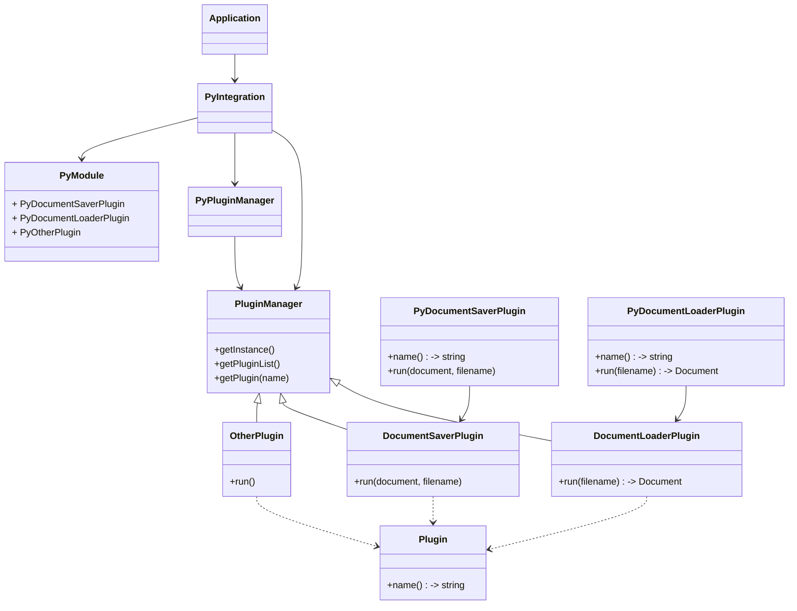

# Plugin Integration Overview

---

## Key Classes and Modules

```mermaid
classDiagram
    class PluginManager {
        +getInstance()
        +getPluginList()
        +getPlugin(name)
    }
    class DocumentLoaderPlugin {
        +run(filename) -> Document
    }
    class DocumentSaverPlugin {
        +run(document, filename)
    }
    class OtherPlugin {
        +run(<signature>)
    }
    class Plugin {
        +name() -> string
    }
    class PyPluginManager
    class PyIntegration
    class PyDocumentSaverPlugin {
        +name() -> string
        +run(document, filename)
    }
    class PyDocumentLoaderPlugin {
        +name() -> string
        +run(filename) -> Document
    }
    class PyModule {
        + PyDocumentSaverPlugin
        + PyDocumentLoaderPlugin
        + PyOtherPlugin
    }
    class Application

    Application --> PyIntegration
    PluginManager <|-- DocumentLoaderPlugin
    PluginManager <|-- DocumentSaverPlugin
    PluginManager <|-- OtherPlugin
    PyDocumentLoaderPlugin --> DocumentLoaderPlugin
    PyDocumentSaverPlugin --> DocumentSaverPlugin
    DocumentLoaderPlugin ..> Plugin
    DocumentSaverPlugin ..> Plugin
    OtherPlugin ..> Plugin
    PyPluginManager --> PluginManager
    PyIntegration --> PluginManager
    PyIntegration --> PyPluginManager
    PyIntegration --> PyModule
```