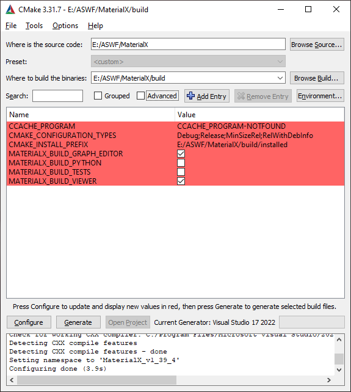
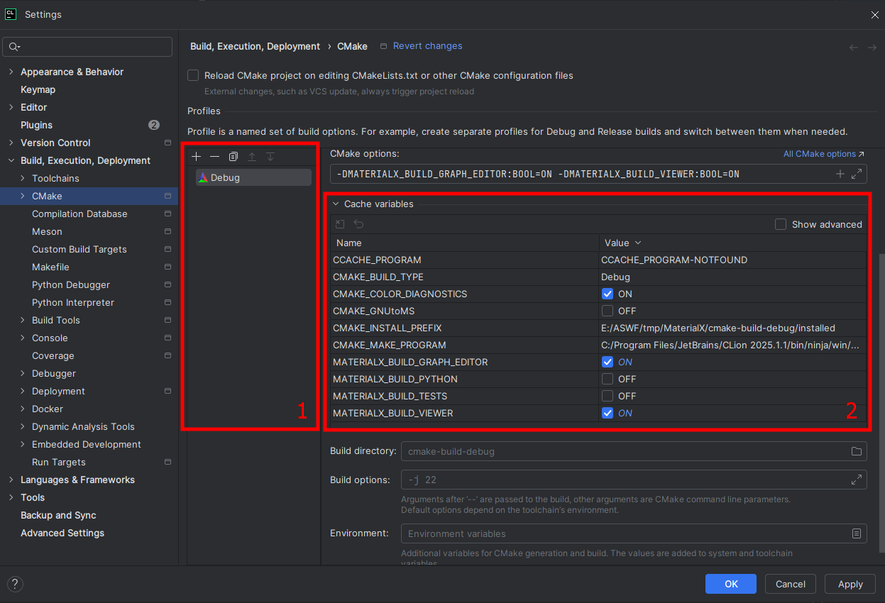

# MaterialX Overview

MaterialX is an open standard for representing rich material and look-development content in computer graphics, enabling its platform-independent description and exchange across applications and renderers.  Launched at [Industrial Light & Magic](https://www.ilm.com/) in 2012, MaterialX has been a key technology in their feature films and real-time experiences since _Star Wars: The Force Awakens_ and _Millennium Falcon: Smugglers Run_.  The project was released as open source in 2017, with companies including Sony Pictures Imageworks, Pixar, Autodesk, Adobe, and SideFX contributing to its ongoing development.  In 2021, MaterialX became the seventh hosted project of the [Academy Software Foundation](https://www.aswf.io/).

# Setup and Build MaterialX

## Quick Start for Developers

- Download and install the latest version of [CMake](https://cmake.org/).
- Use CMake (either via terminal or GUI) to configure and generate C++ projects from the root of the MaterialX repository for your platform and compiler.
- Enable the following build options as needed:
  - `MATERIALX_BUILD_PYTHON` to build the Python bindings.
  - `MATERIALX_BUILD_VIEWER` to build the [MaterialX Viewer](https://github.com/AcademySoftwareFoundation/MaterialX/blob/main/documents/DeveloperGuide/Viewer.md).
  - `MATERIALX_BUILD_GRAPH_EDITOR` to build the [MaterialX Graph Editor](https://github.com/AcademySoftwareFoundation/MaterialX/blob/main/documents/DeveloperGuide/GraphEditor.md). 

For information on setting up your development environment, see [Prepare Development Environment](#prepare-development-environment).

To view a complete list of [build options](#build-options), refer to the dedicated section below.

For a step-by-step guide and additional configuration tips, continue to [Build Methods](#build-methods).

## Prepare Development Environment

Start by cloning the MaterialX repository. In your terminal, run:
```bash
git clone --recurse-submodules https://github.com/AcademySoftwareFoundation/MaterialX.git
```

The MaterialX codebase requires the following tools:

- **[CMake](https://cmake.org/) (version ≥ 3.0 and < 4.0)** — Build system.
- **Compiler with C++17 support** — Choose a generator and compiler combination:
  - *Microsoft Visual Studio 2017 or newer* (includes both compiler and generator).
  - *MinGW Makefiles* with *GCC 8 or newer*.
  - *Ninja + Clang 5 or newer* (cross-platform).
- **Python (version ≥ 3.7)** — Required for building Python bindings.

> [!Note] **Using MSVC on Windows**
> On Windows, the MSVC toolchain included with Visual Studio serves as both the generator and the compiler. You do **not** need to install GCC, Clang, or Ninja separately when using Visual Studio.

> [!Tip] **Additional Notes**
> 
> - On macOS, [Xcode](https://developer.apple.com/xcode/resources/) must be installed to access Metal tools and compiler toolchains.
> - Python bindings for MaterialX are built using [PyBind11](https://github.com/pybind/pybind11), compatible with Python 3.9 and newer.
> - `PyBind11` is included in the repository for basic usage. For advanced configurations, you may download a custom version and set the `MATERIALX_PYTHON_PYBIND11_DIR` CMake variable.


## Build Methods

You can build MaterialX using any of the following methods:

1. [CMake GUI](#cmake-gui)
2. CMake Command-Line Interface (CLI)
   - [Passing options as arguments](#pass-options-as-arguments)
   - [Specifying options in a CMake preset](#specify-options-in-a-cmake-preset)
3. [Using an IDE](#use-an-ide)

There is no recommended method; it’s purely based on personal preference.

### CMake GUI
You can use the CMake GUI to configure and generate project files for MaterialX. Note that CMake GUI only generates build files—the actual build must be performed in an external tool such as an IDE or the terminal.



To get started, open CMake GUI and go through these steps:

1. **Browse Source**: Select the root of the cloned MaterialX repository.
2. **Browse Build**: Choose a build directory (e.g. `MaterialX/build`).
3. Click **Configure**: Click Configure: This saves your current configuration. You'll need to click it again anytime you change any options. The first time you click it, CMake will prompt you to choose a generator (e.g., Visual Studio, Ninja).
4. Click **Generate**: This step creates the build system files (e.g., a Visual Studio solution or Makefiles).

You’ll see progress messages in the output window confirming each step. For example:
```
Configuring done (3.9s)
Generating done (1.0s)
```

After generation, you have two options to build the project:
- Click **Open Project** to launch the generated project in your default IDE or some other configured environment to open your project, then build from there.
- Or, build directly from the terminal:
```bash
cd <your-build-directory>
cmake --build .
```

> [!Note]
> The CMake GUI includes **Grouped** and **Advanced** checkboxes, which control how the environment variables are displayed in the UI. Use them to manage build configuration more easily.

### CMake CLI

The CMake Command-Line Interface (CLI) offers several ways to configure and build the project, as outlined below.

#### Pass Options as Arguments

You can specify build options directly during the CMake configuration step using the `-D` flag. Reference the [YAML build actions](../../.github/workflows/main.yml) in the repository for examples.

Example:

```bash
cd MaterialX
cmake -S . -B build -DMATERIALX_BUILD_VIEWER=ON -DMATERIALX_BUILD_GRAPH_EDITOR=ON
cmake --build ./build
```

> [!Note]
> Command syntax may vary depending on your tools. For example, with **Ninja + Clang**:
>
> ```bash
> cmake -G "Ninja" -DCMAKE_C_COMPILER=clang -DCMAKE_CXX_COMPILER=clang++ -S . -B build -DMATERIALX_BUILD_VIEWER=ON -DMATERIALX_BUILD_GRAPH_EDITOR=ON
> cmake --build build
> ```


#### Specify Options in a CMake Preset

[CMake Presets](https://cmake.org/cmake/help/latest/manual/cmake-presets.7.html) (available in CMake 3.19+) allow you to define options easily.
Example preset file (`CMakePresets.json`) should be located at the project root:

```json
{
  "version": 3,
  "cmakeMinimumRequired": {
    "major": 3,
    "minor": 23,
    "patch": 0
  },
  "configurePresets": [
    {
      "name": "default",
      "generator": "Visual Studio 17 2022",
      "description": "Default build configuration",
      "hidden": false,
      "binaryDir": "build",
      "cacheVariables": {
        "MATERIALX_BUILD_VIEWER": "ON",
        "MATERIALX_BUILD_GRAPH_EDITOR": "ON"
      }
    }
  ]
}
```

> [!Note]
> The `generator` and some `cacheVariables` may need to be updated depending on your chosen tools.
> For example, when using Ninja + Clang, you would adjust the following fields:
> ```json
> {
>   // Partial JSON — only fields that need modification are shown  
>   "generator": "Ninja",
>   "cacheVariables": {
>    "CMAKE_C_COMPILER": "clang",
>    "CMAKE_CXX_COMPILER": "clang++"
>  }
> }
> ```


To build using the preset:

```bash
cd MaterialX
cmake --preset default
cmake --build build
```

### Use an IDE

MaterialX is compatible with any IDE that supports CMake. Below are some common IDEs for MaterialX development:

#### CLion

[CLion](https://www.jetbrains.com/clion/) is a cross-platform IDE that fully supports CMake. It is free for non-commercial use and provides granular settings to manage CMake builds effectively.

To get started, simply open the MaterialX repository in CLion, and it will auto-load the CMake project.

You can configure CMake settings through:

- **Top Gear ⚙️ Icon → `Build, Execution, Deployment` → `CMake`**
- **Bottom CMake tab → Gear ⚙️ Icon → `CMake Settings`**



In CMake settings, you can create build profiles and specify options:

1. Select or create a profile.
2. Add CMake options, for example:
  ```
  -DMATERIALX_BUILD_PYTHON=OFF
  -DMATERIALX_BUILD_VIEWER=ON
  -DMATERIALX_BUILD_GRAPH_EDITOR=ON
  ```

To build the project:

- Use `Build → Build Project`.
- To install, use `Build → Install`.


## Build Options

| **Option**                      | **Description**                                                              |
| ------------------------------- | ---------------------------------------------------------------------------- |
| `MATERIALX_BUILD_PYTHON`        | Builds Python bindings. Output is located in `/bin` within the build folder. |
| `MATERIALX_BUILD_VIEWER`        | Builds the MaterialX Viewer. Output is located in `/bin`.                    |
| `MATERIALX_BUILD_GRAPH_EDITOR`  | Builds the MaterialX Graph Editor. Output is located in `/bin`.              |
| `MATERIALX_BUILD_OIIO`          | Builds MaterialXRender with OpenImageIO support.                             |
| `MATERIALX_BUILD_OCIO`          | Builds MaterialXGenShader with OpenColorIO color spaces and transforms.      |
| `MATERIALX_PYTHON_VERSION`      | Specifies the Python version to use for building the Python package.         |
| `MATERIALX_PYTHON_EXECUTABLE`   | Defines the Python executable for building the MaterialX Python package.     |
| `MATERIALX_PYTHON_PYBIND11_DIR` | Path to the PyBind11 source for custom Python builds.                        |
| `MATERIALX_BUILD_DOCS`          | Builds the API documentation.                                                |
| `CMAKE_INSTALL_PREFIX`          | Specifies the install directory for MaterialX C++ and Python libraries.      |
| `MATERIALX_INSTALL_PYTHON`      | Determines whether to install MaterialX Python as a third-party library.     |


## Building MaterialX

### Building MaterialX C++

The MaterialX C++ libraries are automatically included when building MaterialX through CMake.

To enable OpenImageIO and OpenColorIO support in MaterialX builds, the following additional options may be used:

- `MATERIALX_BUILD_OIIO`: Requests that MaterialXRender be built with OpenImageIO in addition to stb_image, extending the set of supported image formats.  The minimum supported version of OpenImageIO is 2.2.
- `MATERIALX_BUILD_OCIO`: Requests that MaterialXGenShader be built with support for custom OpenColorIO color spaces and transforms.  The minimum supported version of OpenColorIO is 2.4.

See the [MaterialX Unit Tests](https://github.com/AcademySoftwareFoundation/MaterialX/tree/main/source/MaterialXTest) page for documentation on shader generation and render testing in GLSL, OSL, and MDL.

### Building MaterialX Python

By default, the `MATERIALX_BUILD_PYTHON` option will use the active version of Python in the developer's path.  To select a specific version of Python, use one or more of the following advanced options:

- `MATERIALX_PYTHON_VERSION`: Python version to be used in building the MaterialX Python package (e.g. `3.9`)
- `MATERIALX_PYTHON_EXECUTABLE`: Python executable to be used in building the MaterialX Python package (e.g. `C:/Python39/python.exe`)

Additional options for the generation of MaterialX Python include the following:

- `MATERIALX_PYTHON_PYBIND11_DIR`: Path to a folder containing the PyBind11 source to be used in building MaterialX Python. Defaults to the included PyBind11 source.

### Building The MaterialX Viewer

Select the `MATERIALX_BUILD_VIEWER` option to build the MaterialX Viewer.  Installation will copy the `MaterialXView` executable to a `bin/` directory within the selected install folder.

### Building API Documentation

To generate HTML documentation for the MaterialX C++ API, make sure a version of [Doxygen](https://www.doxygen.org/) is on your path, and select the advanced option `MATERIALX_BUILD_DOCS` in CMake.  This option will add a target named `MaterialXDocs` to your project, which can be built as an independent step from your development environment.

## Installing MaterialX

Building the `install` target of your project will install the MaterialX C++ and Python libraries to the folder specified by the `CMAKE_INSTALL_PREFIX` setting, and will install MaterialX Python as a third-party library in your Python environment.  Installation of MaterialX Python as a third-party library can be disabled by setting `MATERIALX_INSTALL_PYTHON` to `OFF`.

## MaterialX Versioning

The MaterialX codebase uses a modified semantic versioning system where the *major* and *minor* versions match that of the corresponding [MaterialX Specification](https://materialx.org/Specification.html), and the *build* version represents engineering advances within that specification version.  MaterialX documents are similarly marked with the specification version they were authored in, and they are valid to load into any MaterialX codebase with an equal or higher specification version.

Upgrading of MaterialX documents from earlier versions is handled at import time by the `Document::upgradeVersion()` method, which applies the syntax and node interface upgrades that have occurred in previous specification revisions.  This allows the syntax conventions of MaterialX and the names and interfaces of nodes to evolve over time, without invalidating documents from earlier versions.

### MaterialX API Changes

The following rules describe the categories of changes to the [MaterialX API](https://materialx.org/docs/api/classes.html) that are allowed in version upgrades:

- In *build* version upgrades, only non-breaking changes to the MaterialX API are allowed.  For any API call that is modified in a build version upgrade, backwards compatibility should be maintained using deprecated C++ and Python wrappers for the original API call.
- In *minor* and *major* version upgrades, breaking changes to the MaterialX API are allowed, though their benefit should be carefully weighed against their cost.  Any breaking changes to API calls should be highlighted in the release notes for the new version.

### MaterialX Data Library Changes

The following rules describe the categories of changes to the [MaterialX Data Libraries](https://github.com/AcademySoftwareFoundation/MaterialX/tree/main/libraries) that are allowed in version upgrades:

- In *build* version upgrades, only additive changes and fixes to the MaterialX data libraries are allowed.  Additive changes are allowed to introduce new nodes, node versions, and node inputs with backwards-compatible default values.  Data library fixes are allowed to update a node implementation to improve its alignment with the specification, without making any changes to its name or interface.
- In *minor* version upgrades, changes to the names and interfaces of MaterialX nodes are allowed, with the requirement that version upgrade logic be used to maintain the validity and visual interpretation of documents from earlier versions.
- In *major* version upgrades, changes to the syntax rules of MaterialX documents are allowed, with the requirement that version upgrade logic be used to maintain the validity and visual interpretation of documents from earlier versions.  These changes usually require synchronized updates to both the MaterialX API and data libraries.

## Additional Links

- The main [MaterialX website](http://www.materialx.org) provides background on the project's history, industry collaborations, and recent presentations.
- The [Python Scripts](https://github.com/materialx/MaterialX/tree/main/python/Scripts) folder contains standalone examples of MaterialX Python code.
- The [MaterialX Unit Tests](https://github.com/materialx/MaterialX/tree/main/source/MaterialXTest) folder contains examples of useful patterns for MaterialX C++.
- The [MaterialX Viewer](https://github.com/materialx/MaterialX/blob/main/documents/DeveloperGuide/Viewer.md) is a complete, cross-platform C++ application based upon [MaterialX Shader Generation](https://github.com/materialx/MaterialX/blob/main/documents/DeveloperGuide/ShaderGeneration.md)
