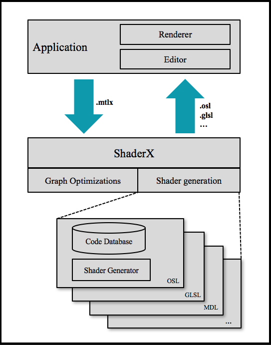

# Shader Generation

## 1.1 Scope
Shader generation features are implemented as a core part of MaterialX. Most
features are contained in the [MaterialXGenShader](/source/MaterialXGenShader) shared library, but some features are part of the [MaterialXCore](/source/MaterialXCore) library as well.

Note that there is no runtime and the output produced is source code, not binary executable
code. The source code produced needs to be compiled by a shading language compiler before being
executed by the renderer. See Figure 1 for a high level overview of the system.



**Figure 1**: Shader generation with multiple shader generators

## 1.2 Languages and Shader Generators
The generation framework is free from device specific details with all implementation details taken care of by shader generators. There is one shader generator for each supported shading language. However for each language there can also be variations needed for different renderers. These variations are specified using a `target` specifier.

For example: `OpenGL` renderers supporting `GLSL` can use forward rendering or deferred rendering,
each with very different requirements for how the shaders are constructed. Another example is
different renderers supporting OSL but with different sets of closures or closure parameters. Hence a separate shader generator can be defined for each language/target combination.

To add a new shader generator for a target you add a new C++ class derived from the base class
`ShaderGenerator`, or one of the existing derived shader generator classes (
`GlslShaderGenerator`, `OslShaderGenerator`, etc.), and override the methods you need to customize. You might also need to derive a new `Syntax` class, which is used to handle syntactical
differences between different shading languages. Then you need to make sure there are implementations defined for all the nodes you want to support, standard library nodes and nodes from other libraries, by either reusing existing implementations where applicable or adding in new ones.

See [1.3](1.3 Node Implementations) on how that is done.

Note that a shader generator doesn’t need to be defined at the time when node definitions are
added. New shader generators can be added later, and node implementations for new targets can
be added for existing nodes.

## 1.3 Node Implementations
There are four different methods to define the implementation of a node:
1. Using an inline expression.
2. Using a function written in the target language.
3. Using a nodegraph that defines the operation performed by the node.
4. Using a C++ class that emits code dynamically during shader generation.

For all methods the implementation is tied to a specific `nodedef` with a well defined interface of typed inputs and outputs. In the following sub-sections each of these methods are explained.

### 1.3.1 Inline Expression
Provided code generators support a very simple expression language for inlining code. This is useful for simple nodes where the operation can be expressed as a single line of code. Inlining will reduce the number of function calls and produce more compact code. The syntax to use is the
same as the target shading language, with the addition of using the node’s input ports as variables wrapped in double curly brackets: `{{input}}`. The code generator will replace these variables with values assigned or connected to the respective inputs. Figure 2 gives an example.

Connecting the expression to the nodedef is done using an `<implementation>` element as seen in
Figure 2. The file extension is used to differentiate inline expressions from source code functions, using `filename.inline`.

```xml
// Nodedef elements for node <add>
<nodedef name="ND_add_float" node="add" type="float" defaultinput="in1">
  <input name="in1" type="float"/>
  <input name="in2" type="float"/>
</nodedef>
<nodedef name="ND_add_color3" node="add" type="color3" defaultinput="in1">
  <input name="in1" type="color3"/>
  <input name="in2" type="color3"/>
</nodedef>
<... more types ...>

// Implementation elements for node <add>
<implementation name="IM_add_float" nodedef="ND_add_float" file="mx_add.inline"/>
<implementation name="IM_add_color3" nodedef="ND_add_color3" file="mx_add.inline"/>
<... more types ...>

// Nodedef elements for node <mix>
<nodedef name="ND_mix_float" node="mix" type="float" defaultinput="bg">
  <input name="fg" type="float"/>
  <input name="bg" type="float"/>
  <input name="mix" type="float"/>
</nodedef>
<nodedef name="ND_mix_color3" node="mix" type="color3" defaultinput="bg">
  <input name="fg" type="color3"/>
  <input name="bg" type="color3"/>
  <input name="mix" type="float"/>
</nodedef>
<... more types ...>
```
```xml
// Implementation elements for node <mix>
<implementation name="IM_mix_float" nodedef="ND_mix_float" file="mx_mix.inline"/>
<implementation name="IM_mix_color3" nodedef="ND_mix_color3" file="mx_mix.inline"/>
<... more types ...>
```
**Figure 2**: Inline expressions for implementing nodes `<add>` and `<mix>`.

### 1.3.2 Shading Language Function
For nodes that can’t be implemented by inline expressions a function definition can be used instead. The function signature should match the nodedefs interface with inputs and outputs. See Figure 3 for an example. Connecting the source code to the nodedef is done using an <implementation> element, see [1] for more information.

```xml
// Nodedef element
<nodedef name="ND_image_color3" node="image" type="color3" default="0.0, 0.0, 0.0">
  <parameter name="file" type="filename"/>
  <parameter name="layer" type="string" value=""/>
  <parameter name="default" type="color3" value="0.0, 0.0, 0.0"/>
  <input name="texcoord" type="vector2" defaultgeomprop="texcoord"/>
  <parameter name="filtertype" type="string" value="linear"/>
  <parameter name="uaddressmode" type="string" value="periodic"/>
  <parameter name="vaddressmode" type="string" value="periodic"/>
  <parameter name="framerange" type="string" value=""/>
  <parameter name="frameoffset" type="integer" value="0"/>
  <parameter name="frameendaction" type="string" value="black"/>
</nodedef>

// Implementation element
<implementation name="IM_image_color3_osl" nodedef="ND_image_color3"
    file="mx_image_color3.osl" language="osl"/>
```
```c++
// File 'mx_image_color3.osl' contains:
void mx_image_color3(string file, string layer, color defaultvalue,
                     vector2 texcoord, string filtertype,
                     string uaddressmode, string vaddressmode,
                     string framerange, int frameoffset,
                     string frameendaction, output color out)
{
  // Sample the texture
  out = texture(file, texcoord.x, texcoord.y,
                "interp", filtertype,
                "subimage", layer,
                "missingcolor", defaultvalue,
                "wrap", uaddressmode);
}
```
**Figure 3**: Shading language function's implementation for node `<image>` in OSL.

### 1.3.3 Implementation by Node Graph
As an alternative to defining source code, there is also an option to reference a nodegraph as the implementation of a nodedef. The only requirement is that the nodegraph and nodedef have matching inputs and outputs.

This is useful for creating a compound for a set of nodes performing some common operation. It can then be referenced as a node inside other nodegraphs. It is also useful for creating compatibility graphs for unknown nodes. If a node is created by some third party, and its implementation is unknown or proprietary, a compatibility graph can be created using known nodes and be referenced as a stand-in implementation. Linking a nodegraph to a nodedef is done by simply setting a nodedef attribute on the nodegraph definition. See Figure 4 for an example.

```xml
<nodedef name="ND_checker_float" node="checker" type="float">
  <input name="scale" type="vector2" value="8.0, 8.0"/>
</nodedef>
<nodegraph name="IM_checker_float" nodedef="ND_checker_float">
  <texcoord name="texcoord1" type="vector2">
    <parameter name="index" type="integer" value="0"/>
  </texcoord>
  <multiply name="mult1" type="vector2">
    <input name="in1" type="vector2" nodename="texcoord1"/>
    <input name="in2" type="vector2" interfacename="scale"/>
  </multiply>
  <swizzle name="swizz_x" type="float">
    <input name="in" type="vector2" nodename="mult1"/>
    <parameter name="channels" type="string" value="x"/>
  </swizzle>
  <swizzle name="swizz_y" type="float">
    <input name="in" type="vector2" nodename="mult1"/>
    <parameter name="channels" type="string" value="y"/>
  </swizzle>
  <floor name="floor1" type="float">
    <input name="in" type="float" nodename="swizz_x"/>
  </floor>
  <floor name="floor2" type="float">
    <input name="in" type="float" nodename="swizz_y"/>
  </floor>
  <add name="add1" type="float">
    <input name="in1" type="float" nodename="floor1"/>
    <input name="in2" type="float" nodename="floor2"/>
  </add>
  <modulo name="mod1" type="float">
    <input name="in1" type="float" nodename="add1"/>
    <input name="in2" type="float" value="2.0"/>
  </modulo>
  <output name="out" type="float" nodename="mod1"/>
</nodegraph>
```
**Figure 4**: Implementation using a nodegraph.

### 1.3.4 Dynamic Code Generation
In some situations static source code is not enough to implement a node. The code might need
to be customized depending on parameters set on the node. Or for a hardware render target vertex streams or uniform inputs might need to be created in order to supply the data needed for the node implementation.

In this case, a C++ class can be added to handle the implementation of the node. The
class should be derived from the base class `ShaderNodeImpl`. It should specify what language
and target it is for by overriding `getLanguage()` and `getTarget()`. It can also be specified to support all languages or all targets by setting the identifier to an empty string, as done for the target identifier in the example below. It then needs to be registered for a `ShaderGenerator` by
calling `ShaderGenerator::registerImplementation()`. See Figure 5 for an example.
When a `ShaderNodeImpl` class is used for a nodedef the corresponding `<implementation>`
element doesn’t need a file attribute, since no static source code is used. The `<implementation>` element will then act only as a declaration that there exists an implementation for the nodedef for a particular language and target.

Note that the use of `ShaderNodeImpl` classes for dynamic code generation goes against our
design goal of being data driven. An application needs to be recompiled after adding a new node implementation class. However this usage is only needed in special cases. And in these cases the code produced can be made much more efficient by allowing this dynamic generation. As a result, we choose to support this method of code generation, but it should only be used when inline expressions or static source code functions are not enough to handle the implementation of a node.

```c++
/// Implementation of ’foo' node for OSL
class FooOsl : public ShaderNodeImpl
{
public:
  static ShaderNodeImplPtr create() { return std::make_shared<FooOsl>(); }

  const string& getLanguage() const override { return LANGUAGE_OSL; }
  const string& getTarget() const override { return EMPTY_STRING; }

  void emitFunctionDefinition(const ShaderNode& node, GenContext& context,
                              ShaderStage& stage) const override
  {
    // Emit function definition if needed for the node
  }

  void emitFunctionCall(const ShaderNode& node, GenContext& context,
                        ShaderStage& stage) const override
  {
    // Emit function call, or inline shader code, for the node
  }
};
```
```c++
OslShaderGenerator::OslShaderGenerator()
    : ShaderGenerator(std::make_shared<OslSyntax>())
{
  ...
  // Register foo implementation for nodedefs it should be used for
  registerImplementation("IM_foo_color2_osl", FooOsl::create);
  registerImplementation("IM_foo_color3_osl", FooOsl::create);
  registerImplementation("IM_foo_color4_osl", FooOsl::create);
  ...
}
```
**Figure 5**: C++ class for dynamic code generation.

## 1.4 Shader Generation Steps
This section outlines the steps taken in general to produce a shader from the MaterialX description. The `ShaderGenerator` base class and its supporting classes will handle this for you, but it’s good to know the steps involved in case custom changes are needed to support a new target.

Shader generation supports generating a shader starting from either a graph output port, an arbitrary node inside a graph, or a `shaderref` in a material. A shader is generated by calling your shader generator class with an element of either of these types as input. The given element and all dependencies upstream will be translated into a single monolithic shader in the target shading language.

```c++
// Generate a shader starting from the given element, translating
// the element and all dependencies upstream into shader code.
ShaderPtr ShaderGenerator::generate(const string& name,
                                    ElementPtr element,
                                    GenContext& context)
```     

The shader generation process can be divided into initialization and code generation. The initialization is handled by the `Shader` class, and consists of a number of steps:

1. Create an optimized version of the graph as a tree with the given element as root, and with only the used dependencies connected upstream. This involves removing unused paths in
the graph, converting constant nodes to constant values, and adding in any default nodes
for ports that are unconnected but have default connections specified. Removal of unused
paths typically involves constant folding and pruning of conditional branches that will never
be taken. Since the resulting shader in the end will be compiled by a shading language
compiler, and receive a lot of additional optimizations, we don’t need to do too much work
in this optimization step. However, a few graph level optimizations can make the resulting
shader a lot smaller and save time and memory during shader compilation. It will also
produce more readable source code which is good for debugging purposes.

  This step is also a good place to do other custom optimizations needed by a particular target. For example simplification of the graph, which could involve substituting expensive nodes with approximate nodes, identification of common subgraphs that can be merged, etc.                              

2. Track which graph interface ports are being used. This is done by finding which graph interface ports have connections to nodes inside the graph. This is useful in later steps to be able to ignore interface ports that are not used.

3. The nodes are sorted in topological order. Since a node can be referenced by many other
nodes in the graph we need an ordering of the nodes so that nodes that have a dependency
on other nodes come after all dependent nodes. This step also makes sure there are no
cyclic dependencies in the graph.

4. The shader signature's interface of uniforms and varyings are established. This consists of
the graph interface ports that are in use, as well as internal ports that have been published
to the interface (an example of the latter is for a hardware shader generator where image texture
filenames get converted to texture samplers which needs to be published in order to be
bound by the target application). This information is stored on the `Shader` class, and can
be retrieved from it, together with the emitted source code when generation is completed.

5. Information about scope is tracked for each node. This information is needed to handle
branching by conditional nodes. For example, if a node is used only by a particular branch
on a varying conditional we want to calculate this node only inside that scope, when that
corresponding branch is taken. A node can be used in global scope, in a single conditional
scope or by multiple conditional scopes.


The output from the initialization step is a new graph representation constructed using the classes `ShaderNode`, `ShaderInput`, `ShaderOutput`, `ShaderGraph`, etc. This is a graph representation optimized for shader generation with quick access and traversal of nodes and ports, as well as caching of extra information needed by shader generation.

After initialization the code generation steps are handled by the `ShaderGenerator` class and derived classes. This part is specific to the particular generator being used, but in general it consists of the following steps:

1. Typedefs are emitted as specified by the Syntax class.

2. Function definitions are emitted for all the atomic nodes that have shading language functions for their implementations. For nodes using dynamic code generation their `ShaderNodeImpl` instances are called to generate the functions. For nodes that are implemented by graphs a function definition representing the graph computation is emitted.

3. The shader signature is emitted with all uniforms set to default values. The shader uniforms can later be accessed on the returned `Shader` instance in order for applications to be able to bind values to them.

4. The function calls for all nodes are emitted, in the right dependency order, propagating
output results from upstream nodes as inputs to downstream nodes. Inline expressions are
emitted instead of functions calls for nodes that use this.

5. The final shader output is produced and assigned to the shader output variable.

Note that if a single monolithic shader for the whole graph is not appropriate for your system the generator can be called on elements at any point in your graph, and generate code for sub-parts. It is then up to the application to decide where to split the graph, and to assemble the shader code for sub-parts after all have been generated.

## 1.5 Bindings and Shading Context

There are a number of ways to bind values to input ports on nodes and graphs. A port can be
assigned a constant default value or be connected to other nodes. If a port is connected it will read the value from the upstream node. Ports can also be set to have a default node connected if the user has not made a specific connection to it. This is for example used for input ports that expect to receive geometric data from the current shading context, like normal or texture coordinates. If no such connection is made explicitly a default geometric node is connected to supply the data.

Geometric data from the current shading context is supplied using MaterialX’s geometric nodes. There are a number of predefined geometric nodes in the MaterialX standard library to supply shading context data like position, normal, tangents, texture coordinates, vertex colors, etc. The vectors can be returned in different coordinate spaces: model, object or world space. If the data available from the standard geometric nodes are not enough, the general purpose primvar node `geomattrvalue` can be used to access any named data on geometry using a string identifier. It is up to the shader generator and node implementation of these geometric nodes to make sure the data is
supplied, and where applicable transformed to the requested coordinate space.

## 1.6 Shader Stages

A `ShaderStage` namespace can include multiple shader stages. This is needed in order to generate separate code for multiple stages on hardware render targets. By default there is a single stage defined, called the `pixel stage`. Hardware generators specify an additional stage, the `vertex stage`. If additional stages are needed they can be added to the namespace. When creating shader input variables you can specify which stage the variable should be used in, see 1.7 for more information on shader variable creation.

Node implementations using static source code (function or inline expressions) are always emitted to the pixel stage. Controlling the vertex stage, or other stages, is not supported using static source code. In order to do that you must use dynamic code generation with a custom `ShaderNodeImpl` sub-class for your node. You are then able to control how it affects all stages separately. Inside `emitFunctionDefinition` and `emitFunctionCall` you can add separate sections for each stage using begin/end shader stage macros. Figure 6 shows how the texcoord node for GLSL is emitting different code into the vertex and pixel stages.

## 1.7 Shader Variables
When generating a shader from a node graph or shaderref the inputs and parameters on those
elements will be published as shader uniforms on the resulting shader. A listing of the created uniforms can be read from the produced `Shader` instance. The shader uniforms can then be presented to the user have their values set by the application.

Adding new uniforms to a shader is done by first creating a uniform block and then adding
uniforms into the block. There are two predefined uniform blocks that can be used directly, one named `PublicUniforms` and another named `PrivateUniforms`. Public is used for uniforms to be published to the user, as described above, and private is used for uniforms needed by node implementations but set by the application and not published. All uniform blocks can be queried and accessed by the application from the `Shader` instance after generation.

```c++
// Implementation of 'texcoord' node for GLSL
class TexCoordGlsl : public ShaderNodeImpl
{
public:
  static ShaderNodeImplPtr create()
  {
      return std::make_shared<TexCoordGlsl>();
  }

  void TexCoordNodeGlsl::createVariables(const ShaderNode& node, GenContext&,
                                         Shader& shader) const
  {
      const ShaderOutput* output = node.getOutput();
      const ShaderInput* indexInput = node.getInput(INDEX);
      const string index = indexInput ? indexInput->getValue()->getValueString() : "0";

      ShaderStage& vs = shader.getStage(Stage::VERTEX);
      ShaderStage& ps = shader.getStage(Stage::PIXEL);

      addStageInput(HW::VERTEX_INPUTS, output->getType(), "i_texcoord_" + index, vs);
      addStageConnector(HW::VERTEX_DATA, output->getType(), "texcoord_" + index, vs, ps);
  }

  void TexCoordNodeGlsl::emitFunctionCall(const ShaderNode& node,
                                          GenContext& context,
                                          ShaderStage& stage) const
  {
      const ShaderGenerator& shadergen = context.getShaderGenerator();

      const ShaderInput* indexInput = node.getInput(INDEX);
      const string index = indexInput ? indexInput->getValue()->getValueString() : "0";
      const string variable = "texcoord_" + index;

      BEGIN_SHADER_STAGE(stage, Stage::VERTEX)
        VariableBlock& vertexData = stage.getOutputBlock(HW::VERTEX_DATA);
        const string prefix = vertexData.getInstance() + ".";
        ShaderPort* texcoord = vertexData[variable];
        if (!texcoord->isEmitted())
        {
            shadergen.emitLine(prefix + texcoord->getVariable() + " = i_" + variable, stage);
            texcoord->setEmitted();
        }
      END_SHADER_STAGE(shader, Stage::VERTEX)

      BEGIN_SHADER_STAGE(stage, Stage::PIXEL)
        VariableBlock& vertexData = stage.getInputBlock(HW::VERTEX_DATA);
        const string prefix = vertexData.getInstance() + ".";
        ShaderPort* texcoord = vertexData[variable];
            shadergen.emitLineBegin(stage);
        shadergen.emitOutput(node.getOutput(), true, false, context, stage);
        shadergen.emitString(" = " + prefix + texcoord->getVariable(), stage);
        shadergen.emitLineEnd(stage);
      END_SHADER_STAGE(shader, Stage::PIXEL)
  }
};
```
**Figure 6**: Implementation of node `texcoord` in GLSL. Using a `ShaderNodeImpl` sub-class in order to control shader variable creation and code generation into separate shader stages.

For inputs representing geometric data streams a separate variable block is used. These variables are named vertex inputs (in a hardware shading language they are often
named varying inputs or attributes). The `ShaderStage` class has a method for creating such variables, in a block named `VertexInputs`. This is also accessible from the `ShaderStage` instance after generation. In order to pass data between shader stages in a hardware shader additional variable blocks are needed. For this purpose an additional variable block named `VertexData` is used. It is used for transporting data from the vertex stage to the pixel stage.

Creating shader variables and binding values to them needs to be done in agreement with the
shader generator side and application side. The application must know what a variable is for in order to bind meaningful data to it. One way of handling this is by using semantics. All shader variables created can be assigned a semantic if that is used by the target application. Shader generation does not impose a specific set of semantics to use, so for languages and applications that use this any semantics can be used. For languages that do not use semantics a variable naming convention needs to be used instead.

Figure 6 shows how creation of shader inputs and vertex data variables are used for a node implementation that requires this.

### 1.7.1 Variable Naming Convention

Built-in shader generators and accompanying node implementations have a naming convention for shader variables. A custom shader generator that derives from and takes
advantage of built-in features should preferably use the same convention.
Uniform variables are prefixed with `u_` and vertex inputs with `i_` . For languages not using semantics, Figure 7 shows the naming used for variables (inputs and uniforms) with predefined binding rules:

App data input variables

|    NAME                                | TYPE    | BINDING |
| :---                                   | :--:    | :--- |
|    i_position                          | vec3    | Vertex position in object space. |
|    i_normal                            | vec3    | Vertex normal in object space. |
|    i_tangent                           | vec3    | Vertex tangent in object space. |
|    i_bitangent                         | vec3    | Vertex bitangent in object space. |
|    i_texcoord_N                        | vec2    | Vertex texture coord for N:th uv set. |
|    i_color_N                           | vec4    | Vertex color for N:th color set. |


Uniform variables

|    NAME                                | TYPE    | BINDING |
| :---                                   | :--:    | :--- |
|    u_worldMatrix                       | mat4    | World transform. |
|    u_worldInverseMatrix                | mat4    | World transform, inverted. |
|    u_worldTransposeMatrix              | mat4    | World transform, transposed. |
|    u_worldInverseTransposeMatrix       | mat4    | World transform, inverted, transposed. |
|    u_viewMatrix                        | mat4    | View transform. |
|    u_viewInverseMatrix                 | mat4    | View transform, inverted. |
|    u_viewTransposeMatrix               | mat4    | View transform, transposed.
|    u_viewInverseTransposeMatrix        | mat4    | View transform, inverted, transposed. |
|    u_projectionMatrix                  | mat4    | Projection transform. |
|    u_projectionInverseMatrix           | mat4    | Projection transform, inverted. |
|    u_projectionTransposeMatrix         | mat4    | Projection transform, transposed. |
|    u_projectionInverseTransposeMatrix  | mat4    | Projection transform, inverted, transposed. |
|    u_worldViewMatrix                   | mat4    | World-view transform. |
|    u_viewProjectionMatrix              | mat4    | View-projection transform. |
|    u_worldViewProjectionMatrix         | mat4    | World-view-projection transform. |
|    u_viewPosition                      | vec3    | World-space position of the viewer. |
|    u_viewDirection                     | vec3    | World-space direction of the viewer. |
|    u_frame                             | float   | The current frame number as defined by the host application. |
|    u_time                              | float   | The current time in seconds. |
|    u_geomattr_<name>                   | <type\>  | A named attribute of given <type\> where <name\> is the name of the variable on the geometry. |
|    u_numActiveLightSources             | int     | The number of currently active light sources. Note that in shader this is clamped against the maximum allowed number of light sources. |
|    u_lightData[]                       | struct  | Array of struct LightData holding parameters for active light sources. The `LightData` struct is built dynamically depending on requirements for bound light shaders. |


**Figure 7** : Listing of predefined variables with their binding rules.

## References

[1] Lucasfilm, MaterialX specification.
http://www.materialx.org, 2017.
