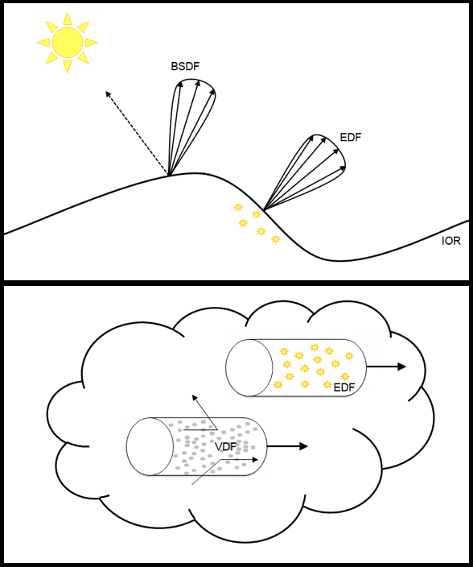

<!-----
MaterialX Physically Based Shading Nodes v1.39
----->

# MaterialX Physically Based Shading Nodes

**Version 1.39**  
Niklas Harrysson - Lumiere Software  
Doug Smythe - Industrial Light & Magic  
Jonathan Stone - Lucasfilm Advanced Development Group  
June 29, 2024

# Introduction

The [MaterialX Specification](./MaterialX.Specification.md) describes a number of standard nodes that may be used to construct node graphs for the processing of images, procedurally-generated values, coordinates and other data. With the addition of user-defined custom nodes, it is possible to describe complete rendering shaders using node graphs. Up to this point, there has been no standardization of the specific shader-semantic nodes used in these node graph shaders, although with the widespread shift toward physically-based shading, it appears that the industry is settling upon a number of specific BSDF and other functions with standardized parameters and functionality.

This document describes a number of shader-semantic nodes implementing widely-used surface scattering, emission and volume distribution functions and utility nodes useful in constructing complex layered rendering shaders using node graphs. These nodes in combination with other nodes may be used with the [MaterialX Shader Generation](../DeveloperGuide/ShaderGeneration.md) system.

## Table of Contents

**[Physical Material Model](#physical-material-model)**  
 [Scope](#scope)  
 [Physically Plausible Materials](#physically-plausible-materials)  
 [Quantities and Units](#quantities-and-units)  
 [Color Management](#color-management)  
 [Surfaces](#surfaces)  
  [Layering](#layering)  
  [Bump and Normal Mapping](#bump-and-normal-mapping)  
  [Surface Thickness](#surface-thickness)  
 [Volumes](#volumes)  
 [Lights](#lights)  

**[MaterialX PBS Library](#materialx-pbs-library)**  
 [Data Types](#data-types)  
 [BSDF Nodes](#bsdf-nodes)  
 [EDF Nodes](#edf-nodes)  
 [VDF Nodes](#vdf-nodes)  
 [PBR Shader Nodes](#pbr-shader-nodes)  
 [Utility Nodes](#utility-nodes)  

**[Shading Model Examples](#shading-model-examples)**  
 [Autodesk Standard Surface](#autodesk-standard-surface)  
 [UsdPreviewSurface](#usdpreviewsurface)  
 [Khronos glTF PBR](#khronos-gltf-pbr)  
 [OpenPBR Surface](#openpbr-surface)  

**[References](#references)**

# Physical Material Model

This section describes the material model used in the MaterialX Physically Based Shading (PBS) library and the rules we must follow to be physically plausible.

## Scope

A material describes the properties of a surface or medium that involves how it reacts to light. To be efficient, a material model is split into different parts, where each part handles a specific type of light interaction: light being scattered at the surface, light being emitted from a surface, light being scattered inside a medium, etc. The goal of our material model definition is to describe light-material interactions typical for physically plausible rendering systems, including those in feature film production, real-time preview, and game engines.

Our model has support for surface materials, which includes scattering and emission of light from the surface of objects, and volume materials, which includes scattering and emission of light within a participating medium. For lighting, we support local lights and distant light from environments. Geometric modification is supported in the form of bump and normal mapping as well as displacement mapping.

## Physically Plausible Materials

The initial requirements for a physically-plausible material are that it 1) should be energy conserving and 2) support reciprocity. The energy conserving says that the sum of reflected and transmitted light leaving a surface must be less than or equal to the amount of light reaching it. The reciprocity requirement says that if the direction of the traveling light is reversed, the response from the material remains unchanged. That is, the response is identical if the incoming and outgoing directions are swapped. All materials implemented for ShaderGen should respect these requirements and only in rare cases deviate from it when it makes sense for the purpose of artistic freedom.

## Quantities and Units

Radiometric quantities are used by the material model for interactions with the renderer. The fundamental radiometric quantity is **radiance** (measured in _Wm−2sr−1_) and gives the intensity of light arriving at, or leaving from, a given point in a given direction. If incident radiance is integrated over all directions we get **irradiance** (measured in _Wm−2_), and if we integrate this over surface area we get **power** (measured in _W_). Input parameters for materials and lights specified in photometric units can be suitably converted to their radiometric counterparts before being submitted to the renderer.

The interpretation of the data types returned by surface and volume shaders are unspecified, and left to the renderer and the shader generator for that renderer to decide. For an OpenGL-type renderer they will be tuples of floats containing radiance calculated directly by the shader node, but for an OSL-type renderer they may be closure primitives that are used by the renderer in the light transport simulation.

In general, a color given as input to the renderer is considered to represent a linear RGB color space. However, there is nothing stopping a renderer from interpreting the color type differently, for instance to hold spectral values. In that case, the shader generator for that renderer needs to handle this in the implementation of the nodes involving the color type.

## Color Management

MaterialX supports the use of [color management systems](./MaterialX.Specification.md#color-spaces-and-color-management-systems) to associate colors with specific color spaces. A MaterialX document typically specifies the working color space that is to be used for the document as well as the color space in which input values and textures are given. If these color spaces are different from the working color space, it is the application's and shader generator's responsibility to transform them.

The ShaderGen module has an interface that can be used to integrate support for different color management systems. A simplified implementation with some popular and commonly used color transformations is supplied and enabled by default. A full integration of OpenColorIO ([http://opencolorio.org](http://opencolorio.org)) is planned for the future.

## Surfaces

In our surface shading model the scattering and emission of light is controlled by distribution functions. Incident light can be reflected off, transmitted through, or absorbed by a surface. This is represented by a Bidirectional Scattering Distribution Function (BSDF). Light can also be emitted from a surface, for instance from a light source or glowing material. This is represented by an Emission Distribution Function (EDF). The PBS library introduces the [data types](#data-types) `BSDF` and `EDF` to represent the distribution functions, and there are nodes for constructing, combining and manipulating them.

Another important property is the **index of refraction** (IOR), which describes how light is propagated through a medium. It controls how much a light ray is bent when crossing the interface between two media of different refractive indices. It also determines the amount of light that is reflected and transmitted when reaching the interface, as described by the Fresnel equations.

A surface shader is represented with the data type `surfaceshader`. In the PBS library there is a [&lt;surface>](#node-surface) node that constructs a surface shader from a BSDF and an EDF. Since there are nodes to combine and modify them, you can easily build surface shaders from different combinations of distribution functions. Inputs on the distribution function nodes can be connected, and nodes from the standard library can be combined into complex calculations, giving flexibility for the artist to author material variations over the surfaces.

It is common for shading models to differentiate between closed surfaces and thin-walled surfaces. A closed surface represents a closed watertight interface with a solid interior. A typical example is a solid glass object. A thin-walled surface on the other hand has an infinitely thin volume, as with a sheet of paper or a soap bubble. For a closed surface there can be no backside visible if the material is opaque. In the case of a transparent closed surface a backside hit is treated as light exiting the closed interface. For a thin-walled surface both the front and back side are visible and it can either have the same material on both sides or different materials on each side. If the material is transparent in this case the thin wall makes the light transmit without refraction or scattering. By default the [&lt;surface>](#node-surface) node constructs a surface shader for a closed surface, but there is a boolean switch to make it thin-walled.

In order to assign different shaders to each side of a thin-walled object the [&lt;surfacematerial>](./MaterialX.Specification.md#node-surfacematerial) node in the standard library has an input to connect an extra backside surface shader. If any of the sides of a &lt;surfacematerial> has a thin-walled shader connected, both sides are considered to be thin-walled. Hence the thin-walled property takes precedence to avoid ambiguity between the sides. If only one side has a shader connected this is used for both sides. If both sides are connected but none of the shaders are thin-walled the front shader is used. The thin-walled property also takes precedence in the case of mixing surface shaders. If any of the shaders involved in the mix is thin-walled, both shaders are considered to be thin-walled.

Note that in order to have surface shaders set for both sides the geometry has to be set as double-sided. Geometry sidedness is a property not handled by MaterialX and needs to be set elsewhere.

### Layering

In order to simplify authoring of complex materials, our model supports the notion of layering. Typical examples include: adding a layer of clear coat over a car paint material, or putting a layer of dirt or rust over a metal surface. Layering can be done in a number of different ways:

* Horizontal Layering: A simple way of layering is using per-shading-point linear mixing of different BSDFs where a mix factor is given per BSDF controlling its contribution. Since the weight is calculated per shading point it can be used as a mask to hide contributions on different parts of a surface. The weight can also be calculated dependent on view angle to simulate approximate Fresnel behavior. This type of layering can be done both on a BSDF level and on a surface shader level. The latter is useful for mixing complete shaders which internally contain many BSDFs, e.g. to put dirt over a car paint, grease over a rusty metal or adding decals to a plastic surface. We refer to this type of layering as **horizontal layering** and the [&lt;mix>](#node-mix) node in the PBS library can be used to achieve this (see below).
* Vertical Layering: A more physically correct form of layering is also supported where a top BSDF layer is placed over another base BSDF layer, and the light not reflected by the top layer is assumed to be transmitted to the base layer; for example, adding a dielectric coating layer over a substrate. The refraction index and roughness of the coating will then affect the attenuation of light reaching the substrate. The substrate can be a transmissive BSDF to transmit the light further, or a reflective BSDF to reflect the light back up through the coating. The substrate can in turn be a reflective BSDF to simulate multiple specular lobes. We refer to this type of layering as **vertical layering** and it can be achieved using the [&lt;layer>](#node-layer) node in the PBS library. See [&lt;dielectric_bsdf>](#node-dielectric-bsdf) and [&lt;sheen_bsdf>](#node-sheen-bsdf) below.
* Shader Input Blending: Calculating and blending many BSDFs or separate surface shaders can be expensive. In some situations good results can be achieved by blending the texture/value inputs instead, before any illumination calculations. Typically one would use this with an über-shader that can simulate many different materials, and by masking or blending its inputs over the surface you get the appearance of having multiple layers, but with less expensive texture or value blending. Examples of this are given in the main [MaterialX Specification "Pre-Shader Compositing Example"](./MaterialX.Specification.md#example-pre-shader-compositing-material).

### Bump and Normal Mapping

The surface normal used for shading calculations is supplied as input to each BSDF that requires it. The normal can be perturbed by bump or normal mapping, before it is given to the BSDF. As a result, one can supply different normals for different BSDFs for the same shading point. When layering BSDFs, each layer can use different bump and normal maps.

## Volumes

In our volume shader model the scattering of light in a participating medium is controlled by a volume distribution function (VDF), with coefficients controlling the rate of absorption and scattering. The VDF represents what physicists call a _phase function, _describing how the light is distributed from its current direction when it is scattered in the medium. This is analogous to how a BSDF describes scattering at a surface, but with one important difference: a VDF is normalized, summing to 1.0 if all directions are considered. Additionally, the amount of absorption and scattering is controlled by coefficients that gives the rate (probability) per distance traveled in world space. The **absorption coefficient** sets the rate of absorption for light traveling through the medium, and the **scattering coefficient** sets the rate of which the light is scattered from its current direction. The unit for these are _m−1_.

Light can also be emitted from a volume. This is represented by an EDF analog to emission from surfaces, but in this context the emission is given as radiance per distance traveled through the medium. The unit for this is _Wm−3sr−1_. The emission distribution is oriented along the current direction.

The [&lt;volume>](#node-volume) node in the PBS library constructs a volume shader from individual VDF and EDF components. There are also nodes to construct various VDFs, as well as nodes to combine them to build more complex ones.

VDFs can also be used to describe the interior of a surface. A typical example would be to model how light is absorbed or scattered when transmitted through colored glass or turbid water. This is done by layering a BSDF for the surface transmission over the VDF using a [&lt;layer>](#node-layer) node.

## Lights

Light sources can be divided into environment lights and local lights. Environment lights represent contributions coming from infinitely far away. All other lights are local lights and have a position and extent in space.

Local lights are specified as light shaders assigned to a locator, modeling an explicit light source, or in the form of emissive geometry using an emissive surface shader. The [&lt;light>](#node-light) node in the PBS library constructs a light shader from an EDF. There are also nodes to construct various EDFs as well as nodes to combine them to build more complex ones. Emissive properties of surface shaders are also modelled using EDFs; see the [**EDF Nodes**](#edf-nodes) section below for more information.

Light contributions coming from far away are handled by environment lights. These are typically photographically-captured or procedurally-generated images that surround the whole scene. This category of lights also includes sources like the sun, where the long distance traveled makes the light essentially directional and without falloff. For all shading points, an environment is seen as being infinitely far away.

# MaterialX PBS Library

MaterialX includes a library of types and nodes for creating physically plausible materials and lights as described above. This section outlines the content of that library.

## Data Types

* `BSDF`: Data type representing a Bidirectional Scattering Distribution Function.
* `EDF`: Data type representing an Emission Distribution Function.
* `VDF`: Data type representing a Volume Distribution Function.

The PBS nodes also make use of the following standard MaterialX types:

* `surfaceshader`: Data type representing a surface shader.
* `lightshader`: Data type representing a light shader.
* `volumeshader`: Data type representing a volume shader.
* `displacementshader`: Data type representing a displacement shader.

## BSDF Nodes

* **`oren_nayar_diffuse_bsdf`**: Constructs a diffuse reflection BSDF based on the Oren-Nayar reflectance model. A `roughness` of 0.0 gives Lambertian reflectance. An `energy_compensation` boolean selects between classic Oren-Nayar behavior[^Oren1994] and the energy-compensated Oren-Nayar in OpenPBR[^Andersson2024].
    * `weight` (float): Weight for this BSDF’s contribution, range [0.0, 1.0]. Defaults to 1.0.
    * `color` (color3): Diffuse reflectivity (albedo). Defaults to (0.18, 0.18, 0.18).
    * `roughness `(float): Surface roughness, range [0.0, 1.0]. Defaults to 0.0.
    * `normal` (vector3): Normal vector of the surface. Defaults to world space normal.
    * `energy_compensation` (uniform boolean): Set to `true` to enable energy compensation. Defaults to `false`.

* **`burley_diffuse_bsdf`**: Constructs a diffuse reflection BSDF based on the corresponding component of the Disney Principled model[^Burley2012].
    * `weight` (float): Weight for this BSDF’s contribution, range [0.0, 1.0]. Defaults to 1.0.
    * `color` (color3): Diffuse reflectivity (albedo). Defaults to (0.18, 0.18, 0.18).
    * `roughness` (float): Surface roughness, range [0.0, 1.0]. Defaults to 0.0.
    * `normal` (vector3): Normal vector of the surface. Defaults to world space normal.

* **`dielectric_bsdf`**: Constructs a reflection and/or transmission BSDF based on a microfacet reflectance model and a Fresnel curve for dielectrics[^Walter2007]. If reflection scattering is enabled the node may be layered vertically over a base BSDF for the surface beneath the dielectric layer. By chaining multiple &lt;dielectric_bsdf> nodes you can describe a surface with multiple specular lobes. If transmission scattering is enabled the node may be layered over a VDF describing the surface interior to handle absorption and scattering inside the medium, useful for colored glass, turbid water, etc.
    * `weight` (float): Weight for this BSDF’s contribution, range [0.0, 1.0]. Defaults to 1.0.
    * `tint` (color3): Color weight to tint the reflected and transmitted light. Defaults to (1.0, 1.0, 1.0). Note that changing the tint gives non-physical results and should only be done when needed for artistic purposes.
    * `ior` (float): Index of refraction of the surface. Defaults to 1.5. If set to 0.0 the Fresnel curve is disabled and reflectivity is controlled only by weight and tint.
    * `roughness` (vector2): Surface roughness. Defaults to (0.05, 0.05).
    * `thinfilm_thickness` (float): The thickness of an iridescent thin film layer[^Belcour2017] applied over the base bsdf, expressed in nanometers. Defaults to 0.0, for no thin film.
    * `thinfilm_ior` (float): The index of refraction of the thin film layer. Defaults to 1.5.
    * `normal` (vector3): Normal vector of the surface. Defaults to world space normal.
    * `tangent` (vector3): Tangent vector of the surface. Defaults to world space tangent.
    * `distribution` (uniform string): Microfacet distribution type. Defaults to `ggx`.
    * `scatter_mode` (uniform string): Scattering mode, specifying whether the BSDF supports reflection `R`, transmission `T` or both reflection and transmission `RT`. With `RT`, reflection and transmission occur both when entering and leaving a surface, with their respective intensities controlled by the Fresnel curve. Depending on the IOR and incident angle, it is possible for total internal reflection to occur, generating no transmission even if `T` or `RT` is selected. Defaults to `R`.

* **`conductor_bsdf`**: Constructs a reflection BSDF based on a microfacet reflectance model[^Burley2012]. Uses a Fresnel curve with complex refraction index for conductors/metals. If an artistic parametrization[^Gulbrandsen2014] is needed the [&lt;artistic_ior>](#node-artistic-ior) utility node can be connected to handle this.
    * `weight` (float): Weight for this BSDF’s contribution, range [0.0, 1.0]. Defaults to 1.0.
    * `ior `(color3): Index of refraction. Defaults to (0.18, 0.42, 1.37) (approximate IOR for gold).
    * `extinction` (color3): Extinction coefficient. Defaults to (3.42, 2.35, 1.77) (approximate extinction coefficients for gold).
    * `roughness` (vector2): Surface roughness. Defaults to (0.05, 0.05).
    * `thinfilm_thickness` (float): The thickness of an iridescent thin film layer[^Belcour2017] applied over the base bsdf, expressed in nanometers. Defaults to 0.0, for no thin film.
    * `thinfilm_ior` (float): The index of refraction of the thin film layer. Defaults to 1.5.
    * `normal` (vector3): Normal vector of the surface. Defaults to world space normal.
    * `tangent` (vector3): Tangent vector of the surface. Defaults to world space tangent.
    * `distribution` (uniform string): Microfacet distribution type. Defaults to `ggx`.

* **`generalized_schlick_bsdf`**: Constructs a reflection and/or transmission BSDF based on a microfacet model and a generalized Schlick Fresnel curve[^Hoffman2023]. If reflection scattering is enabled the node may be layered vertically over a base BSDF for the surface beneath the dielectric layer. By chaining multiple &lt;generalized_schlick_bsdf> nodes you can describe a surface with multiple specular lobes. If transmission scattering is enabled the node may be layered over a VDF describing the surface interior to handle absorption and scattering inside the medium, useful for colored glass, turbid water, etc.
    * `weight` (float): Weight for this BSDF’s contribution, range [0.0, 1.0]. Defaults to 1.0.
    * `color0` (color3): Reflectivity per color component at facing angles. Defaults to (1.0, 1.0, 1.0).
    * `color82` (color3): A multiplier on the reflectivity per color component at 82 degrees, useful for capturing the "dip" in the reflectance curve of metallic surfaces. Defaults to (1.0, 1.0, 1.0), which effectively disables "color82" for backward compatibility.
    * `color90` (color3): Reflectivity per color component at grazing angles. Defaults to (1.0, 1.0, 1.0).
    * `exponent` (float): Exponent for the Schlick blending between `color0` and `color90`. Defaults to 5.0.
    * `roughness` (vector2): Surface roughness. Defaults to (0.05, 0.05).
    * `thinfilm_thickness` (float): The thickness of an iridescent thin film layer[^Belcour2017] applied over the base bsdf, expressed in nanometers. Defaults to 0.0, for no thin film.
    * `thinfilm_ior` (float): The index of refraction of the thin film layer. Defaults to 1.5.
    * `normal` (vector3): Normal vector of the surface. Defaults to world space normal.
    * `tangent` (vector3): Tangent vector of the surface. Defaults to world space tangent.
    * `distribution` (uniform string): Microfacet distribution type. Defaults to `ggx`.
    * `scatter_mode` (uniform string): Scattering mode, specifying whether the BSDF supports reflection `R`, transmission `T` or both reflection and transmission `RT`. With `RT`, reflection and transmission occur both when entering and leaving a surface, with their respective intensities controlled by the Fresnel curve. Depending on the IOR and incident angle, it is possible for total internal reflection to occur, generating no transmission even if `T` or `RT` is selected. Defaults to `R`.

* **`translucent_bsdf`**: Constructs a translucent (diffuse transmission) BSDF based on the Lambert reflectance model.
    * `weight` (float): Weight for this BSDF’s contribution, range [0.0, 1.0]. Defaults to 1.0.
    * `color` (color3): Diffuse transmittance. Defaults to (1.0, 1.0, 1.0).
    * `normal` (vector3): Normal vector of the surface. Defaults to world space normal.

* **`subsurface_bsdf`**: Constructs a subsurface scattering BSDF for subsurface scattering within a homogeneous medium. The parameterization is chosen to match random walk Monte Carlo methods as well as approximate empirical methods[^Christensen2015]. Note that this category of subsurface scattering can be defined more rigorously as a BSDF vertically layered over an [<anisotropic_vdf>](#node-anisotropic-vdf), and we expect these two descriptions of the scattering-surface distribution function to be unified in future versions of MaterialX.
    * `weight` (float): Weight for this BSDF’s contribution, range [0.0, 1.0]. Defaults to 1.0.
    * `color` (color3): Diffuse reflectivity (albedo). Defaults to (0.18, 0.18, 0.18).
    * `radius` (color3): Sets the average distance that light might propagate below the surface before scattering back out. This is also known as the mean free path of the material. The radius can be set for each color component separately. Defaults to (1, 1, 1).
    * `anisotropy` (float): Anisotropy factor, controlling the scattering direction, range [-1.0, 1.0]. Negative values give backwards scattering, positive values give forward scattering, and a value of zero gives uniform scattering. Defaults to 0.0.
    * `normal` (vector3): Normal vector of the surface. Defaults to world space normal.

* **`sheen_bsdf`**: Constructs a microfacet BSDF for the back-scattering properties of cloth-like materials. This node may be layered vertically over a base BSDF using a [&lt;layer>](#node-layer) node. All energy that is not reflected will be transmitted to the base layer. A `mode` option selects between two available sheen models, Conty-Kulla[^Conty2017] and Zeltner[^Zeltner2022].
    * `weight` (float): Weight for this BSDF’s contribution, range [0.0, 1.0]. Defaults to 1.0.
    * `color` (color3): Sheen reflectivity. Defaults to (1.0, 1.0, 1.0).
    * `roughness` (float): Surface roughness, range [0.0, 1.0]. Defaults to 0.3.
    * `normal` (vector3): Normal vector of the surface. Defaults to world space normal.
    * `mode` (uniform string): Selects between `conty_kulla` and `zeltner` sheen models. Defaults to `conty_kulla`.

* **`chiang_hair_bsdf`**: Constructs a hair BSDF based on the Chiang hair shading model[^Chiang2016]. This node does not support vertical layering.
    * `tint_R` (color3): Color multiplier for the first R-lobe. Defaults to (1.0, 1.0, 1.0).
    * `tint_TT` (color3): Color multiplier for the first TT-lobe. Defaults to (1.0, 1.0, 1.0).
    * `tint_TRT` (color3): Color multiplier for the first TRT-lobe. Defaults to (1.0, 1.0, 1.0).
    * `ior` (float): Index of refraction. Defaults to 1.55 being the value for keratin.
    * `roughness_R` (vector2): Longitudinal and azimuthal roughness (ν, s) for the first R-lobe, range [0.0, ∞). With (0, 0) specifying pure specular scattering. Defaults to (0.1, 0.1).
    * `roughness_TT` (vector2): Longitudinal and azimuthal roughness (ν, s) for the first TT-lobe, range [0.0, ∞). With (0, 0) specifying pure specular scattering. Defaults to (0.05, 0.05).
    * `roughness_TRT` (vector2): Longitudinal and azimuthal roughness (ν, s) for the first TRT-lobe, range [0.0, ∞). With (0, 0) specifying pure specular scattering. Defaults to (0.2, 0.2).
    * `cuticle_angle` (float): Cuticle angle in radians, Values above 0.5 tilt the scales towards the root of the fiber, range [0.0, 1.0]. With 0.5 specifying no tilt. Defaults to 0.5.
    * `absorption_coefficient` (vector3): Absorption coefficient normalized to the hair fiber diameter. Defaults to (0.0, 0.0, 0.0).
    * `normal` (vector3): Normal vector of the surface. Defaults to world space normal.
    * `curve_direction` (vector3): Direction of the hair geometry. Defaults to world space tangent.

## EDF Nodes

* **`uniform_edf`**: Constructs an EDF emitting light uniformly in all directions.
    * `color` (color3): Radiant emittance of light leaving the surface. Defaults to (1, 1, 1).

* **`conical_edf`**: Constructs an EDF emitting light inside a cone around the normal direction.
    * `color` (color3): Radiant emittance of light leaving the surface. Defaults to (1, 1, 1).
    * `normal` (vector3): Normal vector of the surface. Defaults to world space normal.
    * `inner_angle` (uniform float): Angle of inner cone where intensity falloff starts (given in degrees). Defaults to 60.
    * `outer_angle` (uniform float): Angle of outer cone where intensity goes to zero (given in degrees). If set to a smaller value than inner angle no falloff will occur within the cone. Defaults to 0.

* **`measured_edf`**: Constructs an EDF emitting light according to a measured IES light profile.
    * `color` (color3): Radiant emittance of light leaving the surface. Defaults to (1, 1, 1).
    * `normal` (vector3): Normal vector of the surface. Defaults to world space normal.
    * `file` (uniform filename): Path to a file containing IES light profile data. Defaults to "".

* **`generalized_schlick_edf`**: Adds a directionally varying factor to an EDF. Scales the emission distribution of the base EDF according to a generalized Schlick Fresnel curve.
    * `color0` (color3): Scale factor for emittance at facing angles. Defaults to (1, 1, 1).
    * `color90` (color3): Scale factor for emittance at grazing angles. Defaults to (1, 1, 1).
    * `exponent` (float): Exponent for the Schlick blending between `color0` and `color90`. Defaults to 5.0.
    * `base` (EDF): The base EDF to be modified. Defaults to "".

## VDF Nodes

* **`absorption_vdf`**: Constructs a VDF for pure light absorption.
    * `absorption` (color3): Absorption rate for the medium (rate per distance traveled in the medium, given in _m−1_). Set for each color component/wavelength separately. Defaults to (0, 0, 0).

* **`anisotropic_vdf`**: Constructs a VDF scattering light for a participating medium, based on the Henyey-Greenstein phase function[^Pharr2023]. Forward, backward and uniform scattering is supported and controlled by the anisotropy input.
    * `absorption` (color3): Absorption rate for the medium (rate per distance traveled in the medium, given in _m−1_). Set for each color component/wavelength separately. Defaults to (0, 0, 0).
    * `scattering` (color3): Scattering rate for the medium (rate per distance traveled in the medium, given in _m−1_). Set for each color component/wavelength separately. Defaults to (0, 0, 0).
    * `anisotropy` (float): Anisotropy factor, controlling the scattering direction, range [-1.0, 1.0]. Negative values give backwards scattering, positive values give forward scattering, and a value of 0.0 (the default) gives uniform scattering.

## PBR Shader Nodes

* **`surface`**: Constructs a surface shader describing light scattering and emission for surfaces. By default the node will construct a shader for a closed surface, representing an interface to a solid volume. In this mode refraction and scattering is enabled for any transmissive BSDFs connected to this surface. By setting thin_walled to "true" the node will instead construct a thin-walled surface, representing a surface with an infinitely thin volume. In thin-walled mode refraction and scattering will be disabled. Thin-walled mode must be enabled to construct a double-sided material with different surface shaders on the front and back side of geometry (using [&lt;surfacematerial>](./MaterialX.Specification.md#node-surfacematerial) in the standard library). Output type "surfaceshader".
    * `bsdf` (BSDF): Bidirectional scattering distribution function for the surface. Defaults to "".
    * `edf` (EDF): Emission distribution function for the surface. If unconnected, then no emission will occur.
    * `opacity` (float): Cutout opacity for the surface. Defaults to 1.0.
    * `thin_walled` (boolean): Set to `true` to make the surface thin-walled. Defaults to `false`.

* **`volume`**: Constructs a volume shader describing a participating medium. Output type "volumeshader".
    * `vdf` (VDF): Volume distribution function for the medium. Defaults to "".
    * `edf` (EDF): Emission distribution function for the medium. If unconnected, then no emission will occur.

* **`light`**: Constructs a light shader describing an explicit light source. The light shader will emit light according to the connected EDF. If the shader is attached to geometry both sides will be considered for light emission and the EDF controls if light is emitted from both sides or not. Output type "lightshader".
    * `edf` (EDF): Emission distribution function for the light source. Defaults to no emission.
    * `intensity` (color3): Intensity multiplier for the EDF’s emittance. Defaults to (1.0, 1.0, 1.0).
    * `exposure` (float): Exposure control for the EDF’s emittance. Defaults to 0.0.

Note that the standard library includes definitions for [**`displacement`**](./MaterialX.Specification.md#node-displacement) and [**`surface_unlit`**](./MaterialX.Specification.md#node-surfaceunlit) shader nodes.

## Utility Nodes

* **`mix`**: Mix two same-type distribution functions according to a weight. Performs horizontal layering by linear interpolation between the two inputs, using the function "bg∗(1−mix) + fg∗mix".
    * `bg` (BSDF or EDF or VDF): The first distribution function. Defaults to "".
    * `fg` (same type as `bg`): The second distribution function. Defaults to "".
    * `mix` (float): The mixing weight, range [0.0, 1.0]. Defaults to 0.

* **`layer`**: Vertically layer a layerable BSDF such as [&lt;dielectric_bsdf>](#node-dielectric-bsdf), [&lt;generalized_schlick_bsdf>](#node-generalized-schlick-bsdf) or [&lt;sheen_bsdf>](#node-sheen-bsdf) over a BSDF or VDF. The implementation is target specific, but a standard way of handling this is by albedo scaling, using the function "base*(1-reflectance(top)) + top", where the reflectance function calculates the directional albedo of a given BSDF.
    * `top` (BSDF): The top BSDF. Defaults to "".
    * `base` (BSDF or VDF): The base BSDF or VDF. Defaults to "".

* **`add`**: Additively blend two distribution functions of the same type.
    * `in1` (BSDF or EDF or VDF): The first distribution function. Defaults to "".
    * `in2` (same type as `in1`): The second distribution function. Defaults to "".

* **`multiply`**: Multiply the contribution of a distribution function by a scaling weight. The weight is either a float to attenuate the channels uniformly, or a color which can attenuate the channels separately. To be energy conserving the scaling weight should be no more than 1.0 in any channel.
    * `in1` (BSDF or EDF or VDF): The distribution function to scale. Defaults to "".
    * `in2` (float or color3): The scaling weight. Defaults to 1.0.

* **`roughness_anisotropy`**: Calculates anisotropic surface roughness from a scalar roughness and anisotropy parameterization. An anisotropy value above 0.0 stretches the roughness in the direction of the surface's "tangent" vector. An anisotropy value of 0.0 gives isotropic roughness. The roughness value is squared to achieve a more linear roughness look over the input range [0,1]. Output type `vector2`.
    * `roughness` (float): Roughness value, range [0.0, 1.0]. Defaults to 0.0.
    * `anisotropy` (float): Amount of anisotropy, range [0.0, 1.0]. Defaults to 0.0.

* **`roughness_dual`**: Calculates anisotropic surface roughness from a dual surface roughness parameterization. The roughness is squared to achieve a more linear roughness look over the input range [0,1]. Output type `vector2`.
    * `roughness` (vector2): Roughness in x and y directions, range [0.0, 1.0]. Defaults to (0.0, 0.0).

* **`glossiness_anisotropy`**: Calculates anisotropic surface roughness from a scalar glossiness and anisotropy parameterization. This node gives the same result as roughness anisotropy except that the glossiness value is an inverted roughness value. To be used as a convenience for shading models using the glossiness parameterization. Output type `vector2`.
    * `glossiness` (float): Roughness value, range [0.0, 1.0]. Defaults to 0.0.
    * `anisotropy` (float): Amount of anisotropy, range [0.0, 1.0]. Defaults to 0.0.

* **`blackbody`**: Returns the radiant emittance of a blackbody radiator with the given temperature. Output type `color3`.
    * `temperature` (float): Temperature in Kelvin. Defaults to 5000.

* **`artistic_ior`**: Converts the artistic parameterization reflectivity and edge_color to complex IOR values. To be used with the [&lt;conductor_bsdf>](#node-conductor-bsdf) node.
    * `reflectivity` (color3): Reflectivity per color component at facing angles. Defaults to (0.947, 0.776, 0.371).
    * `edge_color` (color3): Reflectivity per color component at grazing angles. Defaults to (1.0, 0.982, 0.753).
    * `ior` (**output**, vector3): Computed index of refraction.
    * `extinction` (**output**, vector3): Computed extinction coefficient.

* **`chiang_hair_roughness`**: Converts the artistic parameterization hair roughness to roughness for R, TT and TRT lobes, as described in [^Chiang2016]. Output type `multioutput`, `roughness_R`, `roughness_TT` and `roughness_TRT`, `vector2` type. 
    * `longitudinal` (float): Longitudinal roughness, range [0.0, 1.0]. Defaults to 0.1.
    * `azimuthal` (float): Azimuthal roughness, range [0.0, 1.0]. Defaults to 0.2.
    * `scale_TT` (float): Roughness scale for TT lobe. Defaults to 0.5[^Marschner2003].
    * `scale_TRT` (float): Roughness scale for TRT lobe. Defaults to 2.0[^Marschner2003].

* **`deon_hair_absorption_from_melanin`** : Converts the hair melanin parameterization to absorption coefficient based on pigments eumelanin and pheomelanin using the mapping method described in [^d'Eon2011]. The default of `eumelanin_color` and `pheomelanin_color` are `lin_rec709` color converted from the constants[^d'Eon2011] via `exp(-c)`. They may be transformed to scene-linear rendering color space. `Output type `vector3`.
    * `melanin_concentration` (float): Amount of melanin affected to the output, range [0.0, 1.0]. Defaults to 0.25.
    * `melanin_redness` (float): Amount of redness affected to the output, range [0.0, 1.0]. Defaults to 0.5.
    * `eumelanin_color` (color3): Eumelanin color. Defaults to (0.657704, 0.498077, 0.254107)
    * `pheomelanin_color` (color3): Pheomelanin color. Defaults to (0.829444, 0.67032, 0.349938)

* **`chiang_hair_absorption_from_color`** : Converts the hair scattering color to absorption coefficient using the mapping method described in [^Chiang2016]. Output type `vector3`.
    * `color` (color3): Scattering color. Defaults to (1.0, 1.0, 1.0).
    * `azimuthal_roughness` (float): Azimuthal roughness, range [0.0, 1.0]. Defaults to 0.2.

# Shading Model Examples

This section contains examples of shading model implementations using the MaterialX PBS library. For all examples, the shading model is defined via a &lt;nodedef> interface plus a nodegraph implementation. The resulting nodes can be used as shaders by a MaterialX material definition.

## Disney Principled BSDF

This shading model was presented by Brent Burley from Walt Disney Animation Studios in 2012[^Burley2012], with additional refinements presented in 2015[^Burley2015].

A MaterialX definition and nodegraph implementation of the Disney Principled BSDF can be found here:  
[https://github.com/AcademySoftwareFoundation/MaterialX/blob/main/libraries/bxdf/disney_principled.mtlx](https://github.com/AcademySoftwareFoundation/MaterialX/blob/main/libraries/bxdf/disney_principled.mtlx)

## Autodesk Standard Surface

This is a surface shading model used in Autodesk products created by the Solid Angle team for the Arnold renderer. It is an über shader built from ten different BSDF layers[^Georgiev2019].

A MaterialX definition and nodegraph implementation of Autodesk Standard Surface can be found here:  
[https://github.com/AcademySoftwareFoundation/MaterialX/blob/main/libraries/bxdf/standard_surface.mtlx](https://github.com/AcademySoftwareFoundation/MaterialX/blob/main/libraries/bxdf/standard_surface.mtlx)

## UsdPreviewSurface

This is a shading model proposed by Pixar for USD[^Pixar2019]. It is meant to model a physically based surface that strikes a balance between expressiveness and reliable interchange between current day DCC’s and game engines and other real-time rendering clients.

A MaterialX definition and nodegraph implementation of UsdPreviewSurface can be found here:  
[https://github.com/AcademySoftwareFoundation/MaterialX/blob/main/libraries/bxdf/usd_preview_surface.mtlx](https://github.com/AcademySoftwareFoundation/MaterialX/blob/main/libraries/bxdf/usd_preview_surface.mtlx)

## Khronos glTF PBR

This is a shading model using the PBR material extensions in Khronos glTF specification.

A MaterialX definition and nodegraph implementation of glTF PBR can be found here:  
[https://github.com/AcademySoftwareFoundation/MaterialX/blob/main/libraries/bxdf/gltf_pbr.mtlx](https://github.com/AcademySoftwareFoundation/MaterialX/blob/main/libraries/bxdf/gltf_pbr.mtlx)

## OpenPBR Surface

This is an open surface shading model that was designed as a collaboration between Adobe, Autodesk, and other companies in the industry, and is currently maintained as a subproject of MaterialX within the Academy Software Foundation[^Andersson2024].

A MaterialX definition and nodegraph implementation of OpenPBR Surface can be found here:  
[https://github.com/AcademySoftwareFoundation/MaterialX/blob/main/libraries/bxdf/open_pbr_surface.mtlx](https://github.com/AcademySoftwareFoundation/MaterialX/blob/main/libraries/bxdf/open_pbr_surface.mtlx)

# Shading Translation Graphs

The MaterialX PBS Library includes a number of nodegraphs that can be used to approximately translate the input parameters for one shading model into values to drive the inputs of a different shading model, to produce the same visual results to the degree the differences between the shading models allow. Currently, the library includes translation graphs for:

* Autodesk Standard Surface to UsdPreviewSurface
* Autodesk Standard Surface to glTF

# References

[^Andersson2024]: Andersson et al., **OpenPBR Surface Specification**, <https://academysoftwarefoundation.github.io/OpenPBR/>, 2024.

[^Belcour2017]: Laurent Belcour, Pascal Barla, **A Practical Extension to Microfacet Theory for the Modeling of Varying Iridescence**, <https://belcour.github.io/blog/research/publication/2017/05/01/brdf-thin-film.html>, 2017

[^Burley2012]: Brent Burley, **Physically-Based Shading at Disney**, <https://media.disneyanimation.com/uploads/production/publication_asset/48/asset/s2012_pbs_disney_brdf_notes_v3.pdf>, 2012

[^Burley2015]: Brent Burley, **Extending the Disney BRDF to a BSDF with Integrated Subsurface Scattering**, <https://blog.selfshadow.com/publications/s2015-shading-course/burley/s2015_pbs_disney_bsdf_notes.pdf>, 2015

[^Chiang2016]: Matt Jen-Yuan Chiang et al., **A Practical and Controllable Hair and Fur Model for Production
Path Tracing**, <https://media.disneyanimation.com/uploads/production/publication_asset/152/asset/eurographics2016Fur_Smaller.pdf>, 2016

[^Christensen2015]: Per H. Christensen, Brent Burley, **Approximate Reflectance Profiles for Efficient Subsurface Scattering**, <http://graphics.pixar.com/library/ApproxBSSRDF/> 2015

[^Conty2017]: Alejandro Conty, Christopher Kulla, **Production Friendly Microfacet Sheen BRDF**, <https://fpsunflower.github.io/ckulla/data/s2017_pbs_imageworks_sheen.pdf>, 2017

[^d'Eon2011]: Eugene d'Eon et al., **An Energy-Conserving Hair Reflectance Model**, <https://eugenedeon.com/pdfs/egsrhair.pdf>, 2011

[^Georgiev2019]: Iliyan Georgiev et al., **Autodesk Standard Surface**, <https://autodesk.github.io/standard-surface/>, 2019.

[^Gulbrandsen2014]: Ole Gulbrandsen, **Artist Friendly Metallic Fresnel**, <http://jcgt.org/published/0003/04/03/paper.pdf>, 2014

[^Hoffman2023]: Naty Hoffman, **Generalization of Adobe's Fresnel Model**, <https://renderwonk.com/publications/wp-generalization-adobe/gen-adobe.pdf> 2023

[^Marschner2003]: Stephen R. Marschner et al., **Light Scattering from Human Hair Fibers**, <http://www.graphics.stanford.edu/papers/hair/hair-sg03final.pdf>, 2003

[^Oren1994]: Michael Oren, Shree K. Nayar, **Generalization of Lambert’s Reflectance Model**, <https://www1.cs.columbia.edu/CAVE/publications/pdfs/Oren_SIGGRAPH94.pdf>, 1994

[^Pharr2023]: Matt Pharr et al., **Physically Based Rendering: From Theory To Implementation**, <https://www.pbr-book.org/>, 2023

[^Pixar2019]: Pixar Animation Studios, **UsdPreviewSurface Specification**, <https://openusd.org/release/spec_usdpreviewsurface.html>, 2019.

[^Walter2007]: Bruce Walter et al., **Microfacet Models for Refraction through Rough Surfaces**, <https://www.graphics.cornell.edu/~bjw/microfacetbsdf.pdf>, 2007

[^Zeltner2022]: Tizian Zeltner et al., **Practical Multiple-Scattering Sheen Using Linearly Transformed Cosines**, <https://tizianzeltner.com/projects/Zeltner2022Practical/>, 2022
