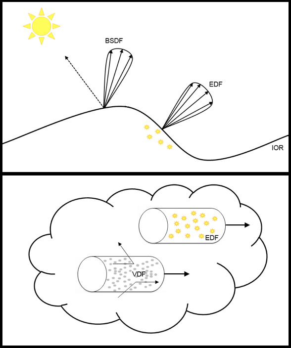

<!-----
MaterialX Physically Based Shading Nodes v1.39
----->


# MaterialX Physically Based Shading Nodes

**Version 1.39**  
Niklas Harrysson - Lumiere Software  
Doug Smythe - Industrial Light & Magic  
Jonathan Stone - Lucasfilm Advanced Development Group  
June 5, 2026

# Introduction

The [MaterialX Specification](./MaterialX.Specification.md) describes a number of standard nodes that may be used to construct node graphs for the processing of images, procedurally-generated values, coordinates and other data. With the addition of user-defined custom nodes, it is possible to describe complete rendering shaders using node graphs. Up to this point, there has been no standardization of the specific shader-semantic nodes used in these node graph shaders, although with the widespread shift toward physically-based shading, it appears that the industry is settling upon a number of specific BSDF and other functions with standardized parameters and functionality.

This document describes a number of shader-semantic nodes implementing widely-used surface scattering, emission and volume distribution functions and utility nodes useful in constructing complex layered rendering shaders using node graphs. These nodes in combination with other nodes may be used with the [MaterialX Shader Generation](../DeveloperGuide/ShaderGeneration.md) system.


## Table of Contents

**[Physical Material Model](#physical-material-model)**  
 [Scope](#scope)  
 [Physically Plausible Materials](#physically-plausible-materials)  
 [Quantities and Units](#quantities-and-units)  
 [Color Management](#color-management)  
 [Surfaces](#surfaces)  
  [Layering](#layering)  
  [Bump and Normal Mapping](#bump-and-normal-mapping)  
 [Volumes](#volumes)  
 [Lights](#lights)  
 [Scattering Framework](#scattering-framework)  
  [Symbols](#symbols)  
  [Media, Interfaces, and Scattering Events](#media-interfaces-and-scattering-events)  
  [Bidirectional Scattering Distribution Function](#bidirectional-scattering-distribution-function)  
  [Emission Distribution Function](#emission-distribution-function)  
  [Reflection and Transmission](#reflection-and-transmission)  
  [Diffuse, Glossy, and Specular](#diffuse-glossy-and-specular)  
 [Reflectance Models](#reflectance-models)  
  [Microfacet Model](#microfacet-model)  
  [Directional Albedo and Energy Conservation](#directional-albedo-and-energy-conservation)  
  [Thin-Film Iridescence](#thin-film-iridescence)  
 [Light Transport](#light-transport)  
  [The Light Transport Equation](#the-light-transport-equation)  
  [The Equation of Transfer](#the-equation-of-transfer)  

**[MaterialX PBS Library](#materialx-pbs-library)**  
 [Data Types](#data-types)  
 [BSDF Nodes](#bsdf-nodes)  
 [EDF Nodes](#edf-nodes)  
 [VDF Nodes](#vdf-nodes)  
 [PBR Shader Nodes](#pbr-shader-nodes)  
 [Utility Nodes](#utility-nodes)  

**[Shading Model Examples](#shading-model-examples)**  
 [Autodesk Standard Surface](#autodesk-standard-surface)  
 [UsdPreviewSurface](#usdpreviewsurface)  
 [Khronos glTF PBR](#khronos-gltf-pbr)  
 [OpenPBR Surface](#openpbr-surface)  

**[Appendix: Extended Reflectance Models](#appendix-extended-reflectance-models)**  
 [EON Reflectance Model](#eon-reflectance-model)  
 [Subsurface Scattering Model](#subsurface-scattering-model)  
 [Zeltner Sheen Model](#zeltner-sheen-model)  
 [Chiang Hair Model](#chiang-hair-model)  
 [Thin-Film Iridescence Model](#thin-film-iridescence-model)  

**[References](#references)**

<br>


# Physical Material Model

This section describes the material model used in the MaterialX Physically Based Shading (PBS) library and the rules we must follow to be physically plausible.


## Scope

A material describes the properties of a surface or medium that involves how it reacts to light. To be efficient, a material model is split into different parts, where each part handles a specific type of light interaction: light being scattered at the surface, light being emitted from a surface, light being scattered inside a medium, etc. The goal of our material model definition is to describe light-material interactions typical for physically plausible rendering systems, including those in feature film production, real-time preview, and game engines.

Our model has support for surface materials, which includes scattering and emission of light from the surface of objects, and volume materials, which includes scattering and emission of light within a participating medium. For lighting, we support local lights and distant light from environments. Geometric modification is supported in the form of bump and normal mapping as well as displacement mapping.


## Physically Plausible Materials

The initial requirements for a physically-plausible material are that it 1) should be energy conserving and 2) support reciprocity. The energy conserving says that the sum of reflected and transmitted light leaving a surface must be less than or equal to the amount of light reaching it. The reciprocity requirement says that if the direction of the traveling light is reversed, the response from the material remains unchanged. That is, the response is identical if the incoming and outgoing directions are swapped. All materials implemented for ShaderGen should respect these requirements and only in rare cases deviate from it when it makes sense for the purpose of artistic freedom.


## Quantities and Units

Radiometric quantities are used by the material model for interactions with the renderer. The fundamental radiometric quantity is **radiance** (measured in $`W\,m^{-2}\,sr^{-1}`$) and gives the intensity of light arriving at, or leaving from, a given point in a given direction. If incident radiance is integrated over all directions we get **irradiance** (measured in $`W\,m^{-2}`$), and if we integrate this over surface area we get **power** (measured in $W$). Input parameters for materials and lights specified in photometric units can be suitably converted to their radiometric counterparts before being submitted to the renderer.

When the renderer operates in RGB rather than on a full spectrum, each of the red, green, and blue channels carries the convolution of a spectral radiance distribution with a sensor response function, so the quantity actually transported is neither spectral radiance nor luminance, but an _integrated radiance_, also called a _tristimulus weight_. The radiometric units used throughout this document should therefore be understood as nominal: they identify the physical quantity that each value represents in an idealized spectral sense, and fix the relative scaling between quantities, while the absolute scale of emission and the mapping to displayed pixel values are governed by the renderer's exposure and color-management conventions.

The interpretation of the data types returned by surface and volume shaders are unspecified, and left to the renderer and the shader generator for that renderer to decide. For an OpenGL-type renderer they will be tuples of floats containing radiance calculated directly by the shader node, but for an OSL-type renderer they may be closure primitives that are used by the renderer in the light transport simulation.

In general, a color given as input to the renderer is considered to represent a linear RGB color space. However, there is nothing stopping a renderer from interpreting the color type differently, for instance to hold spectral values. In that case, the shader generator for that renderer needs to handle this in the implementation of the nodes involving the color type.


## Color Management

MaterialX supports the use of [color management systems](./MaterialX.Specification.md#color-spaces-and-color-management-systems) to associate colors with specific color spaces. A MaterialX document typically specifies the working color space that is to be used for the document as well as the color space in which input values and textures are given. If these color spaces are different from the working color space, it is the application's and shader generator's responsibility to transform them.

The ShaderGen module has an interface that can be used to integrate support for different color management systems. A simplified implementation with some popular and commonly used color transformations is supplied and enabled by default. An integration with the relevant portions of OpenColorIO ([http://opencolorio.org](http://opencolorio.org)) is planned for the future.


## Surfaces

In our surface shading model the scattering and emission of light is controlled by distribution functions. Incident light can be reflected off, transmitted through, or absorbed by a surface. This is represented by a Bidirectional Scattering Distribution Function (BSDF). Light can also be emitted from a surface, for instance from a light source or glowing material. This is represented by an Emission Distribution Function (EDF). The PBS library introduces the [data types](#data-types) `BSDF` and `EDF` to represent the distribution functions, and there are nodes for constructing, combining and manipulating them.



Another important property is the **index of refraction** (IOR), which describes how light is propagated through a medium. It controls how much a light ray is bent when crossing the interface between two media of different refractive indices. It also determines the amount of light that is reflected and transmitted when reaching the interface, as described by the Fresnel equations.

A surface shader is represented with the data type `surfaceshader`. In the PBS library there is a [&lt;surface>](#node-surface) node that constructs a surface shader from a BSDF and an EDF. Since there are nodes to combine and modify them, you can easily build surface shaders from different combinations of distribution functions. Inputs on the distribution function nodes can be connected, and nodes from the standard library can be combined into complex calculations, giving flexibility for the artist to author material variations over the surfaces.

It is common for shading models to differentiate between closed surfaces and thin-walled surfaces. A closed surface represents a closed watertight interface with a solid interior. A typical example is a solid glass object. A thin-walled surface on the other hand has an infinitely thin volume, as with a sheet of paper or a soap bubble. For a closed surface there can be no backside visible if the material is opaque. In the case of a transparent closed surface a backside hit is treated as light exiting the closed interface. For a thin-walled surface both the front and back side are visible and it can either have the same material on both sides or different materials on each side. If the material is transparent in this case the thin wall makes the light transmit without refraction or scattering. By default the [&lt;surface>](#node-surface) node constructs a surface shader for a closed surface, but there is a boolean switch to make it thin-walled.

In order to assign different shaders to each side of a thin-walled object the [&lt;surfacematerial>](./MaterialX.Specification.md#node-surfacematerial) node in the standard library has an input to connect an extra backside surface shader. If any of the sides of a &lt;surfacematerial> has a thin-walled shader connected, both sides are considered to be thin-walled. Hence the thin-walled property takes precedence to avoid ambiguity between the sides. If only one side has a shader connected this is used for both sides. If both sides are connected but none of the shaders are thin-walled the front shader is used. The thin-walled property also takes precedence in the case of mixing surface shaders. If any of the shaders involved in the mix is thin-walled, both shaders are considered to be thin-walled.

Note that in order to have surface shaders set for both sides the geometry has to be set as double-sided. Geometry sidedness is a property not handled by MaterialX and needs to be set elsewhere.


### Layering

In order to simplify authoring of complex materials, our model supports the notion of layering. Typical examples include: adding a layer of clear coat over a car paint material, or putting a layer of dirt or rust over a metal surface. Layering can be done in a number of different ways:


* Horizontal Layering: A simple way of layering is using per-shading-point linear mixing of different BSDFs where a mix factor is given per BSDF controlling its contribution. Since the weight is calculated per shading point it can be used as a mask to hide contributions on different parts of a surface. The weight can also be calculated dependent on view angle to simulate approximate Fresnel behavior. This type of layering can be done both on a BSDF level and on a surface shader level. The latter is useful for mixing complete shaders which internally contain many BSDFs, e.g. to put dirt over a car paint, grease over a rusty metal or adding decals to a plastic surface. We refer to this type of layering as **horizontal layering** and the [&lt;mix>](#node-mix) node in the PBS library can be used to achieve this (see below).
* Vertical Layering: A more physically correct form of layering is also supported where a top BSDF layer is placed over another base BSDF layer, and the light not reflected by the top layer is assumed to be transmitted to the base layer; for example, adding a dielectric coating layer over a substrate. The refraction index and roughness of the coating will then affect the attenuation of light reaching the substrate. The substrate can be a transmissive BSDF to transmit the light further, or a reflective BSDF to reflect the light back up through the coating. The substrate can in turn be a reflective BSDF to simulate multiple specular lobes. We refer to this type of layering as **vertical layering** and it can be achieved using the [&lt;layer>](#node-layer) node in the PBS library. See [&lt;dielectric_bsdf>](#node-dielectric-bsdf) and [&lt;sheen_bsdf>](#node-sheen-bsdf) below.
* Shader Input Blending: Calculating and blending many BSDFs or separate surface shaders can be expensive. In some situations good results can be achieved by blending the texture/value inputs instead, before any illumination calculations. Typically one would use this with an über-shader that can simulate many different materials, and by masking or blending its inputs over the surface you get the appearance of having multiple layers, but with less expensive texture or value blending. Examples of this are given in the main [MaterialX Specification "Pre-Shader Compositing Example"](./MaterialX.Specification.md#example-pre-shader-compositing-material).


### Bump and Normal Mapping

The surface normal used for shading calculations is supplied as input to each BSDF that requires it. The normal can be perturbed by bump or normal mapping, before it is given to the BSDF. As a result, one can supply different normals for different BSDFs for the same shading point. When layering BSDFs, each layer can use different bump and normal maps.


## Volumes

In our volume shader model the scattering of light in a participating medium is controlled by a volume distribution function (VDF), with coefficients controlling the rate of absorption and scattering. The VDF represents what physicists call a _phase function_, describing how the light is distributed from its current direction when it is scattered in the medium. This is analogous to how a BSDF describes scattering at a surface, but with one important difference: a VDF is normalized, summing to 1.0 if all directions are considered. Additionally, the amount of absorption and scattering is controlled by coefficients that gives the rate (probability) per distance traveled in world space. The **absorption coefficient** sets the rate (per unit-length) of absorption of light energy traveling through the medium, and the **scattering coefficient** sets the rate (per unit-length) at which the light is scattered from its current direction. The units for these are $m^{-1}$.

Light can also be emitted from a volume. This is represented by an EDF analog to emission from surfaces, but in this context the emission is given as radiance per distance traveled through the medium. The unit for this is $`W\,m^{-3}\,sr^{-1}`$. Because a participating medium has no surface normal to orient the distribution, volume emission is assumed to be isotropic.

The [&lt;volume>](#node-volume) node in the PBS library constructs a volume shader from individual VDF and EDF components. There are also nodes to construct various VDFs, as well as nodes to combine them to build more complex ones.

VDFs can also be used to describe the interior of a surface. A typical example would be to model how light is absorbed or scattered when transmitted through colored glass or turbid water. This is done by layering a BSDF for the surface transmission over the VDF using a [&lt;layer>](#node-layer) node.


## Lights

Light sources can be divided into environment lights and local lights. Environment lights represent contributions coming from infinitely far away. All other lights are local lights and have a position and extent in space.

Local lights are specified as light shaders assigned to a locator, modeling an explicit light source, or in the form of emissive geometry using an emissive surface shader. The [&lt;light>](#node-light) node in the PBS library constructs a light shader from an EDF. There are also nodes to construct various EDFs as well as nodes to combine them to build more complex ones. Emissive properties of surface shaders are also modelled using EDFs; see the [**EDF Nodes**](#edf-nodes) section below for more information.

Light contributions coming from far away are handled by environment lights. These are typically photographically-captured or procedurally-generated images that surround the whole scene. This category of lights also includes sources like the sun, where the long distance traveled makes the light essentially directional and without falloff. For all shading points, an environment is seen as being infinitely far away.


## Scattering Framework

The [Surfaces](#surfaces) and [Volumes](#volumes) sections above introduce the BSDF, EDF, and VDF informally. This section defines the formal notation, the scattering and emission distribution functions, and the descriptive terminology used by the per-node equations in the [MaterialX PBS Library](#materialx-pbs-library) chapter below.

### Symbols

In scattering equations, the subscript $_i$ denotes a quantity related to the *incoming* direction, and the subscript $_o$ denotes a quantity related to the *outgoing* direction. Depending on the rendering algorithm in use, these notions may be reversed or not well-defined. For the purposes of this document, we assume a unidirectional path-tracing algorithm: the outgoing direction $\omega_o$ points along the path toward the eye, and the incoming direction $\omega_i$ points along the path away from the eye. Both vectors are defined at a position $p$ and both point away from that position.

|Symbol|Description|
|------|-----------|
|$L_i$|Incident radiance at $p$ along direction $\omega_i$|
|$L_o$|Exitant radiance at $p$ along direction $\omega_o$|
|$L_e$|Emitted radiance at $p$ along direction $\omega_o$|
|$p$|Position of a scattering event on a surface or in a volume|
|$n$|Unit surface normal vector at $p$|
|$\omega_i$|Direction from $p$ along which incident radiance arrives|
|$\omega_o$|Direction from $p$ along which exitant radiance leaves|
|$\omega_h = \dfrac{\omega_i + \omega_o}{\lVert \omega_i + \omega_o \rVert}$|Half-vector between $\omega_i$ and $\omega_o$|
|$\theta$|Elevation angle of a direction from the surface normal|
|$\theta_i$|Elevation angle of the incident direction|
|$\theta_o$|Elevation angle of the exitant direction|
|$\theta_t$|Elevation angle of the exitant transmitted direction, measured from the inverted surface normal|
|$\phi$|Azimuthal angle of a direction around the surface normal|
|$\phi_i$|Azimuthal angle of the incident direction|
|$\phi_o$|Azimuthal angle of the exitant direction|
|$\Omega_i$|Hemisphere of incident directions around the surface normal|
|$\mathbb{S}^2$|Unit sphere of directions around $p$|
|$\eta_i$|Absolute index of refraction of the medium on the incident side of an interface|
|$\eta_t$|Absolute index of refraction of the medium on the transmitted side of an interface|
|$\eta = \eta_t / \eta_i$|Relative index of refraction across an interface|


### Media, Interfaces, and Scattering Events

A **medium** is a distribution of matter contained in some (possibly infinite or semi-infinite) region of space; its properties dictate how it interacts with electromagnetic radiation such as visible light. An **interface** is a boundary between two media of different properties. A **volume** is a three-dimensional region of space containing a medium, and a **surface** is a geometric representation of an interface.

A **scattering event** occurs when radiance arriving at a position $p$ from direction $\omega_i$ is redirected along a new direction $\omega_o$. The energy arriving along $\omega_i$ need not be fully redirected along $\omega_o$ — the remainder is absorbed or scattered in other directions.


### Bidirectional Scattering Distribution Function

The **bidirectional scattering distribution function** (BSDF) describes the proportion of radiance scattered at a surface from an incoming direction $\omega_i$ to an outgoing direction $\omega_o$:

```math
f(\omega_i, \omega_o) = \frac{dL_o}{L_i \cos\theta_i \; d\omega_i}
```
<p></p>

The **bidirectional reflectance distribution function** $f_r(\omega_i, \omega_o)$ (BRDF) and **bidirectional transmittance distribution function** $f_t(\omega_i, \omega_o)$ (BTDF) are specializations of the BSDF. For the BRDF, $\omega_i$ and $\omega_o$ lie in the same hemisphere; for the BTDF, they lie in opposite hemispheres.

Further specializations include the **bidirectional curve-scattering distribution function** $f_c$ (BCSDF), which defines scattering between directions from an infinitesimally thin cylinder as used by [&lt;chiang_hair_bsdf>](#node-chiang-hair-bsdf), and the **bidirectional subsurface-scattering distribution function** $f_{\text{sss}}(\omega_i, \omega_o, p_i, p_o)$, which defines scattering between directions and between positions on a surface as used by [&lt;subsurface_bsdf>](#node-subsurface-bsdf).


### Emission Distribution Function

The **emission distribution function** (EDF) describes the radiance emitted at a position $p$ along an outgoing direction $\omega_o$. For a surface emitting radiant flux $\Phi_e$, the emitted radiance is:

```math
L_e(\omega_o) = \frac{d^2\Phi_e}{dA \, \cos\theta_o \; d\omega_o}
```
<p></p>

where $dA$ is the differential area around $p$. Unlike the BSDF, the EDF is a function of a single direction and carries no dependence on an incident direction or cosine factor. For surface EDFs, $L_e$ has units of $`W\,m^{-2}\,sr^{-1}`$; for volume EDFs, $`W\,m^{-3}\,sr^{-1}`$.


### Reflection and Transmission

**Reflection** is a scattering event where the exitant direction $\omega_o$ lies in the same hemisphere as the incident direction $\omega_i$, that is:

```math
\mathrm{sgn}(\omega_i \cdot n) = \mathrm{sgn}(\omega_o \cdot n)
```
<p></p>

**Transmission** is a scattering event where $\omega_o$ lies in the opposite hemisphere from $\omega_i$, that is:

```math
\mathrm{sgn}(\omega_i \cdot n) \ne \mathrm{sgn}(\omega_o \cdot n)
```
<p></p>

The **reflectance** and **transmittance** are the fractions of incident energy leaving a scattering event via reflection and transmission, respectively.

The **reflection direction** $\omega_r$ of $\omega_i$ about a surface or microfacet normal is:

```math
\omega_r = 2(\omega_i \cdot n) n - \omega_i
```
<p></p>

The **refraction direction** $\omega_t$ of $\omega_i$ about a surface or microfacet normal, for media with incident and transmitted indices of refraction $\eta_i$ and $\eta_t$, is:

```math
\cos\theta_t = \sqrt{1 - \left(\frac{\eta_i}{\eta_t}\right)^2 \sin^2\theta_i}
```
<p></p>

```math
\omega_t = -\frac{\eta_i}{\eta_t} \omega_i + \left(\frac{\eta_i}{\eta_t}\cos\theta_i - \cos\theta_t\right) n
```
<p></p>


### Diffuse, Glossy, and Specular

The terms **diffuse**, **glossy**, and **specular** offer a perceptual classification of scattering distributions. They are not precisely defined, but are useful when describing and comparing BSDFs. The distinction concerns how broadly or narrowly the scattered energy is distributed across exitant directions, rather than which directions receive energy:

* **Diffuse**: scattered energy is spread broadly across a hemisphere (either upper or lower) around the surface normal, varying only gradually with exitant direction.
* **Specular**: scattered energy is concentrated entirely, or almost entirely, along the reflection or refraction direction. The idealized perfectly specular case is a Dirac delta distribution that carries all of its energy in that single direction.
* **Glossy**: scattered energy is concentrated about the reflection or refraction direction but spread more broadly than in the specular case, forming the intermediate regime between diffuse and specular.


## Reflectance Models

This section defines the shared reflectance models referenced by multiple BSDF nodes in the [MaterialX PBS Library](#materialx-pbs-library) below.

### Microfacet Model

The [&lt;dielectric_bsdf>](#node-dielectric-bsdf), [&lt;conductor_bsdf>](#node-conductor-bsdf), and [&lt;generalized_schlick_bsdf>](#node-generalized-schlick-bsdf) nodes share a microfacet model[^Walter2007] in which a surface is treated as a collection of infinitesimal, perfectly specular mirrors (**microfacets**) whose orientations are distributed around the macroscopic surface normal. All three nodes use the microfacet BRDF for reflection. The [&lt;dielectric_bsdf>](#node-dielectric-bsdf) and [&lt;generalized_schlick_bsdf>](#node-generalized-schlick-bsdf) nodes additionally use the microfacet BTDF for transmission when `scatter_mode` is set to T or RT.

Both the BRDF and BTDF share a common normal distribution function $D$ and masking-shadowing function $G_2$, and differ in their geometric and Fresnel terms. The Fresnel reflectance $F$ is defined per node.

The `retroreflective` input of the [&lt;dielectric_bsdf>](#node-dielectric-bsdf), [&lt;conductor_bsdf>](#node-conductor-bsdf), and [&lt;generalized_schlick_bsdf>](#node-generalized-schlick-bsdf) nodes modifies only the reflection lobe. For the [&lt;dielectric_bsdf>](#node-dielectric-bsdf) and [&lt;generalized_schlick_bsdf>](#node-generalized-schlick-bsdf) nodes it therefore applies when `scatter_mode` is `R` or `RT`, and has no effect when `scatter_mode` is `T`. The [&lt;conductor_bsdf>](#node-conductor-bsdf) node has no `scatter_mode` input and is always reflective, so its `retroreflective` input always applies.

#### Microfacet BRDF

```math
f_r(\omega_i, \omega_o) = \frac{D(\omega_h) F(\omega_i, \omega_h) G_2(\omega_i, \omega_o)}{4 \cos\theta_i \cos\theta_o}
```
<p></p>

where $\omega_h$ is the half-vector between $\omega_i$ and $\omega_o$ as defined in the [Symbols](#symbols) table.

#### Microfacet BTDF

The microfacet BTDF uses a transmission half-vector that accounts for the change in index of refraction across the interface:

```math
\omega_{ht} = -\frac{\eta_i \omega_i + \eta_t \omega_o}{\lVert \eta_i \omega_i + \eta_t \omega_o \rVert}
```
<p></p>

where $\eta_i$ and $\eta_t$ are the absolute indices of refraction of the incident and transmitted media, whose ratio $\eta_t/\eta_i$ is the relative index $\eta$ of the [Symbols](#symbols) table. The BTDF is:

```math
f_t(\omega_i, \omega_o) = \frac{|\omega_i \cdot \omega_{ht}| \cdot |\omega_o \cdot \omega_{ht}|}{\cos\theta_i \cos\theta_t} \cdot \frac{\eta_t^2 (1 - F(\omega_i, \omega_{ht})) D(\omega_{ht}) G_2(\omega_i, \omega_o)}{(\eta_i (\omega_i \cdot \omega_{ht}) + \eta_t (\omega_o \cdot \omega_{ht}))^2}
```
<p></p>

where $1 - F$ is the Fresnel transmittance, the complement of the Fresnel reflectance defined per node.

#### GGX Normal Distribution Function

The microfacet normal distribution is the anisotropic GGX (Trowbridge-Reitz) function[^Walter2007]:

```math
D(\omega_h) = \frac{1}{\pi \alpha_x \alpha_y\left(\left(\dfrac{h_x}{\alpha_x}\right)^2 + \left(\dfrac{h_y}{\alpha_y}\right)^2 + h_z^2\right)^2}
```
<p></p>

where $\alpha_x$ and $\alpha_y$ are the roughness values along the surface tangent and bitangent, and $h_x$, $h_y$, $h_z$ are the components of $\omega_h$ (or $\omega_{ht}$ for transmission) in the local tangent frame.

The pair $(\alpha_x, \alpha_y)$ is supplied directly by the `roughness` input of each microfacet node, with no internal remapping. These low-level values may be computed from perceptual roughness and glossiness parameterizations using the [&lt;roughness_anisotropy>](#node-roughness-anisotropy), [&lt;roughness_dual>](#node-roughness-dual), and [&lt;glossiness_anisotropy>](#node-glossiness-anisotropy) utility nodes.

#### Height-Correlated Smith Masking-Shadowing

The joint masking-shadowing function is the height-correlated form of the Smith function[^Heitz2014]:

```math
G_2(\omega_i, \omega_o) = \frac{2 \cos\theta_i \cos\theta_o}{\lambda_o \cos\theta_i + \lambda_i \cos\theta_o}
```
<p></p>

where $\lambda_i = \lambda(\cos\theta_i)$, $\lambda_o = \lambda(\cos\theta_o)$, $\lambda(\cos\theta) = \sqrt{\alpha^2 + (1 - \alpha^2) \cos^2\theta}$, and $\alpha = \sqrt{\alpha_x \alpha_y}$ when the roughness is anisotropic.


### Directional Albedo and Energy Conservation

The **directional albedo** $E_o$ of a BSDF is its integral over all incident directions, for a fixed exitant direction $\omega_o$:

```math
E_o = \int_{\Omega_i} f(\omega_i, \omega_o) \cos\theta_i \; d\omega_i
```
<p></p>

The directional albedo is the quantity referenced by the [&lt;layer>](#node-layer) node when performing albedo-scaled vertical layering of a top BSDF over a base.

#### Energy Compensation

The single-scattering microfacet BRDF does not account for light that scatters multiple times between microfacets before leaving the surface. As roughness increases, the energy lost to these unmodeled paths becomes significant, and is compensated using a multiplicative correction factor[^Turquin2019]:

```math
f_r^{\text{comp}}(\omega_i, \omega_o) = f_r(\omega_i, \omega_o)\left(1 + F_{\text{ss}} \frac{1 - E_{\text{ss}}}{E_{\text{ss}}}\right)
```
<p></p>

where $E_{\text{ss}}$ is the directional albedo of the microfacet BRDF evaluated with unit Fresnel ($F = 1$), and $F_{\text{ss}}$ is the cosine-weighted hemispherical average of the Fresnel reflectance of the BSDF being compensated.


### Thin-Film Iridescence

The [&lt;dielectric_bsdf>](#node-dielectric-bsdf), [&lt;conductor_bsdf>](#node-conductor-bsdf), and [&lt;generalized_schlick_bsdf>](#node-generalized-schlick-bsdf) nodes support an optional thin-film interference effect[^Belcour2017]. A thin dielectric film of thickness $d$ (in nanometers) and index of refraction $\eta_2$ is placed between the outer medium ($\eta_1$, assumed to be vacuum with $\eta_1 = 1$) and the node's substrate. The substrate is characterized by its own optical properties: a real-valued IOR $\eta_3$ for dielectrics, a complex IOR $(\eta_3, \kappa_3)$ for conductors, or Schlick reflectance values mapped to an effective $\eta_3$.

When `thinfilm_thickness` is set to a non-zero value, the standard Fresnel reflectance $F$ defined by each node is replaced by the Airy reflectance $F_{\text{airy}}$, computed by summing the contributions of successive reflections between the two interfaces of the film. The reflectance is evaluated independently for the parallel (p) and perpendicular (s) polarization states and averaged:

```math
F_{\text{airy}} = \tfrac{1}{2} \sum_{\text{pol} \in \{p,s\}} \left[ R_{12} + \frac{T_{12}^2 R_{23}}{1 - R_{12} R_{23}} + \sum_{m=1}^{M} C_m S_m \right]
```
<p></p>

where $R_{12}$ and $R_{23}$ are the polarized Fresnel reflectances at the first (air–film) and second (film–substrate) interfaces, $T_{12} = 1 - R_{12}$ is the transmittance through the first interface, $C_m$ are amplitude coefficients that account for successive bounces within the film, and $S_m$ encodes the spectral interference pattern for bounce order $m$ as a function of the optical path difference and accumulated phase shifts. The result is converted from a spectral representation to RGB. The full derivation, including polarized phase shifts and spectral-to-RGB conversion, is given in the [Thin-Film Iridescence Model](#thin-film-iridescence-model) appendix.


## Light Transport

The [BSDF](#bidirectional-scattering-distribution-function) and [EDF](#emission-distribution-function) describe scattering and emission at a single point. The equations in this section describe how those local distributions, together with the radiance arriving from the rest of the scene, determine the radiance leaving a point, following the formulation of Pharr et al.[^Pharr2023]. The [&lt;surface>](#node-surface), [&lt;volume>](#node-volume), and [&lt;light>](#node-light) shader nodes assemble per-node BSDFs, EDFs, and VDFs into these equations.

### The Light Transport Equation

For a surface, the exitant radiance $L_o$ leaving a point $p$ along direction $\omega_o$ is the sum of the radiance emitted at $p$ and the radiance scattered toward $\omega_o$ from all incident directions:

```math
L_o(\omega_o) = L_e(\omega_o) + \int_{\mathbb{S}^2} f(\omega_i, \omega_o)\, L_i(\omega_i)\, |\omega_i \cdot n|\; d\omega_i
```
<p></p>

where $f$ is the surface BSDF, $L_e$ is the surface EDF, and $L_i(\omega_i)$ is the radiance incident at $p$ from direction $\omega_i$. The integral is taken over the entire sphere of directions $\mathbb{S}^2$ rather than a single hemisphere, so that transmissive BSDFs — whose incident and exitant directions lie in opposite hemispheres — are included. The factor $|\omega_i \cdot n| = |\cos\theta_i|$ accounts for the projected solid angle of the incident direction.

### The Equation of Transfer

For a participating medium, radiance is continuously attenuated by absorption and out-scattering and augmented by emission and in-scattering. The change in radiance $L$ per unit distance traveled along $\omega_o$ is given by the equation of transfer:

```math
(\omega_o \cdot \nabla)\, L(p, \omega_o) = -\sigma_t\, L(p, \omega_o) + \sigma_s \int_{\mathbb{S}^2} f_p(\omega_i, \omega_o)\, L(p, \omega_i)\; d\omega_i + L_e(p, \omega_o)
```
<p></p>

The first term attenuates radiance by the extinction coefficient $\sigma_t = \sigma_a + \sigma_s$. The second adds radiance scattered into $\omega_o$ from all directions, weighted by the scattering coefficient $\sigma_s$ and the phase function $f_p$. The final term $L_e$ is the volume emission, stated in $`W\,m^{-3}\,sr^{-1}`$; it corresponds to the product $\sigma_a L_e$ of an absorption coefficient and an emitted radiance in the formulation of Pharr et al.[^Pharr2023]. The coefficients $\sigma_a$, $\sigma_s$ and the phase function $f_p$ are supplied by the medium's [VDF](#vdf-nodes), and $L_e$ by its [EDF](#edf-nodes).

<br>


# MaterialX PBS Library

MaterialX includes a library of types and nodes for creating physically plausible materials and lights as described above. This section outlines the content of that library.


## Data Types

* `BSDF`: Data type representing a Bidirectional Scattering Distribution Function.
* `EDF`: Data type representing an Emission Distribution Function.
* `VDF`: Data type representing a Volume Distribution Function.

The PBS nodes also make use of the following standard MaterialX types:

* `surfaceshader`: Data type representing a surface shader.
* `lightshader`: Data type representing a light shader.
* `volumeshader`: Data type representing a volume shader.
* `displacementshader`: Data type representing a displacement shader.


## BSDF Nodes

The equations below use the symbols and notation defined in the [Scattering Framework](#scattering-framework), together with the shared reflectance models defined in [Reflectance Models](#reflectance-models).

<a id="node-oren-nayar-diffuse-bsdf"> </a>

### `oren_nayar_diffuse_bsdf`
Constructs a diffuse reflection BSDF based on the Oren-Nayar reflectance model.

A `roughness` of 0.0 gives Lambertian reflectance.

An `energy_compensation` boolean selects between the Qualitative Oren-Nayar[^Oren1994] and Energy-Preserving Oren-Nayar[^Portsmouth2025] models of diffuse reflectance.

|Port                 |Description                            |Type   |Default         |Accepted Values|
|---------------------|---------------------------------------|-------|----------------|---------------|
|`weight`             |Weight of the BSDF contribution        |float  |1.0             |[0, 1]         |
|`color`              |Diffuse reflectivity or albedo         |color3 |0.18, 0.18, 0.18|               |
|`roughness`          |Surface roughness                      |float  |0.0             |[0, 1]         |
|`normal`             |Normal vector of the surface           |vector3|Nworld          |               |
|`energy_compensation`|Enable energy compensation for the BSDF|boolean|false           |               |
|`out`                |Output: the computed BSDF              |BSDF   |                |               |

In the equations below, the `color` input corresponds to $\rho$, the diffuse albedo, and the `roughness` input corresponds to $\sigma$, where $\sigma \in [0, 1]$.

#### Qualitative Oren-Nayar Reflectance Equations

```math
A = 1 - 0.5\left(\frac{\sigma^2}{\sigma^2 + 0.33}\right)
```
<p></p>

```math
B = 0.45\left(\frac{\sigma^2}{\sigma^2 + 0.09}\right)
```
<p></p>

```math
g(\omega_i,\omega_o) = \max\left(0, \cos(\phi_i - \phi_o)\right)\sin\alpha \tan\beta,\quad \alpha = \max(\theta_i,\theta_o),\quad \beta = \min(\theta_i,\theta_o)
```
<p></p>

```math
f_r(\omega_i,\omega_o) = \frac{\rho}{\pi}\bigl(A + B g(\omega_i,\omega_o)\bigr)
```
<p></p>

#### Energy-Preserving Oren-Nayar (EON) Reflectance Equations

When `energy_compensation` is enabled, the EON model[^Portsmouth2025] decomposes the BRDF into a single-scatter lobe based on Fujii's improved Oren-Nayar formulation[^Fujii2020] and a multi-scatter lobe that compensates for inter-reflection energy lost at higher roughness values. The full derivation is given in the [EON Reflectance Model](#eon-reflectance-model) appendix.

<a id="node-burley-diffuse-bsdf"> </a>

### `burley_diffuse_bsdf`
Constructs a diffuse reflection BSDF based on the corresponding component of the Disney Principled model[^Burley2012].

|Port       |Description                    |Type    |Default         |Accepted Values|
|-----------|-------------------------------|--------|----------------|---------------|
|`weight`   |Weight of the BSDF contribution|float   |1.0             |[0, 1]         |
|`color`    |Diffuse reflectivity or albedo |color3  |0.18, 0.18, 0.18|               |
|`roughness`|Surface roughness              |float   |0.0             |[0, 1]         |
|`normal`   |Normal vector of the surface   |vector3 |Nworld          |               |
|`out`      |Output: the computed BSDF      |BSDF    |                |               |

In the equations below, the `color` input corresponds to $\rho$, the diffuse albedo, and the `roughness` input corresponds to $\sigma$, a perceptual roughness controlling the transition from Fresnel darkening at grazing angles for smooth surfaces to retroreflection for rough surfaces.

#### Burley Diffuse Reflectance Equations

The model uses a modified Schlick Fresnel factor with $F_0 = 1$ (no modification at normal incidence) and a roughness-dependent grazing term $F_{D90}$:

```math
F_{D90} = \tfrac{1}{2} + 2\sigma (\omega_i \cdot \omega_h)^2
```
<p></p>

```math
F_D(\theta) = 1 + (F_{D90} - 1)(1 - \cos\theta)^5
```
<p></p>

```math
f_r(\omega_i, \omega_o) = \frac{\rho}{\pi} F_D(\theta_i) F_D(\theta_o)
```
<p></p>

<a id="node-dielectric-bsdf"> </a>

### `dielectric_bsdf`
Constructs a reflection and/or transmission BSDF based on a microfacet reflectance model and a Fresnel curve for dielectrics[^Walter2007]. If reflection scattering is enabled the node may be layered vertically over a base BSDF for the surface beneath the dielectric layer. By chaining multiple &lt;dielectric_bsdf> nodes you can describe a surface with multiple specular lobes. If transmission scattering is enabled the node may be layered over a VDF describing the surface interior to handle absorption and scattering inside the medium, useful for colored glass, turbid water, etc.

Implementations are expected to preserve energy as the roughness of the surface increases, with multiple scattering compensation[^Turquin2019] being a popular implementation strategy.

The `tint` input colors the reflected and transmitted light but should be left at white (1,1,1) for physically correct results. Setting the `ior` input to zero disables the Fresnel curve, allowing reflectivity to be controlled purely by weight and tint.

Setting `retroreflective` to true switches the BSDF to retroreflection mode, where light is reflected back toward the incoming direction rather than the mirror reflection direction[^Portsmouth2026].

Thin-film iridescence effects[^Belcour2017] may be enabled by setting `thinfilm_thickness` to a non-zero value.

The `scatter_mode` controls whether the surface reflects light (`R`), transmits light (`T`), or both (`RT`). In `RT` mode, reflection and transmission occur both when entering and leaving a surface, with their respective intensities controlled by the Fresnel curve. Depending on the IOR and incident angle, total internal reflection may occur even when transmission modes are selected.

|Port                |Description                                                    |Type   |Default      |Accepted Values|
|--------------------|---------------------------------------------------------------|-------|-------------|---------------|
|`weight`            |Weight of the BSDF contribution                                |float  |1.0          |[0, 1]         |
|`tint`              |Color weight to tint the reflected and transmitted light       |color3 |1.0, 1.0, 1.0|               |
|`ior`               |Index of refraction of the surface                             |float  |1.5          |               |
|`roughness`         |Surface roughness along the tangent and bitangent              |vector2|0.05, 0.05   |[0, 1]         |
|`retroreflective`   |Enable retroreflection mode for the BSDF                       |boolean|false        |               |
|`thinfilm_thickness`|Thickness of the iridescent thin-film layer in nanometers      |float  |0.0          |               |
|`thinfilm_ior`      |Index of refraction of the thin-film layer                     |float  |1.5          |               |
|`normal`            |Normal vector of the surface                                   |vector3|Nworld       |               |
|`tangent`           |Tangent vector of the surface                                  |vector3|Tworld       |               |
|`distribution`      |Microfacet distribution type                                   |string |ggx          |ggx            |
|`scatter_mode`      |Surface Scatter mode, specifying reflection and/or transmission|string |R            |R, T, RT       |
|`out`               |Output: the computed BSDF                                      |BSDF   |             |               |

In the equations below, the `tint` input corresponds to $t$ and the `ior` input corresponds to $\eta$, the real-valued index of refraction of the surface *relative to the exterior medium*. The Fresnel formulation below assumes the exterior medium is air/vacuum ($\eta_i \approx 1$), so $\eta$ is equivalently the ratio of the surface IOR to that of the medium on the incident side of the interface.

The tint $t$ scales the node's reflection and transmission lobes directly, multiplying the [microfacet BRDF and BTDF](#microfacet-model) as $t f_r$ and $t f_t$. It does not modify the Fresnel reflectance $F$ itself, so the Fresnel transmittance $1 - F$ used by the BTDF remains untinted.

#### Dielectric Fresnel Equations

The Fresnel reflectance $F$ is computed from the standard Fresnel equations for unpolarized light[^Walter2007], using the optimized formulation given by Lagarde[^Lagarde2013]:

```math
c = \cos\theta
```
<p></p>

```math
g = \sqrt{\eta^2 + c^2 - 1}
```
<p></p>

```math
F = \frac{1}{2}\cdot\frac{(g - c)^2}{(g + c)^2}\left(1 + \frac{\bigl(c(g + c) - 1\bigr)^2}{\bigl(c(g - c) + 1\bigr)^2}\right)
```
<p></p>

When $\eta^2 + c^2 < 1$, the quantity $g$ is imaginary and total internal reflection occurs, in which case $F = 1$.

#### Thin-Film Iridescence

When `thinfilm_thickness` is non-zero, the Fresnel reflectance $F$ above is replaced by the Airy reflectance $F_{\text{airy}}$ defined in [Thin-Film Iridescence](#thin-film-iridescence). The substrate IOR $\eta_3$ is set to the node's `ior` input $\eta$, with $\kappa_3 = 0$ (lossless dielectric). The polarized phase shifts at the film–substrate interface are computed using the complex phase formulas given in the [Thin-Film Iridescence Model](#thin-film-iridescence-model) appendix, evaluated with $\kappa_3 = 0$; these capture the phase flip of the parallel polarization at the film–substrate Brewster angle, as well as the continuous phase shifts arising from total internal reflection within the film.

<a id="node-conductor-bsdf"> </a>

### `conductor_bsdf`
Constructs a reflection BSDF based on a microfacet reflectance model[^Burley2012]. Uses a Fresnel curve with complex refraction index for conductors/metals. If an artistic parametrization[^Gulbrandsen2014] is needed the [&lt;artistic_ior>](#node-artistic-ior) utility node can be connected to handle this.

Implementations are expected to preserve energy as the roughness of the surface increases, with multiple scattering compensation[^Turquin2019] being a popular implementation strategy.

The default values for `ior` and `extinction` represent approximate values for gold.

Setting `retroreflective` to true switches the BSDF to retroreflection mode, where light is reflected back toward the incoming direction rather than the mirror reflection direction[^Portsmouth2026].

Thin-film iridescence effects[^Belcour2017] may be enabled by setting `thinfilm_thickness` to a non-zero value.

|Port                |Description                                              |Type   |Default               |Accepted Values|
|--------------------|---------------------------------------------------------|-------|----------------------|---------------|
|`weight`            |Weight of the BSDF contribution                          |float  |1.0                   |[0, 1]         |
|`ior`               |Index of refraction                                      |color3 |0.183, 0.421, 1.373   |               |
|`extinction`        |Extinction coefficient                                   |color3 |3.424, 2.346, 1.770   |               |
|`roughness`         |Surface roughness                                        |vector2|0.05, 0.05            |[0, 1]         |
|`retroreflective`   |Enable retroreflection mode for the BSDF                 |boolean|false                 |               |
|`thinfilm_thickness`|Thickness of the iridescent thin-film layer in nanometers|float  |0.0                   |               |
|`thinfilm_ior`      |Index of refraction of the thin-film layer               |float  |1.5                   |               |
|`normal`            |Normal vector of the surface                             |vector3|Nworld                |               |
|`tangent`           |Tangent vector of the surface                            |vector3|Tworld                |               |
|`distribution`      |Microfacet distribution type                             |string |ggx                   |ggx            |
|`out`               |Output: the computed BSDF                                |BSDF   |                      |               |

In the equations below, the `ior` input corresponds to $\eta$, the index of refraction per color channel, and the `extinction` input corresponds to $\kappa$, the extinction coefficient per color channel. Together, these define the complex index of refraction $\eta + i\kappa$ of the conductor.

#### Conductor Fresnel Equations

The reflectance $F$ is the average of the s-polarized ($R_s$) and p-polarized ($R_p$) Fresnel reflectances at a conductor interface[^Lagarde2013]:

```math
a^2 + b^2 = \sqrt{(\eta^2 - \kappa^2 - \sin^2\theta)^2 + 4\eta^2 \kappa^2}
```
<p></p>

```math
a = \sqrt{\max\left(0, \tfrac{1}{2}(a^2 + b^2 + \eta^2 - \kappa^2 - \sin^2\theta)\right)}
```
<p></p>

```math
R_s = \frac{a^2 + b^2 - 2a \cdot \cos\theta + \cos^2\theta}{a^2 + b^2 + 2a \cdot \cos\theta + \cos^2\theta}
```
<p></p>

```math
R_p = R_s \cdot \frac{\cos^2\theta (a^2 + b^2) - 2a \cdot \cos\theta\sin^2\theta + \sin^4\theta}{\cos^2\theta (a^2 + b^2) + 2a \cdot \cos\theta\sin^2\theta + \sin^4\theta}
```
<p></p>

```math
F = \tfrac{1}{2}(R_s + R_p)
```
<p></p>

#### Thin-Film Iridescence

When `thinfilm_thickness` is non-zero, the Fresnel reflectance $F$ above is replaced by the Airy reflectance $F_{\text{airy}}$ defined in [Thin-Film Iridescence](#thin-film-iridescence). The substrate is defined by the node's complex index of refraction, with $\eta_3 = \eta$ and $\kappa_3 = \kappa$. The polarized phase shifts at the film–substrate interface are computed using the complex phase formulas given in the [Thin-Film Iridescence Model](#thin-film-iridescence-model) appendix.

<a id="node-generalized-schlick-bsdf"> </a>

### `generalized_schlick_bsdf`
Constructs a reflection and/or transmission BSDF based on a microfacet model and a generalized Schlick Fresnel curve[^Hoffman2023]. If reflection scattering is enabled the node may be layered vertically over a base BSDF for the surface beneath the dielectric layer. By chaining multiple &lt;generalized_schlick_bsdf> nodes you can describe a surface with multiple specular lobes. If transmission scattering is enabled the node may be layered over a VDF describing the surface interior to handle absorption and scattering inside the medium, useful for colored glass, turbid water, etc.

Implementations are expected to preserve energy as the roughness of the surface increases, with multiple scattering compensation[^Turquin2019] being a popular implementation strategy.

The `color82` input provides a multiplier on reflectivity at 82 degrees, useful for capturing the characteristic "dip" in the reflectance curve of metallic surfaces. Setting it to (1,1,1) effectively disables this feature for backward compatibility.

Setting `retroreflective` to true switches the BSDF to retroreflection mode, where light is reflected back toward the incoming direction rather than the mirror reflection direction[^Portsmouth2026].

Thin-film iridescence effects[^Belcour2017] may be enabled by setting `thinfilm_thickness` to a non-zero value.

The `scatter_mode` behavior matches that of `dielectric_bsdf`: in `RT` mode, reflection and transmission occur both when entering and leaving a surface, with intensities controlled by the Fresnel curve. Total internal reflection may occur depending on the incident angle.

|Port                |Description                                                    |Type   |Default      |Accepted Values|
|--------------------|---------------------------------------------------------------|-------|-------------|---------------|
|`weight`            |Weight of the BSDF contribution                                |float  |1.0          |[0, 1]         |
|`color0`            |Reflectivity per color component at facing angles              |color3 |1.0, 1.0, 1.0|               |
|`color82`           |Reflectivity multiplier at 82 degrees                          |color3 |1.0, 1.0, 1.0|               |
|`color90`           |Reflectivity per color component at grazing angles             |color3 |1.0, 1.0, 1.0|               |
|`exponent`          |Exponent for Schlick blending between color0 and color90       |float  |5.0          |               |
|`roughness`         |Surface roughness along the tangent and bitangent              |vector2|0.05, 0.05   |[0, 1]         |
|`retroreflective`   |Enable retroreflection mode for the BSDF                       |boolean|false        |               |
|`thinfilm_thickness`|Thickness of the iridescent thin-film layer in nanometers      |float  |0.0          |               |
|`thinfilm_ior`      |Index of refraction of the thin-film layer                     |float  |1.5          |               |
|`normal`            |Normal vector of the surface                                   |vector3|Nworld       |               |
|`tangent`           |Tangent vector of the surface                                  |vector3|Tworld       |               |
|`distribution`      |Microfacet distribution type                                   |string |ggx          |ggx            |
|`scatter_mode`      |Surface Scatter mode, specifying reflection and/or transmission|string |R            |R, T, RT       |
|`out`               |Output: the computed BSDF                                      |BSDF   |             |               |

In the equations below, the `color0` and `color90` inputs correspond to $r_0$ and $r_{90}$, the `color82` input corresponds to $t$, and the `exponent` input corresponds to $q$ in the generalized Schlick model.

#### Generalized Schlick Equations

The Hoffman[^Hoffman2023] generalization of the Schlick Fresnel curve adds a controllable dip in the reflectance at $\theta_{\max} = \arccos(1/7) \approx 81.79°$, whose depth is set by the `color82` multiplier $t$:

```math
\cos\theta_{\max} = \frac{1}{7}
```
<p></p>

```math
a = \frac{\bigl[r_0 + (r_{90} - r_0)(1 - \cos\theta_{\max})^{q}\bigr](1 - t)}{\cos\theta_{\max}(1 - \cos\theta_{\max})^{6}}
```
<p></p>

```math
F_{\theta} = r_0 + (r_{90} - r_0)(1 - \cos\theta)^{q} - a \cdot \cos\theta (1 - \cos\theta)^{6}
```
<p></p>

#### Thin-Film Iridescence

When `thinfilm_thickness` is non-zero, the Fresnel reflectance $F_{\theta}$ above is replaced by the Airy reflectance $F_{\text{airy}}$ defined in [Thin-Film Iridescence](#thin-film-iridescence). The substrate IOR $\eta_3$ is derived from the `color0` input $r_0$ using the standard Schlick-to-IOR inversion, with $\kappa_3 = 0$. The phase shift at the film–substrate interface uses the step-function approximation given in the [Thin-Film Iridescence Model](#thin-film-iridescence-model) appendix, applied equally to both polarization states.

<a id="node-translucent-bsdf"> </a>

### `translucent_bsdf`
Constructs a translucent (diffuse transmission) BSDF based on the Lambert reflectance model.

|Port     |Description                    |Type   |Default      |Accepted Values|
|---------|-------------------------------|-------|-------------|---------------|
|`weight` |Weight of the BSDF contribution|float  |1.0          |[0, 1]         |
|`color`  |Diffuse transmittance          |color3 |1.0, 1.0, 1.0|               |
|`normal` |Normal vector of the surface   |vector3|Nworld       |               |
|`out`    |Output: the computed BSDF      |BSDF   |             |               |

In the equation below, the `color` input corresponds to $\rho$, the diffuse transmittance.

#### Lambertian Transmittance Equation

The node implements a Lambertian BTDF, the transmission analog of the Lambertian BRDF. Incident light is scattered uniformly over the lower hemisphere (the opposite side of the surface from the incident direction):

```math
f_t(\omega_i, \omega_o) = \frac{\rho}{\pi}
```
<p></p>

<a id="node-subsurface-bsdf"> </a>

### `subsurface_bsdf`
Constructs a subsurface scattering BSDF for subsurface scattering within a homogeneous medium. The parameterization is chosen to match random walk Monte Carlo methods[^Kulla2017] as well as approximate empirical methods[^Christensen2015]. This node is defined compositionally as a BSDF vertically layered over an [&lt;anisotropic_vdf>](#node-anisotropic-vdf), as detailed below.

The `radius` input sets the average distance (mean free path) that light propagates below the surface before scattering back out, and can be set independently for each color channel.

The `anisotropy` input controls the scattering direction: negative values produce backwards scattering, positive values produce forward scattering, and zero produces uniform scattering.

|Port        |Description                               |Type   |Default         |Accepted Values|
|------------|------------------------------------------|-------|----------------|---------------|
|`weight`    |Weight of the BSDF contribution           |float  |1.0             |[0, 1]         |
|`color`     |Diffuse reflectivity (albedo)             |color3 |0.18, 0.18, 0.18|               |
|`radius`    |Mean free path per color channel          |color3 |1.0, 1.0, 1.0   |               |
|`anisotropy`|Anisotropy factor for scattering direction|float  |0.0             |[-1, 1]        |
|`normal`    |Normal vector of the surface              |vector3|Nworld          |               |
|`out`       |Output: the computed BSDF                 |BSDF   |                |               |

#### Compositional Structure

The node's scattering behavior is equivalent to an untinted Lambertian transmission surface — [&lt;translucent_bsdf>](#node-translucent-bsdf) with unit color — vertically layered over a participating medium described by [&lt;anisotropic_vdf>](#node-anisotropic-vdf). Incident light enters the medium through the surface, scatters with phase function asymmetry $g$ (the `anisotropy` input), and exits at a potentially different surface position; its coloring is determined entirely by the volumetric absorption, not by the surface transmission. The resulting distribution function therefore depends on both the incident and exitant surface positions ($p_i$ and $p_o$), as introduced in the [Bidirectional Scattering Distribution Function](#bidirectional-scattering-distribution-function) section.

The artist-facing `color` and `radius` inputs are converted to the volume's physical absorption and scattering coefficients by an albedo inversion, and a renderer may evaluate the result either directly via random-walk volumetric transport or through an equivalent normalized diffusion approximation. These conversions and the diffusion profile are given in the [Subsurface Scattering Model](#subsurface-scattering-model) appendix.

<a id="node-sheen-bsdf"> </a>

### `sheen_bsdf`
Constructs a microfacet BSDF for the back-scattering properties of cloth-like materials. This node may be layered vertically over a base BSDF using a [&lt;layer>](#node-layer) node. All energy that is not reflected will be transmitted to the base layer. A `mode` option selects between two available sheen models, Conty-Kulla[^Conty2017] and Zeltner[^Zeltner2022].

|Port       |Description                                             |Type   |Default      |Accepted Values     |
|-----------|--------------------------------------------------------|-------|-------------|--------------------|
|`weight`   |Weight of the BSDF contribution                         |float  |1.0          |[0, 1]              |
|`color`    |Sheen reflectivity                                      |color3 |1.0, 1.0, 1.0|                    |
|`roughness`|Surface roughness                                       |float  |0.3          |                    |
|`normal`   |Normal vector of the surface                            |vector3|Nworld       |                    |
|`mode`     |Selects between `conty_kulla` and `zeltner` sheen models|string |conty_kulla  |conty_kulla, zeltner|
|`out`      |Output: the computed BSDF                               |BSDF   |             |                    |

In the equations below, the `color` input corresponds to $c$, a non-physical color tint on the sheen lobe, and the `roughness` input corresponds to $r$, the degree to which the microfibers diverge from the surface normal.

#### Conty-Kulla Sheen Equations

```math
D(\theta_h) = \frac{\left(2 + \dfrac{1}{r}\right)\left(1 - \cos^2\theta_h\right)^{\frac{1}{2r}}}{2\pi}
```
<p></p>

```math
f_r(\omega_i,\omega_o,\omega_h) = \frac{c D(\theta_h)}{4(\cos\theta_i + \cos\theta_o - \cos\theta_i\cos\theta_o)}
```
<p></p>

#### Zeltner Sheen Equations

When `mode` is set to `zeltner`, the Zeltner sheen model[^Zeltner2022] approximates multi-scattering cloth reflectance using a Linearly Transformed Cosine (LTC) lobe. The full derivation and fitted coefficients are given in the [Zeltner Sheen Model](#zeltner-sheen-model) appendix.

<a id="node-chiang-hair-bsdf"> </a>

### `chiang_hair_bsdf`
Constructs a hair BSDF based on the Chiang hair shading model[^Chiang2016]. This node does not support vertical layering.

The roughness inputs provide a longitudinal variance $v$ and an azimuthal logistic scale $s$ for each lobe, with (0,0) specifying pure specular scattering. These low-level parameters may be computed from artist-facing longitudinal and azimuthal roughness values using the [&lt;chiang_hair_roughness>](#node-chiang-hair-roughness) utility node. The default `ior` of 1.55 represents the index of refraction for keratin. The `cuticle_angle` is a normalized value in $[0, 1]$, with 0.5 representing no tilt, and values above 0.5 tilting the scales toward the root of the fiber.

|Port                    |Description                                             |Type   |Default      |Accepted Values|
|------------------------|--------------------------------------------------------|-------|-------------|---------------|
|`tint_R`                |Color multiplier for the first R-lobe                   |color3 |1.0, 1.0, 1.0|               |
|`tint_TT`               |Color multiplier for the first TT-lobe                  |color3 |1.0, 1.0, 1.0|               |
|`tint_TRT`              |Color multiplier for the first TRT-lobe                 |color3 |1.0, 1.0, 1.0|               |
|`ior`                   |Index of refraction                                     |float  |1.55         |               |
|`roughness_R`           |Longitudinal variance and azimuthal scale for R-lobe    |vector2|0.1, 0.1     |[0, ∞)         |
|`roughness_TT`          |Longitudinal variance and azimuthal scale for TT-lobe   |vector2|0.05, 0.05   |[0, ∞)         |
|`roughness_TRT`         |Longitudinal variance and azimuthal scale for TRT-lobe  |vector2|0.2, 0.2     |[0, ∞)         |
|`cuticle_angle`         |Normalized cuticle angle                                |float  |0.5          |[0, 1]         |
|`absorption_coefficient`|Absorption coefficient normalized to hair fiber diameter|vector3|0.0, 0.0, 0.0|               |
|`normal`                |Normal vector of the surface                            |vector3|Nworld       |               |
|`curve_direction`       |Direction of the hair geometry                          |vector3|Tworld       |               |
|`out`                   |Output: the computed BSDF                               |BSDF   |             |               |

In the equations below, the `tint_R`, `tint_TT`, and `tint_TRT` inputs correspond to per-lobe color tints $t_R$, $t_{TT}$, $t_{TRT}$; the `ior` input corresponds to $\eta$, the index of refraction of the hair fiber; the `roughness_R`, `roughness_TT`, and `roughness_TRT` inputs each provide a pair $(v, s)$ of longitudinal variance and azimuthal logistic scale values; the `cuticle_angle` input corresponds to $\alpha$; and the `absorption_coefficient` input corresponds to $\sigma_a$.

#### Chiang Hair Scattering Equations

The Chiang hair model[^Chiang2016] treats a hair fiber as a dielectric cylinder with tilted cuticle scales. Directions at a point on the fiber are parameterized by inclination $\theta$ from the fiber's normal plane and azimuth $\phi$ around the fiber, differing from the surface-normal angles used by planar BSDF nodes. The BCSDF is a sum over four scattering lobes — R (surface reflection), TT (double transmission), TRT (internal reflection), and TRRT+ (higher-order paths):

```math
f_c(\omega_i, \omega_o) = \frac{1}{\pi} \sum_{p \in \{R,TT,TRT,TRRT+\}} t_p A_p M_p N_p
```
<p></p>

where $M_p$ is the longitudinal scattering function, $N_p$ is the azimuthal scattering function, and $A_p$ is the attenuation factor combining Fresnel reflectance and volumetric absorption. The higher-order TRRT+ lobe shares the tint $t_{TRT}$ and the roughness values of the TRT lobe. The full definitions of these components are given in the [Chiang Hair Model](#chiang-hair-model) appendix.


## EDF Nodes

The equations below use the symbols, notation, and emission conventions defined in the [Scattering Framework](#scattering-framework).

<a id="node-uniform-edf"> </a>

### `uniform_edf`
Constructs an EDF emitting light uniformly across the hemisphere around the surface normal.

|Port    |Description                                   |Type   |Default      |
|--------|----------------------------------------------|-------|-------------|
|`color` |Radiant emittance of light leaving the surface|color3 |1.0, 1.0, 1.0|
|`out`   |Output: the computed EDF                      |EDF    |             |

In the equation below, the `color` input corresponds to $c$, the emitted radiance.

#### Uniform Emission Equation

```math
L_e(\omega_o) = c
```
<p></p>

For a Lambertian emitter such as this, the equivalent radiant exitance (power per unit area integrated over the hemisphere) is $M = \pi c$.

<a id="node-conical-edf"> </a>

### `conical_edf`
Constructs an EDF emitting light inside a cone around the normal direction.

Light intensity begins to fall off at the `inner_angle` and reaches zero at the `outer_angle` (both specified in degrees as **full cone angles**). If the `outer_angle` is smaller than the `inner_angle`, no falloff occurs within the cone.

|Port         |Description                                       |Type   |Default      |
|-------------|--------------------------------------------------|-------|-------------|
|`color`      |Radiant emittance of light leaving the surface    |color3 |1.0, 1.0, 1.0|
|`normal`     |Normal vector of the surface                      |vector3|Nworld       |
|`inner_angle`|Angle of inner cone where intensity falloff starts|float  |60.0         |
|`outer_angle`|Angle of outer cone where intensity goes to zero  |float  |0.0          |
|`out`        |Output: the computed EDF                          |EDF    |             |

In the equations below, the `color` input corresponds to $c$, the peak emitted radiance along the cone axis. The `inner_angle` and `outer_angle` inputs are full cone angles in degrees and are halved to obtain the angle from the cone axis.

#### Conical Falloff Equations

Define:

```math
\cos\theta_o = \max(0, \omega_o \cdot n)
```
<p></p>

```math
c_{\text{in}} = \cos\!\left(\tfrac{\pi}{360}\cdot\text{inner\_angle}\right), \quad c_{\text{out}} = \cos\!\left(\tfrac{\pi}{360}\cdot\text{outer\_angle}\right)
```
<p></p>

**Case 1 — no falloff** (`outer_angle` $\le$ `inner_angle`): a hard cutoff at the inner cone boundary.

```math
L_e(\omega_o) = \begin{cases} c & \text{if } \cos\theta_o \ge c_{\text{in}} \\ 0 & \text{otherwise} \end{cases}
```
<p></p>

**Case 2 — smooth falloff** (`outer_angle` $>$ `inner_angle`): Hermite-smoothstep interpolation in cosine space between the outer and inner cone boundaries.

```math
L_e(\omega_o) = c\cdot\mathrm{smoothstep}(c_{\text{out}},\, c_{\text{in}},\, \cos\theta_o)
```
<p></p>

where $\mathrm{smoothstep}(a, b, x) = t^2(3 - 2t)$ with $`t = \mathrm{clamp}\!\left(\dfrac{x - a}{b - a},\, 0,\, 1\right)`$.

<a id="node-measured-edf"> </a>

### `measured_edf`
Constructs an EDF emitting light according to a measured IES light profile.

|Port    |Description                                       |Type    |Default      |
|--------|--------------------------------------------------|--------|-------------|
|`color` |Radiant emittance of light leaving the surface    |color3  |1.0, 1.0, 1.0|
|`normal`|Normal vector of the surface                      |vector3 |Nworld       |
|`file`  |Path to a file containing IES light profile data  |filename|__empty__    |
|`out`   |Output: the computed EDF                          |EDF     |             |

<a id="node-generalized-schlick-edf"> </a>

### `generalized_schlick_edf`
Adds a directionally varying factor to an EDF. Scales the emission distribution of the base EDF according to a generalized Schlick Fresnel curve.

|Port      |Description                                                  |Type  |Default      |
|----------|-------------------------------------------------------------|------|-------------|
|`color0`  |Scale factor for emittance at facing angles                  |color3|1.0, 1.0, 1.0|
|`color90` |Scale factor for emittance at grazing angles                 |color3|1.0, 1.0, 1.0|
|`exponent`|Exponent for the Schlick blending between color0 and color90 |float |5.0          |
|`base`    |The base EDF to be modified                                  |EDF   |__zero__     |
|`out`     |Output: the computed EDF                                     |EDF   |             |

In the equations below, the `color0` and `color90` inputs correspond to $r_0$ and $r_{90}$, the `exponent` input corresponds to $q$, and the `base` input corresponds to $L_e^{\text{base}}$.

#### Generalized Schlick Emission Equations

The emission scaling factor follows the two-parameter Schlick curve[^Schlick1994] evaluated at $\cos\theta_o = \omega_o \cdot n$:

```math
F(\cos\theta_o) = r_0 + (r_{90} - r_0)(1 - \cos\theta_o)^{q}
```
<p></p>

```math
L_e(\omega_o) = F(\cos\theta_o) \cdot L_e^{\text{base}}(\omega_o)
```
<p></p>


## VDF Nodes

<a id="node-absorption-vdf"> </a>

### `absorption_vdf`
Constructs a VDF for pure light absorption.

The `absorption` input represents the absorption rate per distance traveled in the medium, stated in $m^{-1}$, with independent control for each wavelength.

|Port        |Description                   |Type   |Default      |
|------------|------------------------------|-------|-------------|
|`absorption`|Absorption rate for the medium|vector3|0.0, 0.0, 0.0|
|`out`       |Output: the computed VDF      |VDF    |             |

In the equation below, the `absorption` input corresponds to $\sigma_a$, the absorption coefficient per color channel, stated in $m^{-1}$.

#### Beer-Lambert Absorption

As light travels a distance $t$ through a purely absorbing medium, its radiance is attenuated exponentially according to Beer's law:

```math
T(t) = e^{-\sigma_a t}
```
<p></p>

where $T$ is the fraction of radiance transmitted.

<a id="node-anisotropic-vdf"> </a>

### `anisotropic_vdf`
Constructs a VDF scattering light for a participating medium, based on the Henyey-Greenstein phase function[^Pharr2023]. Forward, backward and uniform scattering is supported and controlled by the anisotropy input.

The `absorption` input represents the absorption rate per distance traveled in the medium, stated in $m^{-1}$, with independent control for each wavelength.

The `anisotropy` input controls the scattering direction: negative values produce backwards scattering, positive values produce forward scattering, and 0.0 produces uniform scattering. Both absorption and scattering rates are specified per wavelength.

|Port        |Description                               |Type   |Default      |Accepted Values|
|------------|------------------------------------------|-------|-------------|---------------|
|`absorption`|Absorption rate for the medium            |vector3|0.0, 0.0, 0.0|               |
|`scattering`|Scattering rate for the medium            |vector3|0.0, 0.0, 0.0|               |
|`anisotropy`|Anisotropy factor for scattering direction|float  |0.0          |[-1, 1]        |
|`out`       |Output: the computed VDF                  |VDF    |             |               |

In the equations below, the `absorption` input corresponds to $\sigma_a$, the absorption coefficient per color channel; the `scattering` input corresponds to $\sigma_s$, the scattering coefficient per color channel; and the `anisotropy` input corresponds to $g$, the phase function asymmetry parameter. All coefficients are stated in $m^{-1}$.

#### Extinction

The **extinction coefficient** is the combined rate of absorption and scattering:

```math
\sigma_t = \sigma_a + \sigma_s
```
<p></p>

As light travels a distance $t$ through the medium, its radiance is attenuated by absorption and out-scattering:

```math
T(t) = e^{-\sigma_t t}
```
<p></p>

At each scattering event, a fraction of the extinguished energy is scattered into a new direction rather than absorbed. This fraction is the **single-scattering albedo**:

```math
\varpi = \frac{\sigma_s}{\sigma_t}
```
<p></p>

#### Henyey-Greenstein Phase Function

The phase function $f_p$ describes the angular distribution of scattered light at each scattering event. This node uses the Henyey-Greenstein phase function[^Pharr2023], parameterized by the asymmetry parameter $g \in [-1, 1]$:

```math
f_p(\cos\theta, g) = \frac{1}{4\pi} \cdot \frac{1 - g^2}{(1 + g^2 - 2g\cos\theta)^{3/2}}
```
<p></p>

where $\theta$ is the deflection angle between the incident and scattered directions of propagation. Because $\omega_i$ and $\omega_o$ both point away from $p$, this is $\cos\theta = -(\omega_i \cdot \omega_o)$. For $g = 0$ the distribution is uniform (isotropic scattering), positive values of $g$ produce forward scattering, and negative values produce backward scattering.


## PBR Shader Nodes

<a id="node-surface"> </a>

### `surface`
Constructs a surface shader describing light scattering and emission for surfaces. The `thin_walled` input selects between closed and thin-walled interpretations of the surface, as described in [Closed and Thin-Walled Surfaces](#closed-and-thin-walled-surfaces) below.

If the `edf` input is left unconnected, no emission will occur from the surface.

|Port         |Description                                   |Type         |Default |
|-------------|----------------------------------------------|-------------|--------|
|`bsdf`       |Bidirectional scattering distribution function|BSDF         |__zero__|
|`edf`        |Emission distribution function for the surface|EDF          |__zero__|
|`opacity`    |Cutout opacity for the surface                |float        |1.0     |
|`thin_walled`|Set to true to make the surface thin-walled   |boolean      |false   |
|`out`        |Output: the computed surface shader           |surfaceshader|        |

In the equations below, the `bsdf` input corresponds to $f$, the `edf` input corresponds to $L_e$, and the `opacity` input corresponds to $O$.

#### Surface Shading Equation

The surface shader evaluates the [Light Transport Equation](#the-light-transport-equation) at the shading point, scaled by the cutout opacity $O \in [0, 1]$:

```math
L_o(\omega_o) = O \left[ L_e(\omega_o) + \int_{\mathbb{S}^2} f(\omega_i, \omega_o)\, L_i(\omega_i)\, |\omega_i \cdot n|\; d\omega_i \right]
```
<p></p>

The opacity $O$ is the fraction of the surface footprint covered by the material; the remaining uncovered fraction $1 - O$ lets radiance from geometry behind the surface pass through unoccluded, allowing the surface to act as a cutout mask.

#### Closed and Thin-Walled Surfaces

By default (`thin_walled` = false) the surface bounds a solid interior: transmissive BSDFs refract incident light according to their index of refraction, and any medium layered beneath the surface attenuates the transmitted radiance. When `thin_walled` is true the surface represents an infinitely thin shell with matching media on both sides: transmission passes straight through without refraction or interior scattering. Distinct surface shaders may be assigned to the front and back faces of geometry using [&lt;surfacematerial>](./MaterialX.Specification.md#node-surfacematerial) in the standard library, with the rules for sidedness and thin-walled status given in the [Surfaces](#surfaces) section above.

<a id="node-volume"> </a>

### `volume`
Constructs a volume shader describing a participating medium.

If the `edf` input is left unconnected, no emission will occur from the medium.

|Port  |Description                                  |Type        |Default |
|------|---------------------------------------------|------------|--------|
|`vdf` |Volume distribution function for the medium  |VDF         |__zero__|
|`edf` |Emission distribution function for the medium|EDF         |__zero__|
|`out` |Output: the computed volume shader           |volumeshader|        |

In the equations below, the `vdf` input supplies the absorption coefficient $\sigma_a$, scattering coefficient $\sigma_s$, and phase function $f_p$, and the `edf` input corresponds to the volume emission $L_e$.

#### Volume Shading Equation

The volume shader evaluates the [Equation of Transfer](#the-equation-of-transfer) within the participating medium.

<a id="node-light"> </a>

### `light`
Constructs a light shader describing an explicit light source. The light shader will emit light according to the connected EDF. If the shader is attached to geometry both sides will be considered for light emission and the EDF controls if light is emitted from both sides or not.

|Port       |Description                                        |Type        |Default |
|-----------|---------------------------------------------------|------------|--------|
|`edf`      |Emission distribution function for the light source|EDF         |__zero__|
|`intensity`|Intensity multiplier for the EDF's emittance       |float       |1.0     |
|`exposure` |Exposure control for the EDF's emittance           |float       |0.0     |
|`out`      |Output: the computed light shader                  |lightshader |        |

In the equation below, the `edf` input corresponds to the base emission $L_e^{\text{edf}}$, the `intensity` input corresponds to $I$, and the `exposure` input corresponds to $E$.

#### Light Emission Equation

The light shader scales the emission of the connected EDF by a linear intensity multiplier and a photographic exposure control in stops:

```math
L_e(\omega_o) = I \cdot 2^{E} \cdot L_e^{\text{edf}}(\omega_o)
```
<p></p>

Note that the standard library includes definitions for [**`displacement`**](./MaterialX.Specification.md#node-displacement) and [**`surface_unlit`**](./MaterialX.Specification.md#node-surfaceunlit) shader nodes.


## Utility Nodes

<a id="node-mix"> </a>

### `mix`
Mix two same-type distribution functions according to a weight. Performs horizontal layering by linear interpolation between the two inputs, using the function "bg∗(1−mix) + fg∗mix".

|Port  |Description                                |Type                |Default |Accepted Values|
|------|-------------------------------------------|--------------------|--------|---------------|
|`bg`  |The first distribution function            |BSDF, EDF, or VDF   |__zero__|               |
|`fg`  |The second distribution function           |Same as `bg`        |__zero__|               |
|`mix` |The mixing weight                          |float               |0.0     |[0, 1]         |
|`out` |Output: the mixed distribution function    |Same as `bg`        |        |               |

In the equation below, the `bg` input corresponds to $f_{\text{bg}}$, the `fg` input corresponds to $f_{\text{fg}}$, and the `mix` input corresponds to the weight $w$.

#### Mix Equation

```math
f = (1 - w) f_{\text{bg}} + w f_{\text{fg}}
```
<p></p>

Because $w \in [0, 1]$, the mix of two individually energy-conserving distribution functions is also energy conserving.

<a id="node-layer"> </a>

### `layer`
Vertically layer a layerable BSDF such as [&lt;dielectric_bsdf>](#node-dielectric-bsdf), [&lt;generalized_schlick_bsdf>](#node-generalized-schlick-bsdf) or [&lt;sheen_bsdf>](#node-sheen-bsdf) over a BSDF or VDF. The implementation is target specific, but a standard way of handling this is by albedo scaling, using the function "base*(1-reflectance(top)) + top", where the reflectance function calculates the directional albedo of a given BSDF.

|Port  |Description                     |Type       |Default |
|------|--------------------------------|-----------|--------|
|`top` |The top BSDF                    |BSDF       |__zero__|
|`base`|The base BSDF or VDF            |BSDF or VDF|__zero__|
|`out` |Output: the layered distribution|BSDF       |        |

In the equation below, the `top` input corresponds to $f_{\text{top}}$ and the `base` input corresponds to $f_{\text{base}}$. The quantity $E_{\text{top}}$ is the directional albedo of $f_{\text{top}}$, as defined in the [Directional Albedo and Energy Conservation](#directional-albedo-and-energy-conservation) section.

#### Layer Equation

```math
f = f_{\text{top}} + (1 - E_{\text{top}}) f_{\text{base}}
```
<p></p>

The base is attenuated by exactly the energy not reflected by the top layer. If both $f_{\text{top}}$ and $f_{\text{base}}$ are individually energy conserving, the layered result is also energy conserving.

<a id="node-add"> </a>

### `add`
Additively blend two distribution functions of the same type.

|Port  |Description                                |Type             |Default |
|------|-------------------------------------------|-----------------|--------|
|`in1` |The first distribution function            |BSDF, EDF, or VDF|__zero__|
|`in2` |The second distribution function           |Same as `in1`    |__zero__|
|`out` |Output: the added distribution functions   |Same as `in1`    |        |

In the equation below, the `in1` input corresponds to $f_1$ and the `in2` input corresponds to $f_2$.

#### Add Equation

```math
f = f_1 + f_2
```
<p></p>

Note that unlike [&lt;mix>](#node-mix) and [&lt;layer>](#node-layer), the add node does **not** guarantee energy conservation. The sum of two energy-conserving distribution functions may reflect more energy than is incident, so the author is responsible for ensuring that the combined result remains physically plausible.

<a id="node-multiply"> </a>

### `multiply`
Multiply the contribution of a distribution function by a scaling weight. The weight is either a float to attenuate the channels uniformly, or a color which can attenuate the channels separately. To be energy conserving the scaling weight should be no more than 1.0 in any channel.

|Port  |Description                              |Type                |Default |
|------|-----------------------------------------|--------------------|--------|
|`in1` |The distribution function to scale       |BSDF, EDF, or VDF   |__zero__|
|`in2` |The scaling weight                       |float or color3     |1.0     |
|`out` |Output: the scaled distribution function |Same as `in1`       |        |

In the equation below, the `in1` input corresponds to $f_1$ and the `in2` input corresponds to the scaling weight $s$.

#### Multiply Equation

```math
f = s f_1
```
<p></p>

When $s$ is a `color3`, each color channel of the distribution function is scaled independently.

<a id="node-roughness-anisotropy"> </a>

### `roughness_anisotropy`
Calculates anisotropic surface roughness from a scalar roughness and anisotropy parameterization. An anisotropy value above 0.0 stretches the roughness in the direction of the surface's "tangent" vector. An anisotropy value of 0.0 gives isotropic roughness. The roughness value is squared to achieve a more linear roughness look over the input range [0,1].

|Port        |Description                       |Type    |Default |Accepted Values|
|------------|----------------------------------|--------|--------|---------------|
|`roughness` |Roughness value                   |float   |0.0     |[0, 1]         |
|`anisotropy`|Amount of anisotropy              |float   |0.0     |[0, 1]         |
|`out`       |Output: the computed roughness    |vector2 |0.0, 0.0|               |

<a id="node-roughness-dual"> </a>

### `roughness_dual`
Calculates anisotropic surface roughness from a dual surface roughness parameterization. The roughness is squared to achieve a more linear roughness look over the input range [0,1].

|Port       |Description                             |Type    |Default |Accepted Values|
|-----------|----------------------------------------|--------|--------|---------------|
|`roughness`|Roughness in x and y directions         |vector2 |0.0, 0.0|[0, 1]         |
|`out`      |Output: the computed roughness          |vector2 |0.0, 0.0|               |

<a id="node-glossiness-anisotropy"> </a>

### `glossiness_anisotropy`
Calculates anisotropic surface roughness from a scalar glossiness and anisotropy parameterization. This node gives the same result as roughness anisotropy except that the glossiness value is an inverted roughness value. To be used as a convenience for shading models using the glossiness parameterization.

|Port        |Description                       |Type    |Default|Accepted Values|
|------------|----------------------------------|--------|-------|---------------|
|`glossiness`|Glossiness value                  |float   |0.0    |[0, 1]         |
|`anisotropy`|Amount of anisotropy              |float   |0.0    |[0, 1]         |
|`out`       |Output: the computed roughness    |vector2 |       |               |

<a id="node-blackbody"> </a>

### `blackbody`
Returns the radiant emittance of a blackbody radiator with the given temperature.

|Port         |Description                  |Type  |Default|
|-------------|-----------------------------|------|-------|
|`temperature`|Temperature in Kelvin        |float |5000.0 |
|`out`        |Output: the radiant emittance|color3|       |

<a id="node-artistic-ior"> </a>

### `artistic_ior`
Converts the artistic parameterization reflectivity and edge_color to complex IOR values. To be used with the [&lt;conductor_bsdf>](#node-conductor-bsdf) node.

|Port          |Description                                          |Type  |Default            |
|--------------|-----------------------------------------------------|------|-------------------|
|`reflectivity`|Reflectivity per color component at facing angles    |color3|0.947, 0.776, 0.371|
|`edge_color`  |Reflectivity per color component at grazing angles   |color3|1.0, 0.982, 0.753  |
|`ior`         |Output: Computed index of refraction                 |color3|                   |
|`extinction`  |Output: Computed extinction coefficient              |color3|                   |

<a id="node-chiang-hair-roughness"> </a>

### `chiang_hair_roughness`
Converts the artistic parameterization hair roughness to roughness for R, TT and TRT lobes, as described in [^Chiang2016].

|Port            |Description                                             |Type    |Default|Accepted Values|
|----------------|--------------------------------------------------------|--------|-------|---------------|
|`longitudinal`  |Longitudinal roughness                                  |float   |0.1    |[0, 1]         |
|`azimuthal`     |Azimuthal roughness                                     |float   |0.2    |[0, 1]         |
|`scale_TT`      |Roughness scale for TT lobe[^Marschner2003]             |float   |0.5    |               |
|`scale_TRT`     |Roughness scale for TRT lobe[^Marschner2003]            |float   |2.0    |               |
|`roughness_R`   |Output: Roughness for R lobe                            |vector2 |       |               |
|`roughness_TT`  |Output: Roughness for TT lobe                           |vector2 |       |               |
|`roughness_TRT` |Output: Roughness for TRT lobe                          |vector2 |       |               |

In the equations below, the `longitudinal` input corresponds to $\ell$, the artist-facing longitudinal roughness; the `azimuthal` input corresponds to $a$, the artist-facing azimuthal roughness; and the `scale_TT` and `scale_TRT` inputs correspond to the per-lobe roughness scales $k_{TT}$ and $k_{TRT}$[^Marschner2003].

#### Hair Roughness Conversion Equations

The artist-facing roughness values are converted to the longitudinal variance $v$ and azimuthal logistic scale $s$ consumed by [&lt;chiang_hair_bsdf>](#node-chiang-hair-bsdf) using empirical fits[^Chiang2016]:

```math
v = \left(0.726\ell + 0.812\ell^2 + 3.7\ell^{20}\right)^2
```
<p></p>

```math
s = 0.265 a + 1.194 a^2 + 5.372 a^{22}
```
<p></p>

The per-lobe outputs apply the squared roughness scales to the longitudinal variance:

```math
\text{roughness\_R} = (v,\; s), \quad \text{roughness\_TT} = (k_{TT}^2\, v,\; s), \quad \text{roughness\_TRT} = (k_{TRT}^2\, v,\; s)
```
<p></p>

<a id="node-deon-hair-absorption-from-melanin"> </a>

### `deon_hair_absorption_from_melanin`
Converts the hair melanin parameterization to absorption coefficient based on pigments eumelanin and pheomelanin using the mapping method described in [^d'Eon2011]. The default of `eumelanin_color` and `pheomelanin_color` are `lin_rec709` color converted from the constants[^d'Eon2011] via `exp(-c)`. They may be transformed to scene-linear rendering color space.

|Port                   |Description                                         |Type   |Default                     |Accepted Values|
|-----------------------|----------------------------------------------------|-------|----------------------------|---------------|
|`melanin_concentration`|Amount of melanin affected to the output            |float  |0.25                        |[0, 1]         |
|`melanin_redness`      |Amount of redness affected to the output            |float  |0.5                         |[0, 1]         |
|`eumelanin_color`      |Eumelanin color                                     |color3 |0.657704, 0.498077, 0.254107|               |
|`pheomelanin_color`    |Pheomelanin color                                   |color3 |0.829444, 0.67032, 0.349938 |               |
|`absorption`           |Output: the computed absorption coefficient         |vector3|                            |               |

<a id="node-chiang-hair-absorption-from-color"> </a>

### `chiang_hair_absorption_from_color`
Converts the hair scattering color to absorption coefficient using the mapping method described in [^Chiang2016].

|Port                 |Description                                     |Type   |Default      |Accepted Values|
|---------------------|------------------------------------------------|-------|-------------|---------------|
|`color`              |Scattering color                                |color3 |1.0, 1.0, 1.0|               |
|`azimuthal_roughness`|Azimuthal roughness                             |float  |0.2          |[0, 1]         |
|`absorption`         |Output: the computed absorption coefficient     |vector3|             |               |

<br>


# Shading Model Examples

This section contains examples of shading model implementations using the MaterialX PBS library. For all examples, the shading model is defined via a &lt;nodedef> interface plus a nodegraph implementation. The resulting nodes can be used as shaders by a MaterialX material definition.


## Disney Principled BSDF

This shading model was presented by Brent Burley from Walt Disney Animation Studios in 2012[^Burley2012], with additional refinements presented in 2015[^Burley2015].

A MaterialX definition and nodegraph implementation of the Disney Principled BSDF can be found here:  
[https://github.com/AcademySoftwareFoundation/MaterialX/blob/main/libraries/bxdf/disney_principled.mtlx](https://github.com/AcademySoftwareFoundation/MaterialX/blob/main/libraries/bxdf/disney_principled.mtlx)


## Autodesk Standard Surface

This is a surface shading model used in Autodesk products created by the Solid Angle team for the Arnold renderer. It is an über shader built from ten different BSDF layers[^Georgiev2019].

A MaterialX definition and nodegraph implementation of Autodesk Standard Surface can be found here:  
[https://github.com/AcademySoftwareFoundation/MaterialX/blob/main/libraries/bxdf/standard_surface.mtlx](https://github.com/AcademySoftwareFoundation/MaterialX/blob/main/libraries/bxdf/standard_surface.mtlx)


## UsdPreviewSurface

This is a shading model proposed by Pixar for USD[^Pixar2019]. It is meant to model a physically based surface that strikes a balance between expressiveness and reliable interchange between current day DCC’s and game engines and other real-time rendering clients.

A MaterialX definition and nodegraph implementation of UsdPreviewSurface can be found here:  
[https://github.com/AcademySoftwareFoundation/MaterialX/blob/main/libraries/bxdf/usd_preview_surface.mtlx](https://github.com/AcademySoftwareFoundation/MaterialX/blob/main/libraries/bxdf/usd_preview_surface.mtlx)


## Khronos glTF PBR

This is a shading model using the PBR material extensions in Khronos glTF specification.

A MaterialX definition and nodegraph implementation of glTF PBR can be found here:  
[https://github.com/AcademySoftwareFoundation/MaterialX/blob/main/libraries/bxdf/gltf_pbr.mtlx](https://github.com/AcademySoftwareFoundation/MaterialX/blob/main/libraries/bxdf/gltf_pbr.mtlx)


## OpenPBR Surface

This is an open surface shading model that was designed as a collaboration between Adobe, Autodesk, and other companies in the industry, and is currently maintained as a subproject of MaterialX within the Academy Software Foundation[^Andersson2024].

A MaterialX definition and nodegraph implementation of OpenPBR Surface can be found here:  
[https://github.com/AcademySoftwareFoundation/MaterialX/blob/main/libraries/bxdf/open_pbr_surface.mtlx](https://github.com/AcademySoftwareFoundation/MaterialX/blob/main/libraries/bxdf/open_pbr_surface.mtlx)

<br>


# Shading Translation Graphs

The MaterialX PBS Library includes a number of nodegraphs that can be used to approximately translate the input parameters for one shading model into values to drive the inputs of a different shading model, to produce the same visual results to the degree the differences between the shading models allow. Currently, the library includes translation graphs for:

* Autodesk Standard Surface to UsdPreviewSurface
* Autodesk Standard Surface to glTF

<br>


# Appendix: Extended Reflectance Models

This appendix contains extended equation sets for BSDF nodes whose full derivations would otherwise interrupt the flow of the node catalog.


## EON Reflectance Model

The EON model[^Portsmouth2025] decomposes the BRDF into a single-scatter lobe based on Fujii's improved Oren-Nayar formulation[^Fujii2020] and a multi-scatter lobe that compensates for inter-reflection energy lost at higher roughness values. Two constants are shared across the model:

```math
c_1 = \frac{1}{2} - \frac{2}{3\pi}, \quad c_2 = \frac{2}{3} - \frac{28}{15\pi}
```
<p></p>

In the equations below, the `color` input corresponds to $\rho$, the diffuse albedo, and the `roughness` input corresponds to $\sigma$, the surface roughness, where $\sigma \in [0, 1]$.

### Single-Scatter Lobe

```math
A = \frac{1}{1 + c_1 \sigma}
```
<p></p>

```math
s = \omega_i \cdot \omega_o - \cos\theta_i \cos\theta_o
```
<p></p>

```math
\frac{s}{t} = \begin{cases} s / \max(\cos\theta_i, \cos\theta_o) & \text{if } s > 0 \\ s & \text{otherwise}\end{cases}
```
<p></p>

```math
f_{\text{ss}}(\omega_i, \omega_o) = \frac{\rho}{\pi} A \left(1 + \sigma \frac{s}{t}\right)
```
<p></p>

### Directional Albedo and Average Albedo

The directional albedo $\hat{E}$ is the hemispherical integral of the single-scatter lobe with unit albedo, and the average albedo $\bar{E}$ is its cosine-weighted average over the hemisphere. Both have closed-form expressions[^Fujii2020]:

```math
G(\theta) = \sin\theta\left(\theta - \sin\theta\cos\theta\right) + \frac{2}{3}\left(\frac{\sin\theta(1 - \sin^3\theta)}{\cos\theta} - \sin\theta\right)
```
<p></p>

```math
\hat{E}(\theta, \sigma) = A + \frac{\sigma A}{\pi} G(\theta)
```
<p></p>

```math
\bar{E}(\sigma) = \frac{1 + c_2 \sigma}{1 + c_1 \sigma}
```
<p></p>

### Multi-Scatter Lobe

The multi-scatter lobe recovers the energy that the single-scatter lobe loses to unmodeled inter-reflections between microfacets. Because each diffuse bounce is tinted by the albedo, the effective multi-scatter color is:

```math
\rho_{\text{ms}} = \frac{\rho^2 \bar{E}}{1 - \rho(1 - \bar{E})}
```
<p></p>

```math
f_{\text{ms}}(\omega_i, \omega_o) = \frac{\rho_{\text{ms}}}{\pi} \cdot \frac{(1 - \hat{E}(\theta_o, \sigma))(1 - \hat{E}(\theta_i, \sigma))}{1 - \bar{E}(\sigma)}
```
<p></p>

### Combined BRDF

```math
f_r(\omega_i, \omega_o) = f_{\text{ss}}(\omega_i, \omega_o) + f_{\text{ms}}(\omega_i, \omega_o)
```
<p></p>


## Subsurface Scattering Model

The [&lt;subsurface_bsdf>](#node-subsurface-bsdf) node is defined compositionally as a Lambertian transmission surface over an [&lt;anisotropic_vdf>](#node-anisotropic-vdf) medium, with a parameterization chosen to match random walk Monte Carlo methods[^Kulla2017] as well as approximate empirical methods[^Christensen2015]. This section defines the conversion from the node's artist-facing inputs to the volume's physical coefficients, and the normalized diffusion profile used by diffusion-based renderers.

In the equations below, the `color` input corresponds to $\rho$, the observed diffuse reflectance per color channel; the `radius` input corresponds to $\ell$, the mean free path per color channel; and the `anisotropy` input corresponds to $g$, the phase function asymmetry parameter.

### Albedo Inversion

The conversion inverts the diffusion-theory relationship between single-scattering albedo and observed diffuse reflectance[^Kulla2017].

An intermediate quantity $d$ is first computed from the observed diffuse reflectance $\rho$:

```math
d = 4.09712 + 4.20863\rho - \sqrt{9.59217 + 41.6808\rho + 17.7126\rho^2}
```
<p></p>

The single-scattering albedo for isotropic scattering ($g = 0$) is:

```math
\varpi_0 = 1 - d^2
```
<p></p>

When the phase function is anisotropic ($g \ne 0$), the single-scattering albedo is adjusted using the similarity relation[^Christensen2015] to account for the directional bias of scattering:

```math
\varpi = \frac{\varpi_0}{1 - g(1 - \varpi_0)}
```
<p></p>

The absorption and scattering coefficients are then:

```math
\sigma_s = \frac{\varpi}{\ell}, \quad \sigma_a = \frac{1 - \varpi}{\ell}
```
<p></p>

These coefficients, together with $g$, parameterize the [&lt;anisotropic_vdf>](#node-anisotropic-vdf) volume.

### Normalized Diffusion Profile

In highly scattering, optically thick media[^Pharr2023], the volumetric transport defined above produces a radially symmetric reflectance profile. Christensen and Burley[^Christensen2015] propose the following empirical approximation to this profile, parameterized by the mean free path $\ell$ (the `radius` input):

```math
R(r) = \frac{e^{-r/\ell} + e^{-r/(3\ell)}}{8\pi \ell r}
```
<p></p>

where $r$ is measured in the same world-space units as $\ell$. The profile integrates to unity over the plane and is scaled by the observed diffuse reflectance $\rho$. Here $r$ denotes the distance between the entry and exit points on the surface; locating such point pairs depends on the mesh geometry and is part of the renderer's sampling strategy.

A renderer may evaluate this model either directly via random-walk volumetric transport, or with the normalized diffusion profile $R(r)$ above; the two approaches are expected to converge to the same result under the assumptions of diffusion theory.


## Zeltner Sheen Model

The Zeltner sheen model[^Zeltner2022] approximates multi-scattering cloth reflectance using a Linearly Transformed Cosine (LTC) lobe. A clamped cosine distribution $D_o(\omega) = \max(\cos\theta, 0) / \pi$ is warped by an inverse transformation matrix $M^{-1}$ to match the shape of the target sheen BRDF. The lobe shape is determined by the exitant direction $\omega_o$ and distributes energy across incident directions $\omega_i$, making the LTC approximation non-reciprocal. Note that the exitant direction of this document is labeled $\omega_i$ in the notation of Zeltner et al[^Zeltner2022]. The roughness is clamped to $r \in [0.01, 1]$, and the directions $\omega_i$ and $\omega_o$ are expressed in a tangent frame aligned to the view-normal plane.

In the equations below, the `color` input corresponds to $c$, the sheen color tint, and the `roughness` input corresponds to $r$, the surface roughness.

### LTC Inverse Matrix

The inverse matrix has two fitted coefficients $a$ and $b$, each a function of $\cos\theta_o$ and $r$:

```math
M^{-1} = \begin{pmatrix}
a & 0 & b \\
0 & a & 0 \\
0 & 0 & 1
\end{pmatrix}
```
<p></p>

### Cosine-Weighted BRDF

```math
f_r(\omega_i, \omega_o)\cos\theta_i = c \hat{E}(\theta_o, r) D_o\left(\frac{M^{-1}\omega_i}{\lVert M^{-1}\omega_i \rVert}\right) \frac{a^2}{\lVert M^{-1}\omega_i \rVert^3}
```
<p></p>

where $\hat{E}(\theta_o, r)$ is the directional albedo of the sheen lobe.

### Fitted Coefficients

The coefficients $a$, $b$, and $\hat{E}$ are closed-form fits to precomputed reference data[^Zeltner2022], expressed in terms of $x = \cos\theta_o$ and $y = r$:

```math
a(x, y) = \frac{(2.58126 x + 0.813703 y) y}{1 + 0.310327 x^2 + 2.60994 x y}
```
<p></p>

```math
b(x, y) = \frac{\sqrt{1 - x}(y - 1) y^3}{0.0000254053 + 1.71228 x - 1.71506 x y + 1.34174 y^2}
```
<p></p>

### Directional Albedo

The directional albedo $\hat{E}$ uses a Gaussian fit with rational sub-expressions for its standard deviation $s$, mean $m$, and offset $o$:

```math
s = \frac{y(0.0206607 + 1.58491 y)}{0.0379424 + y(1.32227 + y)}
```
<p></p>

```math
m = \frac{y(-0.193854 + y(-1.14885 + y(1.7932 - 0.95943 y^2)))}{0.046391 + y}
```
<p></p>

```math
o = \frac{y(0.000654023 + (-0.0207818 + 0.119681 y) y)}{1.26264 + y(-1.92021 + y)}
```
<p></p>

```math
\hat{E}(x, y) = \frac{1}{s\sqrt{2\pi}} \exp\left(-\tfrac{1}{2}\left(\frac{x - m}{s}\right)^2\right) + o
```
<p></p>


## Chiang Hair Model

The Chiang hair model[^Chiang2016] describes scattering from a hair fiber modeled as a rough dielectric cylinder with tilted cuticle scales, building on the foundational work of Marschner et al.[^Marschner2003] and d'Eon et al.[^d'Eon2011]. This section defines the components of the BCSDF introduced in [&lt;chiang_hair_bsdf>](#node-chiang-hair-bsdf).

In the equations below, the `ior` input corresponds to $\eta$, the index of refraction; the `absorption_coefficient` input corresponds to $\sigma_a$, the absorption coefficient; the `cuticle_angle` input corresponds to $\alpha$, the cuticle angle (remapped from the input range $[0, 1]$ to $[-\pi/2, \pi/2]$); and the `roughness_R`, `roughness_TT`, and `roughness_TRT` inputs provide the longitudinal variance $v$ and azimuthal logistic scale $s$ for their respective lobes.

### Hair Fiber Geometry

Directions at a point on the fiber are parameterized by inclination $\theta$ from the normal plane (where $\sin\theta = \omega \cdot u$ and $u$ is the fiber tangent) and azimuthal angle $\phi$ around the fiber. The relative azimuth between the incident and outgoing directions is $\phi = \phi_i - \phi_o$.

A ray intersecting the fiber is further parameterized by its normalized offset $h \in [-1, 1]$ from the fiber axis within the cross-sectional plane, which determines the azimuthal incidence angle $\gamma_o$ through $\sin\gamma_o = h$. Computing $h$ for a given intersection depends on the curve geometry representation and is part of the renderer's intersection and sampling strategy.

### Cuticle Tilt

The cuticle scales tilt the effective surface of the fiber, shifting the incidence angle for each lobe. The modified incidence angle for lobe $p$ is:

```math
\theta_i^p = \theta_i + (2 - 3p)\alpha
```
<p></p>

where $p = 0$ for R, $p = 1$ for TT, and $p = 2$ for TRT. The TRRT+ lobe uses the unmodified $\theta_i$.

### Longitudinal Scattering

The longitudinal scattering function $M_p$ uses the modified Bessel function of the first kind $I_0$:

```math
M_p = \frac{\exp\left(-\dfrac{\sin\theta_i^p \sin\theta_o}{v}\right) I_0\left(\dfrac{\cos\theta_i^p \cos\theta_o}{v}\right)}{2v\sinh(1/v)}
```
<p></p>

### Azimuthal Scattering

For lobes R, TT, and TRT, the azimuthal scattering function $N_p$ is a trimmed logistic distribution centered at the azimuthal exit angle $\Phi_p$. The exit angle for lobe $p$ is:

```math
\Phi_p = 2p\gamma_t - 2\gamma_o + p\pi
```
<p></p>

where $\gamma_o$ is the azimuthal incidence angle on the fiber cross-section and $\gamma_t$ is the refracted angle satisfying $\sin\gamma_o = \eta'\sin\gamma_t$. Here $\eta'$ is the *effective* index of refraction, corrected for the cylindrical geometry of the fiber, and is the value that must be used for the azimuthal refraction:

```math
\eta' = \frac{\sqrt{\eta^2 - \sin^2\theta_o}}{\cos\theta_o}
```
<p></p>

The logistic distribution with scale parameter $s$ has the PDF and CDF:

```math
\ell(x, s) = \frac{e^{-x/s}}{s(1 + e^{-x/s})^2}, \quad L(x, s) = \frac{1}{1 + e^{-x/s}}
```
<p></p>

The azimuthal scattering is the logistic PDF trimmed to $[-\pi, \pi]$, with the scale adjusted by a factor of $\sqrt{\pi/8}$[^Chiang2016]:

```math
s' = s\sqrt{\pi/8}
```
<p></p>

```math
N_p(\phi) = \frac{\ell(\phi - \Phi_p,\; s')}{L(\pi,\; s') - L(-\pi,\; s')}
```
<p></p>

For the TRRT+ lobe, the azimuthal scattering is uniform: $N_{TRRT+} = 1/(2\pi)$.

### Attenuation Factors

The attenuation factors $A_p$ combine Fresnel reflectance with volumetric absorption inside the fiber, using the effective index of refraction $\eta'$ defined under [Azimuthal Scattering](#azimuthal-scattering). Let $F$ denote the dielectric Fresnel reflectance evaluated at $\cos\theta_o \cos\gamma_o$. The absorption for a single transverse crossing of the fiber follows from Beer's law:

```math
T = \exp\left(-\sigma_a \cdot \frac{2\cos\gamma_t}{\cos\theta_t}\right)
```
<p></p>

where $\theta_t$ is the refracted longitudinal angle ($\sin\theta_t = \sin\theta_o / \eta$). The per-lobe attenuation factors are:

```math
A_R = F
```
<p></p>

```math
A_{TT} = (1 - F)^2 T
```
<p></p>

```math
A_{TRT} = (1 - F)^2 F T^2
```
<p></p>

```math
A_{TRRT+} = \frac{(1 - F)^2 F^2 T^3}{1 - FT}
```
<p></p>


## Thin-Film Iridescence Model

The thin-film iridescence model[^Belcour2017] computes spectrally resolved Fresnel reflectance for a three-layer system — outer medium, thin dielectric film, substrate — using the Airy equations. This section defines the components of the Airy reflectance $F_{\text{airy}}$ introduced in [Thin-Film Iridescence](#thin-film-iridescence).

In the equations below, the `thinfilm_thickness` input corresponds to $d$, the film thickness in nanometers, and the `thinfilm_ior` input corresponds to $\eta_2$, the index of refraction of the film. The substrate optical properties $\eta_3$ (and $\kappa_3$ for conductors) are supplied by the host node as described in its inline thin-film section.


### Three-Layer Geometry

The system consists of three media separated by two parallel interfaces:

| Layer | Medium | IOR |
|-------|--------|-----|
| 1 (outer) | Vacuum | $\eta_1 = 1$ |
| 2 (film) | Thin dielectric film | $\eta_2$ = `thinfilm_ior` |
| 3 (substrate) | Node surface | $\eta_3$ (and $\kappa_3$ for conductors) |

Light arriving at angle $\theta$ from the outer medium refracts into the film at angle $\theta_t$ according to Snell's law:

```math
\cos\theta_t = \sqrt{1 - \left(\frac{\eta_1}{\eta_2}\right)^2 \sin^2\theta}
```
<p></p>


### Interface Reflectances

The polarized Fresnel reflectances at each interface are computed separately for the parallel (p) and perpendicular (s) polarization states.

#### First Interface (Air–Film)

The first interface is a dielectric–dielectric boundary with IOR ratio $\eta_2 / \eta_1$. The polarized reflectances $R_{12}^p$ and $R_{12}^s$ are computed using the standard dielectric Fresnel equations evaluated at $\cos\theta$. The transmittance through the first interface is:

```math
T_{12} = 1 - R_{12}
```
<p></p>

computed per polarization state. If $\cos\theta_t \leq 0$, total internal reflection occurs and $R_{12} = 1$.

#### Second Interface (Film–Substrate)

The second interface is evaluated at the refracted angle $\theta_t$. The computation depends on the substrate type of the host node:

* **Dielectric substrate** ([&lt;dielectric_bsdf>](#node-dielectric-bsdf)): The polarized reflectances $R_{23}^p$ and $R_{23}^s$ are computed using the dielectric Fresnel equations with IOR ratio $\eta_3 / \eta_2$.
* **Conductor substrate** ([&lt;conductor_bsdf>](#node-conductor-bsdf)): The polarized reflectances are computed using the conductor Fresnel equations with $(\eta_3 / \eta_2, \kappa_3 / \eta_2)$.
* **Schlick substrate** ([&lt;generalized_schlick_bsdf>](#node-generalized-schlick-bsdf)): The reflectance is computed using the generalized Schlick Fresnel curve at $\cos\theta_t$, applied equally to both polarization states.


### Phase Shifts

Each reflection at an interface introduces a phase shift that depends on the relative indices of refraction. The total phase accumulated per polarization state determines the interference pattern.

#### First Interface Phase

The phase shift $\phi_{21}$ at the air–film interface depends on the incidence angle relative to the Brewster angle $\theta_B = \arctan(\eta_2 / \eta_1)$:

```math
\phi_{21}^p = \begin{cases} \pi & \text{if } \theta < \theta_B \\ 0 & \text{otherwise} \end{cases}
```
<p></p>

```math
\phi_{21}^s = \pi
```
<p></p>

#### Second Interface Phase (Dielectric and Conductor Substrates)

For a dielectric or conductor substrate with complex IOR $(\eta_3, \kappa_3)$, where $\kappa_3 = 0$ for a lossless dielectric, the phase shifts are computed from the complex Fresnel coefficients. Defining the intermediate quantities:

```math
\bar{k} = \kappa_3 / \eta_3
```
<p></p>

```math
A = \eta_3^2 (1 - \bar{k}^2) - \eta_2^2 \sin^2\theta_t
```
<p></p>

```math
B = \sqrt{A^2 + (2\eta_3^2 \bar{k})^2}
```
<p></p>

```math
U = \sqrt{(A + B) / 2}
```
<p></p>

```math
V = \max\left(0, \sqrt{(B - A) / 2}\right)
```
<p></p>

The polarized phase shifts are computed with the two-argument arctangent $\mathrm{atan2}(y, x)$, which is required to resolve the correct quadrant:

```math
\phi_{23}^s = \mathrm{atan2}\left(2\eta_2 V \cos\theta_t,\; U^2 + V^2 - (\eta_2 \cos\theta_t)^2\right)
```
<p></p>

```math
\phi_{23}^p = \mathrm{atan2}\left(2\eta_2 \eta_3^2 \cos\theta_t \left(2\bar{k}U - (1 - \bar{k}^2)V\right),\; \left(\eta_3^2 (1 + \bar{k}^2) \cos\theta_t\right)^2 - \eta_2^2 (U^2 + V^2)\right)
```
<p></p>

In the dielectric case ($\kappa_3 = 0$), these expressions reduce below the critical angle to step functions of $0$ and $\pi$: the perpendicular phase $\phi_{23}^s$ is $\pi$ when $\eta_3 < \eta_2$ and $0$ otherwise, while the parallel phase $\phi_{23}^p$ additionally flips by $\pi$ at the film–substrate Brewster angle $\arctan(\eta_3 / \eta_2)$. Beyond the critical angle, total internal reflection at the film–substrate interface produces continuously varying phase shifts in both polarization states, which the expressions above handle directly.

#### Second Interface Phase (Schlick Substrate)

For a Schlick substrate, the phase shift at the film–substrate interface is approximated by the step function:

```math
\phi_{23} = \begin{cases} \pi & \text{if } \eta_3 < \eta_2 \\ 0 & \text{otherwise} \end{cases}
```
<p></p>

applied equally to both polarization states, where $\eta_3$ is the effective substrate IOR derived from the `color0` input.


### Optical Path Difference

The optical path difference (OPD) between successive reflected beams within the film is:

```math
\Delta = 2\eta_2 \cos\theta_t \cdot d \times 10^{-9}
```
<p></p>

where the factor $10^{-9}$ converts the film thickness $d$ from nanometers to meters, matching the wavelength units used by the spectral sensitivity function.


### Airy Summation

The reflected intensity $I$ is accumulated over $M$ bounce orders per polarization state. For each polarization (shown here for p; the s computation is analogous with $R_{12}^s$, $R_{23}^s$, $\phi_{21}^s$, $\phi_{23}^s$):

**DC term** ($m = 0$): the incoherent reflectance from the geometric series of internal bounces:

```math
R_{\text{dc}} = \frac{(T_{12}^p)^2 R_{23}^p}{1 - R_{12}^p R_{23}^p}
```
<p></p>

```math
I^p \mathrel{+}= R_{12}^p + R_{\text{dc}}
```
<p></p>

**Higher-order terms** ($m = 1, \ldots, M$): each successive bounce attenuates the amplitude by the geometric mean reflectance $r_{123} = \sqrt{R_{12} R_{23}}$ and introduces a spectral modulation:

```math
C_m = C_{m-1} \cdot r_{123}^p, \quad C_0 = R_{\text{dc}} - T_{12}^p
```
<p></p>

```math
S_m = 2\; \mathcal{S}(m\Delta,\; m(\phi_{23}^p + \phi_{21}^p))
```
<p></p>

```math
I^p \mathrel{+}= C_m S_m
```
<p></p>

where $\mathcal{S}$ is the spectral sensitivity function defined below. The final Airy reflectance averages the two polarization states:

```math
F_{\text{airy}} = \tfrac{1}{2}(I^p + I^s)
```
<p></p>


### Spectral Sensitivity and Color Conversion

The spectral sensitivity function $\mathcal{S}$ evaluates the interference pattern at a given OPD and phase shift, returning an XYZ tristimulus value. It uses Gaussian fits to the CIE color matching functions[^Belcour2017], parameterized by amplitude $v_k$, center frequency $\mu_k$, and variance $\sigma_k^2$:

```math
\varphi = 2\pi\Delta
```
<p></p>

```math
\mathcal{S}_k(\Delta, \phi) = v_k \sqrt{2\pi\sigma_k^2} \cos(\mu_k\varphi + \phi) \exp\left(-\sigma_k^2 \varphi^2\right)
```
<p></p>

The fitted parameters for the three XYZ channels are:

| Channel | $v_k$ | $\mu_k$ | $\sigma_k^2$ |
|---------|--------|---------|------------|
| X | $5.4856 \times 10^{-13}$ | $1.6810 \times 10^{6}$ | $4.3278 \times 10^{9}$ |
| Y | $4.4201 \times 10^{-13}$ | $1.7953 \times 10^{6}$ | $9.3046 \times 10^{9}$ |
| Z | $5.2481 \times 10^{-13}$ | $2.2084 \times 10^{6}$ | $6.6121 \times 10^{9}$ |

The X channel uses a second Gaussian lobe to better fit the bimodal shape of the CIE $\bar{x}$ function:

```math
\mathcal{S}_X \mathrel{+}= 9.7470 \times 10^{-14} \sqrt{2\pi \cdot 4.5282 \times 10^{9}} \cos(2.2399 \times 10^{6} \cdot \varphi + \phi) \exp\left(-4.5282 \times 10^{9}\; \varphi^2\right)
```
<p></p>

The resulting XYZ value is normalized by $1.0685 \times 10^{-7}$ and converted to the renderer's linear working color space:

```math
\begin{pmatrix} R \\ G \\ B \end{pmatrix} = M_{\text{XYZ} \to \text{working}} \begin{pmatrix} X \\ Y \\ Z \end{pmatrix}
```
<p></p>

where $M_{\text{XYZ} \to \text{working}}$ is a $3 \times 3$ matrix transforming from CIE XYZ to the working color space. Implementations should allow this matrix to be configured to match the linear working color space of the rendering environment. As an example, the matrix for the `lin_rec709` working color space is:

```math
M_{\text{XYZ} \to \text{lin\_rec709}} = \begin{pmatrix} 3.2404542 & -1.5371385 & -0.4985314 \\ -0.9692660 & 1.8760108 & 0.0415560 \\ 0.0556434 & -0.2040259 & 1.0572252 \end{pmatrix}
```
<p></p>

The result is clamped to $[0, 1]$ per channel.

<br>


# References

[^Andersson2024]: Andersson et al., **OpenPBR Surface Specification**, <https://academysoftwarefoundation.github.io/OpenPBR/>, 2024.

[^Belcour2017]: Laurent Belcour, Pascal Barla, **A Practical Extension to Microfacet Theory for the Modeling of Varying Iridescence**, <https://belcour.github.io/blog/research/publication/2017/05/01/brdf-thin-film.html>, 2017

[^Burley2012]: Brent Burley, **Physically-Based Shading at Disney**, <https://media.disneyanimation.com/uploads/production/publication_asset/48/asset/s2012_pbs_disney_brdf_notes_v3.pdf>, 2012

[^Burley2015]: Brent Burley, **Extending the Disney BRDF to a BSDF with Integrated Subsurface Scattering**, <https://blog.selfshadow.com/publications/s2015-shading-course/burley/s2015_pbs_disney_bsdf_notes.pdf>, 2015

[^Chiang2016]: Matt Jen-Yuan Chiang et al., **A Practical and Controllable Hair and Fur Model for Production
Path Tracing**, <https://media.disneyanimation.com/uploads/production/publication_asset/152/asset/eurographics2016Fur_Smaller.pdf>, 2016

[^Christensen2015]: Per H. Christensen, Brent Burley, **Approximate Reflectance Profiles for Efficient Subsurface Scattering**, <https://research.pixar.com/docs/2015.TechnicalReport.CB.pdf>, 2015

[^Conty2017]: Alejandro Conty, Christopher Kulla, **Production Friendly Microfacet Sheen BRDF**, <https://fpsunflower.github.io/ckulla/data/s2017_pbs_imageworks_sheen.pdf>, 2017

[^d'Eon2011]: Eugene d'Eon et al., **An Energy-Conserving Hair Reflectance Model**, <https://eugenedeon.com/pdfs/egsrhair.pdf>, 2011

[^Fujii2020]: Yasuhiro Fujii, **Improving the Oren-Nayar Diffuse Model**, <https://mimosa-pudica.net/improved-oren-nayar.html>, 2020

[^Georgiev2019]: Iliyan Georgiev et al., **Autodesk Standard Surface**, <https://autodesk.github.io/standard-surface/>, 2019.

[^Gulbrandsen2014]: Ole Gulbrandsen, **Artist Friendly Metallic Fresnel**, <http://jcgt.org/published/0003/04/03/paper.pdf>, 2014

[^Heitz2014]: Eric Heitz, **Understanding the Masking-Shadowing Function in Microfacet-Based BRDFs**, <http://jcgt.org/published/0003/02/03/paper.pdf>, 2014

[^Hoffman2023]: Naty Hoffman, **Generalization of Adobe's Fresnel Model**, <https://renderwonk.com/publications/wp-generalization-adobe/gen-adobe.pdf> 2023

[^Kulla2017]: Christopher Kulla, Alejandro Conty, **Revisiting Physically Based Shading at Imageworks**, <https://blog.selfshadow.com/publications/s2017-shading-course/imageworks/s2017_pbs_imageworks_slides_v2.pdf>, 2017

[^Lagarde2013]: Sébastien Lagarde, **Memo on Fresnel equations**, <https://seblagarde.wordpress.com/2013/04/29/memo-on-fresnel-equations/>, 2013

[^Marschner2003]: Stephen R. Marschner et al., **Light Scattering from Human Hair Fibers**, <http://www.graphics.stanford.edu/papers/hair/hair-sg03final.pdf>, 2003

[^Oren1994]: Michael Oren, Shree K. Nayar, **Generalization of Lambert’s Reflectance Model**, <https://dl.acm.org/doi/10.1145/192161.192213>, 1994

[^Pharr2023]: Matt Pharr et al., **Physically Based Rendering: From Theory To Implementation**, <https://www.pbr-book.org/>, 2023

[^Pixar2019]: Pixar Animation Studios, **UsdPreviewSurface Specification**, <https://openusd.org/release/spec_usdpreviewsurface.html>, 2019.

[^Portsmouth2025]: Portsmouth et al., **EON: A practical energy-preserving rough diffuse BRDF**, <https://www.jcgt.org/published/0014/01/06/>, 2025.

[^Portsmouth2026]: Portsmouth et al., **The Minimal Retroreflective Microfacet Model**, <https://www.jcgt.org/published/0015/01/04/>, 2026.

[^Schlick1994]: Christophe Schlick, **An Inexpensive BRDF Model for Physically-based Rendering**, Computer Graphics Forum, <https://doi.org/10.1111/1467-8659.1330233>, 1994

[^Turquin2019]: Emmanuel Turquin, **Practical multiple scattering compensation for microfacet models**, <https://blog.selfshadow.com/publications/turquin/ms_comp_final.pdf>, 2019.

[^Walter2007]: Bruce Walter et al., **Microfacet Models for Refraction through Rough Surfaces**, <https://www.graphics.cornell.edu/~bjw/microfacetbsdf.pdf>, 2007

[^Zeltner2022]: Tizian Zeltner et al., **Practical Multiple-Scattering Sheen Using Linearly Transformed Cosines**, <https://tizianzeltner.com/projects/Zeltner2022Practical/>, 2022
