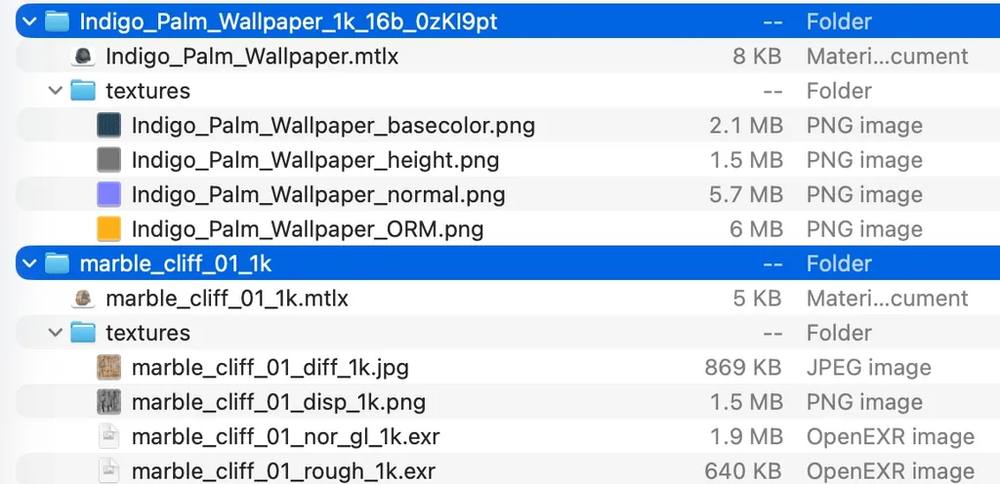

<!-----
MaterialX Proposals v1.39
----->


# MaterialX: Proposed Additions and Changes

**Proposals for Version 1.39**  
September 15, 2024


# Introduction

The [MaterialX Specification](./MaterialX.Specification.md) has historically included descriptions of not just current functionality, but also forward-looking proposed functionality intended for eventual implementation.  We believe it will be beneficial to provide clarity on which functionality is currently supported in the library, and which sections document proposed additions.

As such, those forward-looking proposals have been moved from the formal Specification documents into this Proposed Additions and Changes document to be discussed and debated. These descriptions can then be migrated into the appropriate formal Specification document once actually implemented in the code base.  New proposals for changes and additions to MaterialX may be added to this document once a generally favorable consensus from the community is reached.


## Table of Contents

**[Introduction](#introduction)**  

**[Proposals: General](#propose-general)**   

**[Proposals: Elements](#propose-elements)**  

**[Proposals: Stdlib Nodes](#propose-stdlib-nodes)**  

**[Proposals: PBR Nodes](#propose-pbr-nodes)**  

**[Proposals: NPR Nodes](#propose-npr-nodes)**  


<p>&nbsp;<p><hr><p>

# Proposals: General<a id="propose-general"></a>


## Standardized Metadata

Many 3D content formats, include glTF and USD, include metadata for display, licensing, provenance, and indexing.  MaterialX can represent this metadata using `attributedef` declarations and attributes on the root `<materialx>` element.  A good initial set of standardized, but optional metadata fields, would be:

| Field | Format | Notes |
|-------|--------|-------|
| `materialx_name` | string | Human-readable material name |
| `materialx_authors` | string | Comma-separated author list; email addresses may be included |
| `materialx_license` | string | SPDX identifier such as `CC0-1.0`, `CC-BY-4.0`, or `MIT`; free strings are also allowed |
| `materialx_license_url` | URL | Link to the full license text |
| `materialx_source_url` | URL | Canonical source location for the material |
| `materialx_version` | string | Material asset version, such as a SemVer value |
| `materialx_description` | string | Free-text material description |
| `materialx_keywords` | string | Comma-separated search and discovery keywords |

Example:

```xml
<?xml version="1.0"?>
<materialx version="1.39" colorspace="lin_rec709"
  materialx_name="Marble Cliff"
  materialx_authors="Ben Houston (ben@ben3d.ca), jcaron"
  materialx_license="CC0-1.0"
  materialx_license_url="https://creativecommons.org/publicdomain/zero/1.0/"
  materialx_source_url="https://example.com/materials/marble-cliff"
  materialx_version="1.0.0"
  materialx_description="A weathered marble cliff face with natural veining and displacement."
  materialx_keywords="marble, cliff, rock, natural, displacement, tiled">

  <attributedef name="materialx_name"        attrname="materialx_name"        type="string" value="" elements="materialx"/>
  <attributedef name="materialx_authors"     attrname="materialx_authors"     type="string" value="" elements="materialx"/>
  <attributedef name="materialx_license"     attrname="materialx_license"     type="string" value="" elements="materialx"/>
  <attributedef name="materialx_license_url" attrname="materialx_license_url" type="string" value="" elements="materialx"/>
  <attributedef name="materialx_source_url"  attrname="materialx_source_url"  type="string" value="" elements="materialx"/>
  <attributedef name="materialx_version"     attrname="materialx_version"     type="string" value="" elements="materialx"/>
  <attributedef name="materialx_description" attrname="materialx_description" type="string" value="" elements="materialx"/>
  <attributedef name="materialx_keywords"    attrname="materialx_keywords"    type="string" value="" elements="materialx"/>

  <!-- material graph ... -->
</materialx>
```


## Single-File MaterialX Container

A number of users and developers have discussed the usefulness of a single-file MaterialX container format, along with features that would make such a format practical for online material libraries, publishing workflows, and interchange between applications.  This proposal suggests formalizing the `.mtlx.zip` convention already used by the [AMD Material Library](https://matlib.gpuopen.com/main/materials/all) and [Poly Haven](https://polyhaven.com/materials) as a dedicated `.mtlz` format.

The proposed `.mtlz` format is a zip archive containing one root MaterialX document and its referenced resources.  It is intended as a package format for sharing and delivery, not as a replacement for ordinary `.mtlx` files or directory-based production libraries.

### Motivation

Downloading a single file for a complete MaterialX material, including textures and other referenced files, is convenient for web delivery and content exchange.  Online MaterialX libraries already use `.mtlx.zip` archives for this purpose, since downloading and tracking multiple related files is awkward for browsers, APIs, and asset management systems.

A single-file package also makes it easier to extract one material from a larger local library and share it without preserving the surrounding folder structure.  This mirrors the role of single-file publishing formats such as [USDZ](https://openusd.org/release/spec_usdz.html) for USD content and [GLB](https://registry.khronos.org/glTF/specs/2.0/glTF-2.0.html#glb-file-format-specification) for glTF content.

A dedicated `.mtlz` extension and media type would make the package recognizable to operating systems, browsers, CDNs, and applications.  The extension communicates that the file is a MaterialX material package, while the archive structure makes the root `.mtlx` file unambiguous.

### Technical Format

An `.mtlz` package is a zip archive with the following baseline rules:

* The archive contains exactly one `.mtlx` file at the root level.  This file is the root MaterialX document to load.
* All other content is stored in subdirectories, including textures, included node definitions, and other referenced resources.
* Relative file references in the root `.mtlx` document are resolved within the package.
* The file extension is `.mtlz`.
* The media type is `model/materialx+zip`.

A typical package layout might be:

```text
marble_cliff.mtlz
|-- marble_cliff.mtlx
`-- textures/
    |-- marble_cliff_diff.jpg
    |-- marble_cliff_nor_gl.exr
    |-- marble_cliff_rough.exr
    `-- marble_cliff_disp.png
```

The rule that exactly one `.mtlx` file appears at the root lets readers identify the package entry point without requiring a manifest.  Other `.mtlx` files may be included in subdirectories when referenced by the root document.

### Archive Layout Recommendations

For efficient streaming, the root `.mtlx` file should be stored first in the zip archive.  This lets a reader inspect the MaterialX graph and its referenced resources before the rest of the archive has been downloaded.

For efficient direct access, package writers should consider storing files without zip compression.  This follows the same general rationale as USDZ, where uncompressed zip storage can support direct memory access to package contents.  Many texture formats are already internally compressed, so zip compression may provide limited benefit while adding decoding overhead.

These layout recommendations are not required for a package to be structurally valid, but they provide useful guidance for tools that create `.mtlz` files intended for web delivery, rendering, or large material libraries.

### Command-Line Tooling

Official MaterialX tooling could support creating, unpacking, and validating `.mtlz` packages:

```sh
# Create a .mtlz archive named after the root .mtlx file.
mtlx pack [path to mtlx]

# Validate a .mtlz or .mtlx file and check that references can be resolved.
mtlx check [path to mtlz or mtlx file]

# Create a directory named after the .mtlz file and extract its contents.
mtlx unpack [path to mtlz]

# Apply additional policy checks for a material library or publishing workflow.
mtlx check --allowed-nodes core \
           --allowed-surfaces open_pbr_surface,gltf_pbr \
           --required-metadata author,license \
           [path to mtlz or mtlx file]
```

The policy flags above are examples of validation that may be useful to online libraries or production pipelines.  They are not proposed as requirements for all `.mtlz` packages.

### Additional Data

The following image shows example archive layouts from Poly Haven and the AMD Material Library:



Additional background and discussion are available in [MaterialX Needs a Single-File Container](https://ben3d.ca/blog/materialx-needs-a-single-file-container).


## Color Spaces

When the OCIO NanoColor library (provide link) becomes available, MaterialX should support the official colorspace names in that spec, with the current MaterialX colorspace names supported as aliases.

MaterialX should also support the following color spaces:
* `lin_rec2020`
* `g22_rec2020`


<p>&nbsp;<p><hr><p>

# Proposals: Elements<a id="propose-elements"></a>


### AOV Output Elements

(Summary for README.md: **New Support for Shader AOVs**

Previously, MaterialX used custom types with a structure of output variables to define shader AOVs.  But this approach was not very flexible and in fact had not been implemented.  In v1.39, nodegraph-based shader implementations can include new [&lt;aovoutput> elements](./MaterialX.Specification.md#aov-output-elements) to define AOVs which renderers can use to output additional channels of information in addition to the final shading result, while file-based &lt;implementation>s can similarly define AOVs using [&lt;aov> elements](./MaterialX.Specification.md#implementation-aov-elements).
)

A functional nodegraph with either a "shader" or "material"-semantic output type may contain a number of &lt;aovoutput> elements to declare arbitrary output variables ("AOVs") which the renderer can see and output as additional streams of information.  AOVoutputs must be of type float, color3 or vector3 for pre-shading "pattern" values, or BSDF or EDF for shader-node output values; the renderer is expected to extract the appropriate color-like information from BSDF and EDF types.  AOVs defined within a shader-semantic node instantiated within this functional nodegraph may be "passed along" and potentially renamed (but may not be modified or operated on in any way) by providing a sourceaov attribute in the &lt;aovoutput>.

```xml
  <aovoutput name="name" type="type" aovname="aovname"
             nodename="node_to_connect_to" [sourceaov="aovname"]/>
```

The attributes for &lt;aovoutput> elements are:

* name (string, required): a user-chosen name for this aov output definition element.
* type (string, required): the type of the AOV, which must be one of the supported types listed above.
* aovname (string, required): the name that the renderer should use for the AOV.
* nodename (string, required): the name of the node whose output defines the AOV value.
* sourceaov (string, optional): If nodename is a surfaceshader type, the name of the output AOV defined within nodename to pass along as the output AOV.  The type of the sourceaov defined within nodename must match the &lt;aovoutput> type.

Examples:

```xml
  <aovoutput name="Aalbedo" type="color3" aovname="albedo"
             nodename="coat_affected_diffuse_color"/>
  <aovoutput name="Adiffuse" type="BSDF" aovname="diffuse">
             nodename="diffuse_bsdf"/>
```

#### AovOutput Example

Example of using &lt;aovoutput> with sourceaov to forward AOVs from within an instantiation of a shader-semantic node; this assumes that &lt;standard_surface> has itself defined &lt;aovoutput>s for "diffuse" and "specular" AOVs:

```xml
  <nodegraph name="NG_basic_surface_srfshader" nodedef="ND_basic_surface_srfshader">
    <image name="i_diff1" type="color3">
      <input name="file" type="filename"
                 value="txt/[diff_map_effect]/[diff_map_effect].<UDIM>.tif"/>
    </image>
    <mix name="diffmix" type="color3">
      <input name="bg" type="color3" interfacename="diff_albedo"/>
      <input name="fg" type="color3" nodename="i_diff1"/>
      <input name="mix" type="float" interfacename="diff_map_mix"/>
    </mix>
    <standard_surface name="stdsurf1" type="surfaceshader">
      <input name="base_color" type="color3" nodename="diffmix"/>
      <input name="diffuse_roughness" type="float" interfacename="roughness"/>
      <input name="specular_color" type="color3" interfacename="spec_color"/>
      <input name="specular_roughness" type="float" interfacename="roughness"/>
      <input name="specular_IOR" type="float" interfacename="spec_ior"/>
    </standard_surface>
    <output name="out" type="surfaceshader" nodename="stdsurf1"/>
    <aovoutput name="NGAalbedo" type="color3" aovname="albedo" nodename="diffmix"/>
    <aovoutput name="NGAdiffuse" type="BSDF" aovname="diffuse" nodename="stdsurf1"
                  sourceaov="diffuse"/>
    <aovoutput name="NGAspecular" type="BSDF" aovname="specular" nodename="stdsurf1"
                  sourceaov="specular"/>
  </nodegraph>
```

Layered shaders or materials must internally handle blending of AOV-like values from source layers before outputting them as AOVs: there is currently no facility for blending AOVs defined within post-shading blended surfaceshaders.

Note: while it is syntactically possible to create &lt;aovoutput>s for geometric primitive values such as shading surface point and normal accessed within a nodegraph, it is preferred that renderers derive such information directly from their internal shading state or geometric primvars.


#### Implementation AOV Elements

An &lt;implementation> element with a file attribute defining an external compiled implementation of a surface shader may contain one or more &lt;aov> elements to declare the names and types of arbitrary output variables ("AOVs") which the shader can output to the renderer.  AOVs must be of type float, color3, vector3, BSDF or EDF.  Note that in MaterialX, AOVs for pre-shading "pattern" colors are normally of type color3, while post-shaded color-like values are normally of type BSDF and emissive color-like values are normally of type EDF.  An &lt;implementation> with a `nodegraph` attribute may not contain &lt;aov> elements; instead, &lt;aovoutput> elements within the nodegraph should be used.

```xml
  <implementation name="IM_basicsurface_surface_rmanris"
                  nodedef="ND_basic_surface_surface" implname="basic_srf"
                  target="rmanris" file="basic_srf.C">
    ...<inputs>...
    <aov name="IMalbedo" type="color3" aovname="albedo"/"/>
    <aov name="IMdiffuse" type="BSDF" aovname="diffuse"/"/>
  </implementation>
```


### Material Inheritance

Materials can inherit from other materials, to add or change shaders connected to different inputs; in this example, a displacement shader is added to the above "Mgold" material to create a new "Mgolddsp" material:

```xml
  <noise2d name="noise1" type="float">
    <input name="amplitude" type="float" value="1.0"/>
    <input name="pivot" type="float" value="0.0"/>
  </noise2d>
  <displacement name="stddsp" type="displacementshader">
    <input name="displacement" type="float" nodename="noise1"/>
    <input name="scale" tpe="float" value="0.1"/>
  </displacement>
  <surfacematerial name="Mgolddsp" type="material" inherit="Mgold">
    <input name="displacementshader" type="displacementshader" nodename="stddsp"/>
  </surfacematerial>
```

Inheritance of material-type custom nodes is also allowed, so that new or changed input values can be applied on top of those specified in the inherited material.


<p>&nbsp;<p><hr><p>

# Proposals: Stdlib Nodes<a id="propose-stdlib-nodes"></a>


### Procedural Nodes

<a id="node-tokenvalue"> </a>

### `tokenvalue`
A constant "interface token" value, may only be connected to &lt;token>s in nodes, not to &lt;input>s.

|Port   |Description                         |Type            |Default  |
|-------|------------------------------------|----------------|---------|
|`value`|The value that will be sent to `out`|string, filename|__empty__|
|`out`  |Output: `value`                     |Same as `value` |__empty__|


### Noise Nodes

<a id="node-cellnoise1d"> </a>

### `cellnoise1d`
1D cellular noise, proposed as an alternative approach to random value generation.

|Port    |Description                                      |Type            |Default |
|--------|-------------------------------------------------|----------------|--------|
|`in`    |The 1D coordinate at which the noise is evaluated|float           |        |
|`period`|The period of the noise                          |float, vector3  |__zero__|
|`out`   |Output: the computed noise value                 |float, vector3  |__zero__|

<a id="node-worleynoise2d"> </a>

### `worleynoise2d`
This proposal extends the existing `worleynoise2d` node to support different distance metrics and periodicity.

|Port    |Description                              |Type                   |Default |Accepted Values                          |
|--------|-----------------------------------------|-----------------------|--------|-----------------------------------------|
|`metric`|The distance metric to return            |string                 |distance|distance, distance2, manhattan, chebyshev|
|`period`|The period of the noise                  |float, vector3         |__zero__|                                         |
|`out`   |Output: the computed noise value         |float, vector2, vector3|__zero__|                                         |

<a id="node-worleynoise3d"> </a>

### `worleynoise3d`
This proposal extends the existing `worleynoise3d` node to support different distance metrics and periodicity.

|Port    |Description                              |Type                   |Default |Accepted Values                          |
|--------|-----------------------------------------|-----------------------|--------|-----------------------------------------|
|`metric`|The distance metric to return            |string                 |distance|distance, distance2, manhattan, chebyshev|
|`period`|The period of the noise                  |float, vector3         |__zero__|                                         |
|`out`   |Output: the computed noise value         |float, vector2, vector3|__zero__|                                         |

The `period` input is a positive integer distance at which the noise function returns the same value for coordinates repeated at that step.  A value of 0 means the noise is not periodic.

#### Periodic Noises

In #1201 it was decided that separate periodic versions of all of the noises is preferred to adding it to the existing noises.

### Shape Nodes


### Geometric Nodes


### Global Nodes

<a id="node-ambientocclusion"> </a>

### `ambientocclusion`
Compute the ambient occlusion at the current surface point, returning a scalar value between 0 and 1.  Ambient occlusion represents the accessibility of each surface point to ambient lighting, with larger values representing greater accessibility to light.

The `coneangle` input defines a half-angle about the surface normal, so the default value of 90 degrees represents the full hemisphere.

|Port         |Description                                      |Type |Default|
|-------------|-------------------------------------------------|-----|-------|
|`coneangle`  |The half-angle of the occlusion cone, in degrees |float|90.0   |
|`maxdistance`|The maximum distance to consider for occlusion   |float|1e38   |
|`out`        |Output: the computed ambient occlusion value     |float|       |


### Application Nodes

<a id="node-updirection"> </a>

### `updirection`
The current scene "up vector" direction, as defined by the shading environment.

|Port   |Description                                         |Type   |Default|Accepted Values     |
|-------|----------------------------------------------------|-------|-------|--------------------|
|`space`|The space in which to return the up vector direction|string |world  |model, object, world|
|`out`  |Output: the up direction in `space`                 |vector3|       |                    |


### Math Nodes

<a id="node-transformcolor"> </a>

### `transformcolor`
Transform the incoming color from one specified colorspace to another, ignoring any colorspace declarations that may have been provided upstream.  For color4 types, the alpha channel value is unaffected.  The `fromspace` and `tospace` inputs accept the name of a standard colorspace or a colorspace understood by the application; either may be empty to specify the document's working colorspace.

|Port       |Description                          |Type          |Default  |
|-----------|-------------------------------------|--------------|---------|
|`in`       |The input color                      |color3, color4|__zero__ |
|`fromspace`|The colorspace to transform `in` from|string        |__empty__|
|`tospace`  |The colorspace to transform `in` to  |string        |__empty__|
|`out`      |Output: the transformed color        |Same as `in`  |         |

<a id="node-triplanarblend"> </a>

### `triplanarblend`
Samples data from three inputs, and projects a tiled representation of the images along each of the three respective coordinate axes, computing a weighted blend of the three samples using the geometric normal.

The `iny` input is projected in the direction from the +Y axis back toward the origin, with the +X axis to the right.

If adopted, the existing `triplanarprojection` node would be reimplemented as a wrapper that resolves its three image inputs and passes them to `triplanarblend`.

|Port        |Description                                                                                    |Type           |Default  |Accepted Values       |
|------------|-----------------------------------------------------------------------------------------------|---------------|---------|----------------------|
|`inx`       |The image to be projected in the direction from the +X axis back toward the origin             |float or colorN|__zero__ |                      |
|`iny`       |The image to be projected in the direction from the +Y axis back toward the origin             |float or colorN|__zero__ |                      |
|`inz`       |The image to be projected in the direction from the +Z axis back toward the origin             |float or colorN|__zero__ |                      |
|`position`  |The 3D position at which the projection is evaluated                                           |vector3        |_Pobject_|                      |
|`normal`    |The 3D normal vector used for blending                                                         |vector3        |_Nobject_|                      |
|`blend`     |Weighting factor for blending the three axis samples, with higher values giving softer blending|float          |1.0      |[0, 1]                |
|`filtertype`|The type of texture filtering to use                                                           |string         |linear   |closest, linear, cubic|
|`out`       |Output: the blended value                                                                      |Same as `inx`  |__zero__ |                      |

<a id="node-maxcomponent"> </a>

### `maxcomponent`
Output the maximum of all components of the incoming vectorN or colorN stream as a float value.

|Port |Description                          |Type            |Default  |
|-----|-------------------------------------|----------------|---------|
|`in` |The input value                      |vectorN, colorN |__zero__ |
|`out`|Output: maximum component of `in`    |float           |0.0      |

<a id="node-mincomponent"> </a>

### `mincomponent`
Output the minimum of all components of the incoming vectorN or colorN stream as a float value.

|Port |Description                          |Type            |Default  |
|-----|-------------------------------------|----------------|---------|
|`in` |The input value                      |vectorN, colorN |__zero__ |
|`out`|Output: minimum component of `in`    |float           |0.0      |


### Adjustment Nodes

<a id="node-curveinversecubic"> </a>

### `curveinversecubic`
Remap a 0-1 input value using an inverse Catmull-Rom spline lookup on the input `knots` values.  At least 2 knot values must be provided, and the first and last knot have multiplicity 2.

|Port   |Description                                    |Type      |Default|
|-------|-----------------------------------------------|----------|-------|
|`in`   |The input value                                |float     |0.0    |
|`knots`|The list of input knot values for the remapping|floatarray|       |
|`out`  |Output: the remapped value                     |float     |       |

<a id="node-curveuniformlinear"> </a>

### `curveuniformlinear`
Output a float, colorN or vectorN value linearly interpolated between a number of `knotvalues` values, using the value of `in` as the interpolant.

|Port        |Description                                          |Type                                 |Default|
|------------|-----------------------------------------------------|-------------------------------------|-------|
|`in`        |The input interpolant value                          |float                                |0.0    |
|`knotvalues`|The array of at least 2 values to interpolate between|floatarray, colorNarray, vectorNarray|       |
|`out`       |Output: the interpolated value                       |float, colorN, vectorN               |       |

<a id="node-curveuniformcubic"> </a>

### `curveuniformcubic`
Output a float, colorN or vectorN value smoothly interpolated between a number of `knotvalues` values using a Catmull-Rom spline with the value of `in` as the interpolant.

|Port        |Description                                          |Type                                 |Default|
|------------|-----------------------------------------------------|-------------------------------------|-------|
|`in`        |The input interpolant value                          |float                                |0.0    |
|`knotvalues`|The array of at least 2 values to interpolate between|floatarray, colorNarray, vectorNarray|       |
|`out`       |Output: the interpolated value                       |float, colorN, vectorN               |       |

<a id="node-curveadjust"> </a>

### `curveadjust`
Output a smooth remapping of input values using the centripetal Catmull-Rom cubic spline curve defined by specified knot values, using an inverse spline lookup on input knot values and a forward spline through output knot values.  All channels of the input will be remapped using the same curve.

|Port        |Description                                                                                     |Type                  |Default |
|------------|------------------------------------------------------------------------------------------------|----------------------|--------|
|`in`        |The input value                                                                                 |float, colorN, vectorN|__zero__|
|`numknots`  |The number of values in the knots and knotvalues arrays                                         |integer               |2       |
|`knots`     |The list of input values defining the curve for the remapping; at least 2 and at most 16 values |floatarray            |        |
|`knotvalues`|The list of output values defining the curve for the remapping; must be the same length as knots|floatarray            |        |
|`out`       |Output: the remapped value                                                                      |Same as `in`          |        |

<a id="node-curvelookup"> </a>

### `curvelookup`
Output a float, colorN or vectorN value smoothly interpolated between a number of knotvalue values, using the position of `in` within `knots` as the knotvalues interpolant.

|Port        |Description                                                                              |Type                                 |Default|
|------------|-----------------------------------------------------------------------------------------|-------------------------------------|-------|
|`in`        |The input interpolant value                                                              |float                                |0.0    |
|`numknots`  |The number of values in the knots and knotvalues arrays                                  |integer                              |2      |
|`knots`     |The list of knot values to interpolate `in` within; at least 2 and at most 16 values     |floatarray                           |       |
|`knotvalues`|The values at each knot position to interpolate between; must be the same length as knots|floatarray, colorNarray, vectorNarray|       |
|`out`       |Output: the interpolated value                                                           |float, colorN, vectorN               |       |


### Compositing Nodes


### Conditional Nodes

<a id="node-ifelse"> </a>

### `ifelse`
Output the value of one of two input streams, according to whether the value of a boolean selector input is true or false.

|Port     |Description                                         |Type                  |Default |
|---------|----------------------------------------------------|----------------------|--------|
|`infalse`|The value to output if `which` is false             |float, colorN, vectorN|__zero__|
|`intrue` |The value to output if `which` is true              |Same as `infalse`     |__zero__|
|`which`  |A selector to choose which input to take values from|boolean               |false   |
|`out`    |Output: the selected input                          |Same as `infalse`     |        |


### Channel Nodes

<a id="node-separatecolor4"> </a>

### `separatecolor4`
Output the RGB and alpha channels of a color4 as separate outputs.

|Port      |Description                      |Type  |Default           |
|----------|---------------------------------|------|------------------|
|`in`      |The input color4 value           |color4|0.0, 0.0, 0.0, 0.0|
|`outcolor`|Output: the RGB channels of `in` |color3|0.0, 0.0, 0.0     |
|`outa`    |Output: the alpha channel of `in`|float |0.0               |


<p>&nbsp;<p><hr><p>

# Proposals: PBR Nodes<a id="propose-pbr-nodes"></a>


<p>&nbsp;<p><hr><p>

# Proposals: NPR Nodes<a id="propose-npr-nodes"></a>

